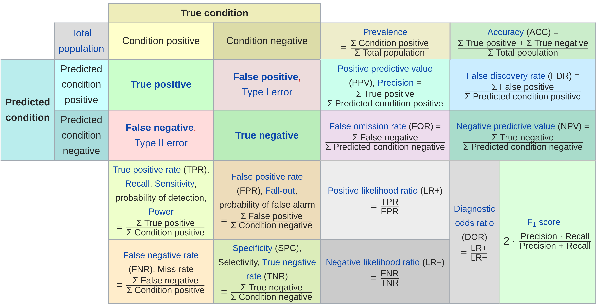

# mlr3 Basics {#basics}

This chapter will teach you the essential building blocks, R6 classes and operations of `r mlr_pkg("mlr3")`.
These include creating supervised ML tasks like classification/regression, performing training/prediction and cross-validate/benchmark different models.

A typical (simple) machine-learning workflow looks like this:

```{r 01-mlr3-basics-001, echo = FALSE}
knitr::include_graphics("images/ml_abstraction.png")
```

Data is usually split up into training and testing portions.
Using a learning algorithm we induce a model on training data, label the test instances with our model, and compare true test label to predicted labels.
We obtain a scalar numeric score which quantifies the predictive power of our learner given the current data situation.

Resampling statistically repeats the whole process and averages test scores to smooth out variance of the performance estimation.

The `r mlr_pkg("mlr3")` package provides R6 classes for the these essential building blocks:

* A [task](#tasks) wraps the data and stores additional information about it.
* A [learners](#learners) interfaces R's many ML algorithms, allows train and predict operations on data and the setting and querying of hyperparameters.
* A [measure](#measures) is a mapping from test labels and predicted labels on a test set to a numeric score.
* A [resampling](#resampling) specifies through index sets the (repeated) splitting of the data into train and test sets.

You will later learn how to enhance learners to full pipelines and tune hyperparameters, but for now we will stick to this simple workflow.

## Quick R6 Intro for Starters

R6 is one of R's more recent dialects for object-oriented programming.
While R6 might take a little while to learn for people who have never seen OO before, you can find here what you need to know in order to use R6 with `r mlr_pkg("mlr3")` from the outside.

* Objects are created from a so called "factory method" with a constructor.
  For example `foo = Foo$new(bar = 1)` creates a new object of class `Foo`, by passing `1` to its constructor.
* Classes encode their state via so called "member variables".
  Assuming, the constructor of `Foo` would directly store the state of `bar = 1` in the created object in a public member variable, we could access it now via `foo$bar` and retrieve its value or change it.
* Classes usually expose some methods to 
  * retrieve information, 
  * perform some action, 
  * change the state of the object.
  
  For example, `foo$inc()` might increment the value of `bar` in `foo` by `+1`, and hence changes the state of the object.
* Classes have public and private parts of their interface, regarding methods and member variables. 
  We as outside users can only access the public parts and do not have to worry about the private ones.
* R6 classes are implemented via environments / references.
  This means that R6 variables do not actually hold the object itself but rather a reference (pointer) to them. 
  This means that `foo2 = foo` does not copy the object, but only copies the reference, which now points to the object.
* If you really want to fully copy an object call `foo$clone()`, possibly `foo$clone(deep = TRUE)`.

If you want more details, have a look at the [R6 vignettes](https://r6.r-lib.org/).

## Tasks {#tasks}

**Tasks** are objects that include the data set and additional meta information about a machine-learning problem.
This could be the name of the target variable for supervised problems or whether the data set belongs to a specific community of datasets (e.g. a _spatial_ or _survival_ dataset).
This information can be used at different points of the workflow to account for specific characteristics of these dataset types.

### Task Types

To create a task from a `r ref("data.frame()")` or `r ref("data.table()")` object, the task type needs to be selected:

* **Classification Task**: Target column is labels (stored as `character()`/`factor()`) with only few distinct values.
<br>$\Rightarrow$ `r ref("mlr3::TaskClassif")`
* **Regression Task**: Target column is numeric (stored as `integer()`/`double()`).
<br>$\Rightarrow$ `r ref("mlr3::TaskRegr")`
* **Survival Task**: Target is the (right-censored) time to event.
<br>$\Rightarrow$ `r ref("mlr3survival::TaskSurv")` in add-on package `r mlr_pkg("mlr3surival")`
* **Ordinal Regression Task**: Target is ordinal.
<br>$\Rightarrow$ `r ref("mlr3ordinal::TaskOrdinal")` in add-on package `r mlr_pkg("mlr3ordinal")`
* **Cluster Task**: You don't have a target but want to identify similarities in the feature space.
<br>$\Rightarrow$ Not yet implemented
* **Spatial Task**: The observations come with spatio-temporal information (e.g. coordinates).
<br>$\Rightarrow$ Not yet implemented in add-on package `r mlr_pkg("mlr3spatiotemporal")`

### Task Creation

Let's assume we want to create a simple regression task using the `mtcars` data set from the package `datasets` to predict the column `"mpg"` (miles per gallon).
For this showcase we only take the first two features to keep the output in the following examples compact.

```{r 01-mlr3-basics-002}
data("mtcars", package = "datasets")
data = mtcars[, 1:3]
str(data)
```

Next, we create the task by providing the following information:

1. `id`: Identifier for the task, used in plots and summaries.
2. `backend`: Here, we simply provide the dataset. It is internally converted to a `r ref("DataBackendDataTable")`.
For more fine-grain control over how the data is stored internally, we could also construct a `r ref("DataBackend")` manually.
3. `target`: Column name of the target column for the regression problem.

```{r 01-mlr3-basics-003}
library(mlr3)

task_mtcars = TaskRegr$new(id = "cars", backend = data, target = "mpg")
print(task_mtcars)
```

The `print()` method gives a short summary of the task: It has `r task_mtcars$nrow` observations, `r task_mtcars$ncol` columns of which `r length(task_mtcars$feature_names)` columns are features.

We can also print the task using the `r mlr_pkg("mlr3viz")` package:
```{r 01-mlr3-basics-004}
library(mlr3viz)
autoplot(task_mtcars, type = "pairs")
```

### Predefined tasks

`r mlr_pkg("mlr3")` ships with some predefined machine-learning tasks.
These are stored in a R6 `r ref("Dictionary")`, which is a simple key-value storage named `mlr3::mlr_tasks`.
If we simply print it out, we see that is has `r length(mlr_tasks$keys())` entries:

```{r 01-mlr3-basics-005}
mlr_tasks
```

We can obtain a summarizing overview of all stored tasks by converting the dictionary to a `data.table()` object

```{r 01-mlr3-basics-006}
library(data.table)
as.data.table(mlr_tasks)
```

To create a **task** from the dictionary (think of it as a book shelf), we use the `$get()` method from the `mlr_tasks` class and assign it to a new object.

For example, if we would like to use the [iris data set](https://en.wikipedia.org/wiki/Iris_flower_data_set) for classification:

```{r 01-mlr3-basics-007}
task_iris = mlr_tasks$get("iris")
print(task_iris)
```

### Task API

All **task** properties and characteristics can be queried using the task's public member values and methods (see `r ref("Task")`).

```{r 01-mlr3-basics-008}
task_iris = mlr_tasks$get("iris")
```

- Member values: Values stored in the object that can be queried by the user

```{r 01-mlr3-basics-009}
# public member values
task_iris$nrow
task_iris$ncol
```

- Member methods: Functions from the object that can accept arguments and return information stored in the object

```{r 01-mlr3-basics-010}
# public member methods
task_iris$head(n = 3)
```

#### Retrieve Data

In `r mlr_pkg("mlr3")`, each row (observation) has a unique identifier which can be either `integer` or `character`.
These can be used to select specific rows.

The _iris_ dataset uses integer `row_ids`:

```{r 01-mlr3-basics-011}
# iris uses integer row_ids
head(task_iris$row_ids)

# retrieve data for rows with ids 1, 51, and 101
task_iris$data(rows = c(1, 51, 101))
```

While the _mtcars_ dataset uses names for its `row_ids`, encoded as `character`:

```{r 01-mlr3-basics-012}
head(task_mtcars$row_ids)

# retrieve data for rows with id "Datsun 710"
task_mtcars$data(rows = "Datsun 710")
```

Note that the method `$data()` is only an accessor and does not modify the underlying data/task.

Analogously, each column has an identifier, which is often just called "column name".
These are stored in the public slots `feature_names` and `target_names`.
Here "target" refers to the response variable and "feature" to the predictor variables of the task.

```{r 01-mlr3-basics-013}
task_iris$feature_names
task_iris$target_names
```

The `row_id` names and the "column names" can be combined for subsetting:

```{r 01-mlr3-basics-014}
# retrieve data for rows 1, 51, and 101 and only select column "Species"
task_iris$data(rows = c(1, 51, 101), cols = "Species")
```

To extract the complete dataset from the task, we can simply convert the task to a `data.table`:

```{r 01-mlr3-basics-015}
summary(as.data.table(task_iris))
```

#### Roles (Rows and Columns)

It is possible to assign a special meanings (aka "roles") to (subsets of) rows and columns.

For example, the previously constructed _mtcars_ task has the following column roles:

```{r 01-mlr3-basics-016}
print(task_mtcars$col_roles)
```

Now, we want the original `rownames()` of `mtcars` to be a regular feature column.
Thus, we first preprocess the `data.frame` and then re-create the task.

```{r 01-mlr3-basics-017}
# with `keep.rownames`, data.table stores the row names in an extra column "rn"
data = as.data.table(mtcars[, 1:3], keep.rownames = TRUE)
task = TaskRegr$new(id = "cars", backend = data, target = "mpg")

# we now have integer row_ids
task$row_ids

# there is a new "feature" called "rn"
task$feature_names
```

The column "rn" is now a regular feature.
As this is a unique string column, most machine-learning algorithms will have problems to process this feature without some kind of preprocessing.
However, we still might want to carry `rn` around for different reasons.
For example, we can use the row names in plots or to associate outliers with the row names.
This being said, we need to change the role of the row names column `rn` and remove it from the set of active features.

```{r 01-mlr3-basics-018}
task$feature_names
task$set_col_role("rn", new_roles = "label")

# "rn" not listed as feature any more
task$feature_names

# also vanished from "data" and "head"
task$data(rows = 1:2)
task$head(2)
```

Note that no copies of the underlying data is inflicted by this operation.
By changing roles, only the view on the data is changed, not the data itself.

Just like columns, it is also possible to assign different roles to rows.
Rows can have two different roles:

1. Role `"use"`:
Rows that are generally available for model fitting (although they may also be used as test set in resampling).
This is the default role.
2. Role `"validation"`:
Rows that are held back (see below).
Rows which have missing values in the target column upon task creation are automatically moved to the validation set.

There are several reasons to hold some observations back or treat them differently:

1. It is often good practice to validate the final model on an external validation set to uncover possible overfitting.
1. Some observations may be unlabeled, e.g. in data mining cups or [Kaggle](https://www.kaggle.com/) competitions.
These observations cannot be used for training a model, but you can still predict labels.

#### Task Mutators

Task methods `.$set_col_role()` and `.$set_row_role()` change the view on the data and can be used to subset the task.
For convenience, method `.$filter()` subsets the task based on row ids, and `.$select()` subsets the task based on feature names.
All these operations only change the view on the data, without creating a copy of it, but modify the task in-place.

```{r 01-mlr3-basics-019}
task = mlr_tasks$get("iris")
task$select(c("Sepal.Width", "Sepal.Length")) # keep only these features
task$filter(1:3) # keep only these rows
task$head()
```

Additionally, methods `.$rbind()` and `.$cbind()` allow to add extra rows and columns to a task, respectively.
Again, the original data set stored in the original `r ref("DataBackend")` is not altered in any way.

```{r 01-mlr3-basics-020}
task$cbind(data.table(foo = letters[1:3])) # add column foo
task$head()
```

## Learners {#learners}

Objects of class `mlr3::Learner` provide a unified interface to many popular machine-learning algorithms in R.
They consist of methods to train and predict on a `mlr3::Task`, and additionally provide meta information about the algorithms.

The package ships with only a rather minimal set of classification and regression learners, more are implemented in the [mlr3learners](https://mlr3learners.mlr-org.com) package.
Furthermore, [mlr3learners](https://mlr3learners.mlr-org.com) has some documentation on creating custom learners.

### Predefined Learners

Similar to `mlr3::mlr_tasks`, the `mlr3misc::Dictionary` `mlr3::mlr_learners` can be queried for available learners:

```{r 01-mlr3-basics-021}
mlr_learners
as.data.table(mlr_learners)
```

As listed in the output, each learner comes with the following information:

* `feature_types`: what kind of features can be processed.
* `packages`: which packages are required to run `train()` and `predict()`.
* `properties`: additional properties and capabilities. For example, a learner has the property "missings" if it is able to handle missing values, and "importance" if it is possible to extract feature importance values.
* `predict_types`: what predict types are possible. For example, a classification learner can predict labels ("response") or probabilities ("prob").

To extract a specific learner, use the corresponding `"id"`:

```{r 01-mlr3-basics-022}
learner = mlr_learners$get("classif.rpart")
print(learner)
```

In the output we see that all information from the previous table is also accessible via public slots (`id`, `feature_types`, `packages`, `properties`, `predict_types`).
Additionally, `predict_type` returns the currently selected predict type of the learner.

Slot `param_set` stores a description of hyperparameter settings:

```{r 01-mlr3-basics-023}
learner$param_set
```

The set of hyperparameter values is stored inside the parameter set in the `values` slot.
By assigning a named list to this slot, we change the active hyperparameters of the learner:

```{r 01-mlr3-basics-024}
learner$param_set$values = list(cp = 0.01)
learner
```

The slot `model` stores the result of the training step.
As we have not yet trained a model, this slot is `NULL`:

```{r 01-mlr3-basics-025}
learner$model
```

## Train & Predict {#train-predict}

In this chapter, we explain how [tasks and learners](#tasks-and-learners) can be used to train a model and predict to a new dataset.

The concept is demonstrated on a supervised classification using the iris dataset and the **rpart** learner (classification tree).

Additionally, this chapter includes the following use-cases

- Functional Data Analysis using <model name> (WIP)
- Regression Analysis using <model name> (WIP)
- Survival Analysis using <model name> (WIP)
- Spatial Analysis using <model name> (WIP)

### Basic concept

#### Creating Task and Learner Objects

The first step is to generate the following `r mlr_pkg("mlr3")` objects from the [task dictionary](#tasks) and the [learner dictionary](#learners), respectively:

1. The classification task
```{r 01-mlr3-basics-026}
task = mlr_tasks$get("iris")
```
2. A learner for the classification tree
```{r 01-mlr3-basics-027}
learner = mlr_learners$get("classif.rpart")
```

#### Setting up the train/test splits of the data (#split-data)

It is common to train on a majority of the data.
Here we use 80% of all available observations and predict on the remaining 20% observations.
For this purpose, we create two index vectors:

```{r 01-mlr3-basics-028}
train_set = sample(task$nrow, 0.8 * task$nrow)
test_set = setdiff(seq_len(task$nrow), train_set)
```

#### Training the learner

Next, we train the classification tree on the train set of the iris task using the `$train()` method of the `r ref("Learner")`:

```{r 01-mlr3-basics-029}
learner$train(task, row_ids = train_set)
```
This operation modifies the learner in-place.
We can access the stored model via the field `$model`:
```{r 01-mlr3-basics-030}
print(learner$model)
```

#### Predicting

After the model was trained, we use the remaining part of the data for prediction.
Remember that we [initially split the data](#split-data) in `train_set` and `test_set`.


```{r 01-mlr3-basics-031}
prediction = learner$predict(task, row_ids = test_set)
print(prediction)
```
The `$predict()` method of the `r ref("Learner")` returns a `r ref("Prediction")` object.
More precise, as the learner is specialized for classification, a `r ref("LearnerClassif")` returns a `r ref("PredictionClassif")` object.

A prediction objects holds The row ids of the test data, the respective true label of the target column and the respective predictions.
The simplest way to extract this information is by converting to a `data.table()`:
```{r 01-mlr3-basics-032}
head(as.data.table(prediction))
```
For classification, you can also extract the confusion matrix:
```{r 01-mlr3-basics-033}
prediction$confusion
```


##### Performance assessment

The last step of an modeling is usually the performance assessment where we choose performance measure to quantify the predictions by comparing the predicted labels with the true labels.
Available measures are stored in `r ref("mlr_measures")`:
```{r 01-mlr3-basics-034}
mlr_measures
```

We select the accuracy (`r ref("mlr_measures_classif.acc", text = "classif.acc")`) and call the method `$score()` of the `r ref("Prediction")` object:

```{r 01-mlr3-basics-035}
measure = mlr_measures$get("classif.ce")
prediction$score(measure)
```
Note that, if no measure is specified, classification defaults to classification error (`r ref("mlr_measures_classif.ce", text = "classif.ce")`) and regression defaults to the mean squared error (`r ref("mlr_measures_regr.mse", text = "regr.mse")`).

## Resampling {#resampling}

### Settings {#resamp-settings}

In this example we use the _iris_ task and a simple classification tree (package `rpart`).

```{r 01-mlr3-basics-036}
task = mlr_tasks$get("iris")
learner = mlr_learners$get("classif.rpart")
```

When performing resampling with a dataset, we first need to define which approach should be used.
The resampling strategies of _mlr3_ can be queried using the `.$keys()` method of the `r ref("mlr_resamplings")` dictionary.

```{r 01-mlr3-basics-037}
mlr_resamplings
```

Additional resampling methods for special use cases will be available via extension packages, such as `r mlr_pkg("mlr3survival")` for survival analysis or [mlr3spatiotemporal](https://github.com/mlr-org/mlr3spatiotemporal) for spatial data (still in development).

The model fit conducted in the [train/predict/score](#train-predict) chapter is equivalent to a "holdout", so let's consider this one first.

```{r 01-mlr3-basics-038}
resampling = mlr_resamplings$get("holdout")
print(resampling)
```

Note that the `Instantianated` field is set to `FALSE`.
This means we did not actually apply the strategy on a dataset yet but just performed a dry-run.
Applying the strategy on a dataset is done in section next [Instantation](#instantation).

By default we get a .66/.33 split of the data.
There are two ways how the ratio can be changed:

1. Overwriting the slot in `.$param_set$values` using a named list.

```{r 01-mlr3-basics-039}
resampling$param_set$values = list(ratio = 0.8)
```

2. Specifying the resampling parameters directly during construction using the `param_vals` argument:

```{r 01-mlr3-basics-040}
mlr_resamplings$get("holdout", param_vals = list(ratio = 0.8))
```

### Instantiation {#resamp-inst}

So far we just set the stage and selected the resampling strategy.
To actually perform the splitting, we need to apply the settings on a dataset.
This can be done in two ways:

1. Manually by calling the method `.$instantiate()` on a `r ref("Task")`

```{r 01-mlr3-basics-041}
resampling = mlr_resamplings$get("cv", param_vals = list(folds = 3L))
resampling$instantiate(task)
resampling$iters
resampling$train_set(1)
```

2. Automatically by passing the resampling object to `resample()`. Here, the splitting is done within the `resample()` call based on the supplied `r ref("Task")`.

```{r 01-mlr3-basics-042}
learner1 = mlr_learners$get("classif.rpart") # simple classification tree
learner2 = mlr_learners$get("classif.featureless") # featureless learner, prediction majority class
rr1 = resample(task, learner1, resampling)
rr2 = resample(task, learner2, resampling)

setequal(rr1$resampling$train_set(1), rr2$resampling$train_set(1))
```

If you want to compare multiple learners, you should use the same resampling per task to reduce the variance of the performance estimation (**method 1**).
If you use **method 2** (and do not instantiate manually before), the resampling splits will differ between both runs.

If you aim is to compare different `r ref("Task")`, `r ref("Learner")` or `r ref("Resampling")`, you are better off using the `r ref("benchmark()")` function.
It is basically a wrapper around `r ref("resample()")` simplifying the handling of multiple settings.

If you discover this only after you've run multiple `r ref("resample()")` calls, don't worry - you can transform multiple single `r ref("ResampleResult")` objects into a `r ref("BenchmarkResult")` (explained later) using the `.$combine()` method.


### Execution {#resamp-exec}

With a `r ref("Task")`, a `r ref("Learner")` and `r ref("Resampling")` object we can call `r ref("resample()")` and create a `r ref("ResampleResult")` object.

```{r 01-mlr3-basics-043}
rr = resample(task, learner, resampling)
print(rr)
```

Before we go into more detail, let's change the resampling to a "3-fold cross-validation" to better illustrate what operations are possible with a `r ref("ResampleResult")`.
Additionally, we tell `r ref("resample()")` to keep the fitted models via a control object (see `r ref("mlr_control()")`):

```{r 01-mlr3-basics-044}
resampling = mlr_resamplings$get("cv", param_vals = list(folds = 3L))
ctrl = mlr_control(store_models = TRUE)
rr = resample(task, learner, resampling, ctrl = ctrl)
print(rr)
```

The following operations are supported with `r ref("ResampleResult")` objects:

* Extract the performance for the individual resampling iterations:

```{r 01-mlr3-basics-045}
rr$performance("classif.ce")
```

* Extract and inspect the resampling splits:

```{r 01-mlr3-basics-046}
rr$resampling
rr$resampling$iters
rr$resampling$test_set(1)
rr$resampling$train_set(3)
```

* Retrieve the learner of a specific iteration and inspect it:

```{r 01-mlr3-basics-047}
lrn = rr$learners[[1]]
lrn$model
```

### Custom resampling

Sometimes it is necessary to perform resampling with custom splits.
If you want to do that because you are coming from a specific modeling field, take a look first at the _mlr3_ extension packages to make sure your custom resampling method hasn't been implemented already.

If your custom resampling method is widely used in your field, feel welcome to integrate it into one of the existing _mlr3_ extension packages or create your own one.

A manual resampling instance can be created using the `"custom"` template from the `r ref("mlr_resamplings")` dictionary.

```{r 01-mlr3-basics-048}
resampling = mlr_resamplings$get("custom")
resampling$instantiate(task,
  list(c(1:10, 51:60, 101:110)),
  list(c(11:20, 61:70, 111:120))
)
resampling$iters
resampling$train_set(1)
resampling$test_set(1)
```

## Benchmarking {#benchmarking}

Comparing the performance of different learners on multiple tasks and/or different resampling schemes is a recurrent task.
This operation is usually referred to as "benchmarking" in the field of machine-learning.
`r mlr_pkg("mlr3")` offers the `r ref("benchmark()")` function for convenience.

### Design Creation {#bm-design}

In _mlr3_ we require you to supply a "design" of your benchmark experiment.
By "design" we essentially mean the matrix of settings you want to execute.
A "design" consists of `r ref("Task")`, `r ref("Learner")` and `r ref("Resampling")`.
Additionally, you can supply different `r ref("Measure")` along side.

Here, we call `r ref("benchmark()")` to perform a single holdout split on a single task and two learners.
We use the `r ref("expand_grid()")` function to create an exhaustive design and properly instantiate the resampling:

```{r 01-mlr3-basics-049}
library(data.table)
design = expand_grid(
  tasks = mlr_tasks$mget("iris"),
  learners = mlr_learners$mget(c("classif.rpart", "classif.featureless")),
  resamplings = mlr_resamplings$mget("holdout")
)
print(design)
bmr = benchmark(design)
```

Note that the holdout splits have been automatically instantiated for each row of the design.
As a result, the `rpart` learner used a different training set than the `featureless` learner.
However, for comparison of learners you usually want the learners to see the same splits into train and test sets.
To overcome this issue, the resampling strategy needs to be [**manually instantiated**](#resamp-inst) before creating the design.

While the interface of `benchmark()` allows full flexibility, the creation of such design tables can be tedious.
Therefore, `r gh_pkg("mlr-org/mlr3")` provides a convenience function to quickly generate design tables and instantiate resampling strategies in an exhaustive grid fashion: `r ref("expand_grid()")`.

```{r 01-mlr3-basics-050}
# get some example tasks
tasks = mlr_tasks$mget(c("pima", "sonar", "spam"))

# get some measures: accuracy (acc) and area under the curve (auc)
measures = mlr_measures$mget(c("classif.acc", "classif.auc"))

# get a featureless learner and a classification tree
# let both learners predict probabilities
learners = mlr_learners$mget(c("classif.featureless", "classif.rpart"), predict_type = "prob")

# compare via 3-fold cross validation
resamplings = mlr_resamplings$mget("cv3")

# create a BenchmarkDesign object
design = expand_grid(tasks, learners, resamplings)
print(design)
```

### Execution and Aggregation of Results {#bm-exec}

After the [benchmark design](#bm-design) is ready, we can directly call `r ref("benchmark()")`

```{r 01-mlr3-basics-051}
# execute the benchmark
bmr = benchmark(design)
```

Note that we did not instantiate the resampling instance, but `r ref("expand_grid()")` took care of it for us:
each resampling strategy is instantiated for each task during the construction of the exhaustive grid.

After the benchmark, we can calculate and aggregate the performance with `.$aggregate()`:

```{r 01-mlr3-basics-052}
bmr$aggregate(measures)
```

We can aggregate the results further.
For example, we might be interested which learner performed best over all tasks.
Since we have `r ref("data.table")` object here, we could do the following:

```{r 01-mlr3-basics-053}
bmr$aggregate(measures)[, list(acc = mean(classif.acc), auc = mean(classif.auc)), by = "learner_id"]
```

Alternatively, we can also use the `r cran_pkg("tidyverse")` approach:

```{r 01-mlr3-basics-054}
library("magrittr")
requireNamespace("dplyr")
requireNamespace("tibble")

bmr$aggregate(measures) %>%
  tibble::as_tibble() %>%
  dplyr::group_by(learner_id) %>%
  dplyr::summarise(acc = mean(classif.acc), auc = mean(classif.auc))
```

Unsurprisingly, the classification tree outperformed the featureless learner.

### Converting specific benchmark objects to resample objects

A `r ref("BenchmarkResult")` object is essentially a collection of multiple `r ref("ResampleResult")` objects.
As these are stored in a column of the aggregated `data.table()`, we can easily extract them:

```{r 01-mlr3-basics-055}
tab = bmr$aggregate(measures)
rr = tab[task_id == "spam" & learner_id == "classif.rpart"]$resample_result[[1]]
print(rr)
```

We can now investigate this resampling and even single resampling iterations using one of the approach shown in [the previous section](#bm-exec):

```{r 01-mlr3-basics-056}
rr$aggregate(measure)

# get the iteration with worst AUC
worst = rr$performance(measures) %>%
  tibble::as_tibble() %>%
  dplyr::slice(which.min(classif.auc)) %>%
  dplyr::select(classif.auc, iteration)

# get the corresponding learner
lrn = rr$learners[[worst$iteration]]
lrn
```

## Binary classification {#binary}

Classification problems with a target variable containing only two classes are called **"binary"**.
For such, you can specify the **positive class** within the `task` object during task creation.
If not specified during construction, `mlr3` sets the positive class automatically to the first class level which appears in the target variable.

```{r 01-mlr3-basics-057}
# during construction
data("Sonar", package = "mlbench")
b = as_data_backend(Sonar)
task = TaskClassif$new(id = "Sonar", backend = b, target = "Class", positive = "R")

# or afterwards
task$positive = "M"
```

### ROC Curve and Thresholds

ROC Analysis -- which stands for "receiver operating characteristics -- is a subfield of Machine Learning which studies the evaluation of binary prediction systems.
We saw earlier, that we can simply access the confusion matrix of a prediction by `prediction$confusion`, where, the positive class corresponds to the one set within the task.
The positive class is the more important, often smaller one
It is a representation of all predictions, where we count correct and incorrect class assignments.
False Positive means: We assigned "positive", but were wrong.
We can now normalize in rows and cols of the confusion matrix to derive several informative metrics in imbalanced or cost-sensitive situations:

- **True Positive Rate (TPR)**: How many of the true positives did we predict as positive?
- **True Negative Rate TNR**: How many of the true negatives did we predict as negative?
- **Positive Predictive Value PPV**: If we predict positive how likely is it a true positive?
- **Negative Predictive Value NPV**: If we predict negative how likely is it a true negative?

```{r 01-mlr3-basics-058, echo = FALSE}

```
Source: [Wikipedia](https://en.wikipedia.org/wiki/Evaluation_of_binary_classifiers)

It is difficult to achieve a high TPR and low FPR simultaneously, so we use them for constructing the ROC Curve.
We characterize a classifier by its TPR and FPR values and plot them in a coordinate system.
We could also use two different ROC metrics which define a trade-off, like TPR and PPV.
The best classifier lies on the top-left corner while the diagonal is the worst, where classifiers produce random labels (with different proportions).
If each positive $x$ will be randomly classified with 25\% as "positive", we get a True Positive Rate of 0.25.
If we assign each negative $x$ randomly to "positive" we get a False Positive Rate of 0.25.
In practice, we should never obtain a classifier below the diagonal, as inverting the predicted labels will result in a reflection at the diagonal.

A scoring classifier is a model which outputs scores or probabilities, instead of discrete labels, and nearly all modern classifiers can do that.
Thresholding flexibly converts measured probabilities to labels.
Predict $1$ (positive class) if $\hat{f}(x) > \tau$ else predict $0$.
Normally we could use $\tau = 0.5$ to convert, but for imbalanced or cost-sensitive situations another threshold could be better.
After thresholding, any metric defined on labels can be used.

For `mlr3` prediction objects, the ROC curve can be created e.g. by the `precrec` package, which creates `ggplot2` graphics.

```{r 01-mlr3-basics-059, eval = FALSE}
library(precrec)
task = mlr_tasks$get("sonar")
lrn = mlr_learners$get("classif.rpart", predict_type = "prob")
rr = resample(task, lrn, "cv3")
pred = rr$prediction
evaluated = evalmod(scores = pred$prob[, task$positive], label = pred$truth, posclass = task$positive)

library(ggplot2)
autoplot(evaluated)
```

```{r 01-mlr3-basics-060, echo = FALSE}
library(precrec)
task = mlr_tasks$get("sonar")
lrn = mlr_learners$get("classif.rpart", predict_type = "prob")
rr = resample(task, lrn, "cv3")
pred = rr$prediction
evaluated = evalmod(scores = pred$prob[, task$positive], label = pred$truth, posclass = task$positive)

library(ggplot2)
autoplot(evaluated, curvetype = "ROC")
autoplot(evaluated, curvetype = "PRC")
```

### Threshold Tuning

When we are interested in class labels based on scores or probabilities, we can set the classification threshold according to our target performance measure.
This threshold however can also be **tuned**, since the optimal threshold might differ for different (custom) measures or in situations like const-sensitive classification.

This can be also done with `mlr3`......

## `mlr` -> `r mlr_pkg("mlr3")` Transition Guide

In case you have already worked with `mlr`, you may want quickstart with `r mlr_pkg("mlr3")` by looking up the specific equivalent of an element of `mlr` in the new version `r mlr_pkg("mlr3")`.
For this, you can use the following table.
This table is not complete but should give you an overview about how `r mlr_pkg("mlr3")` is organized.

```{r 01-mlr3-basics-061, echo = FALSE}
# t = "
#     category , mlr             , mlr3              , note
#     Task     , makeClassifTask , TaskClassif$new() , NA
#     Task     , RegrTask        , TaskRegr          , Class
#     Task     , makeRegrTaskm   , TaskRegr$new()    , NA
#     "
# t = read.table(text =  t, sep = ",", header = TRUE)
# t = knitr::kable(t)
# kableExtra::collapse_rows(t, columns = 1)


t = as.data.frame(mlr3misc::rowwise_table(
  ~Category,          ~mlr,                               ~mlr3,                 ~Note,
  "General / Helper", "getCacheDir() / deleteCacheDir()", "Not yet implemented", "---",
  "General / Helper", "getCacheDir() / deleteCacheDir()", "Not yet implemented", "---",
  "General / Helper", "configureMlr()",                   "---",                 "---",
  "General / Helper", "getMlrOptions()",                  "---",                 "mlr_control()",
  "General / Helper", "createDummyFeatures()",            "Not yet implemented", "mlr3pipelines",
  "General / Helper", "crossover()",                      "---",                 "---",
  "General / Helper", "downsample()",                     "Not yet implemented", "---",
  "General / Helper", "generateCalibrationData()",        "Not yet implemented", "---",
  "General / Helper", "generateCritDifferencesData()",    "Not yet implemented", "---",
  "General / Helper", "generateLearningCurveData()",      "Not yet implemented", "mlr3viz",
  "General / Helper", "generatePartialDependenceData()",  "Not yet implemented", "mlr3viz",
  "General / Helper", "generateThreshVsPerfData()",       "Not yet implemented", "mlr3viz",
  "General / Helper", "getCaretParamSet()",               "Not used anymore",    "---",
  "General / Helper", "impute()",                         "Not yet implemented", "mlr3pipelines",

  "Task", "Task",                                 "mlr_tasks / Task",           "---",
  "Task", "SurvTask",                             "TaskSurv",                   "mlr3survival",
  "Task", "ClusterTask",                          "mlr_tasks",                  "---",
  "Task", "MultilabelTask",                       "mlr_tasks",                  "---",
  "Task", "SpatialTask",                          "Not yet implemented",        "mlr3spatiotemporal",
  "Task", "Example tasks (iris.task,              mtcars.task)",                "mlr_tasks$get('iris')", "---",
  "Task", "convertMLBenchObjToTask()",            "Not yet implemented",        "mlr3",
  "Task", "dropFeatures()",                       "Task$select()",              "---",
  "Task", "getTaskCosts()",                       "Not yet implemented",        "---",
  "Task", "getTaskData()",                        "Task$data()",                "---",
  "Task", "getTaskDesc() / getTaskDescription()", "Task$print()",               "---",
  "Task", "getTaskFeatureNames()",                "Task$feature_names",         "---",
  "Task", "getTaskFormula()",                     "Task$formula",               "---",
  "Task", "getTaskId()",                          "Task$id",                    "---",
  "Task", "getTaskNFeats()",                      "length(Task$feature_names)", "---",
  "Task", "getTaskSize()",                        "Task$nrow()",                "---",
  "Task", "getTaskTargetNames()",                 "Task$target_names",          "---",
  "Task", "getTaskTargets()",                     "Task$truth()",               "---",
  "Task", "getTaskType()",                        "Task$task_type",             "---",
  "Task", "",                        "",             "---",

  "Learner", "helpLearner()",                              "Not yet implemented",  "---",
  "Learner", "helpLearnerParam()",                         "Not yet implemented",  "---",
  "Learner", "getLearnerId()",                             "Learner$id",           "---",
  "Learner", "getLearnerModel()",                          "Learner$model",        "---",
  "Learner", "getLearnerNote()",                           "Not used anymore",     "---",
  "Learner", "getLearnerPackages()",                       "Learner$packages",     "---",
  "Learner", "getLearnerParVals() / getLearnerParamSet()", "Learner$param_set",    "---",
  "Learner", "getLearnerPredictType()",                    "Learner$predict_type", "---",
  "Learner", "getLearnerShortName()",                      "Learner$predict_type", "---",
  "Learner", "getLearnerType()",                           "Learner$Type",         "---",
  "Learner", "getParamSet()",                              "Learner$param_set",    "---",
  "Learner", "generateLearningCurveData()",                "Not yet implemented",  "mlr3viz",
  "Learner", "FailureModel",                               "---",                  "---",
  "Learner", "getFailureModelDump()",                      "---",                  "---",
  "Learner", "getFailureModelMsg()",                       "---",                  "---",
  "Learner", "isFailureModel()",                           "---",                  "---",

  "Train/Predict/Resample", "train()",                                      "Learner$train()",   "---",
  "Train/Predict/Resample", "predict()",                                    "Learner$predict()", "---",
  "Train/Predict/Resample", "performance()",                                "Prediction$score()",   "---",
  "Train/Predict/Resample", "makeResampleDesc()",                           "Resampling,            mlr_resamplings", "---",
  "Train/Predict/Resample", "resample()",                                   "resample()",           "---",
  "Train/Predict/Resample", "Aggregation / makeAggregation",                "Not yet implemented",  "---",
  "Train/Predict/Resample", "asROCRPrediction()",                           "Not yet implemented",  "---",
  "Train/Predict/Resample", "getConfMatrix() / calculateConfusionMatrix()", "Prediction$confusion",  "---",
  "Train/Predict/Resample", "calculateROCMeasures()",                       "Not yet implemented",  "---",
  "Train/Predict/Resample", "estimateRelativeOverfitting()",                "Not yet implemented",  "---",
  "Train/Predict/Resample", "estimateResidualVariance()",                   "Not yet implemented",  "---",
  "Train/Predict/Resample", "getDefaultMeasure()",                          "",                     "---",

  "Benchmark", "benchmark()",                                                       "benchmark()",                             "---",
  "Benchmark", "batchmark() / reduceBatchmarkResults()",                            "not used anymore ",                       "---",
  "Benchmark", "BenchmarkResult",                                                   "BenchmarkResult",                         "---",
  "Benchmark", "convertBMRToRankMatrix()",                                          "Not yet implemented",                     "---",
  "Benchmark", "convertMLBenchObjToTask()",                                         "Not yet implemented",                     "---",
  "Benchmark", "getBMRAggrPerformances()",                                          "BenchmarkResult$aggregate()",            "---",
  "Benchmark", "getBMRFeatSelResults()",                                            "Not yet implemented",                     "mlr3featsel",
  "Benchmark", "getBMRFilteredFeatures()",                                          "Not yet implemented",                     "mlr3featsel",
  "Benchmark", "getBMRLearners() / getBMRLearnerIds() / getBMRLearnerShortNames()", "BenchmarkResult$learners",                "---",
  "Benchmark", "getBMRMeasures() / getBMRMeasureIds()",                             "BenchmarkResult$measures",                "---",
  "Benchmark", "getBMRModels()",                                                    "BenchmarkResult$data$learner[[1]]$model", "---",
  "Benchmark", "getBMRPerformances()",                                              "BenchmarkResult$data$performance",        "---",
  "Benchmark", "getBMRTaskDescriptions() / getBMRTaskDescs() / getBMRTaskIds()",    "BenchmarkResult$tasks",                   "---",
  "Benchmark", "getBMRTuneResults()",                                               "Not yet implemented",                     "---",
  "Benchmark", "friedmanTestBMR()",                                                 "Not yet implemented",                     "---",
  "Benchmark", "mergeBenchmarkResults()",                                           "BenchmarkResult$combine()",               "---",
  "Benchmark", "plotBMRBoxplots()",                                                 "Not yet implemented",                     "mlr3viz",
  "Benchmark", "plotBMRRanksAsBarChart()",                                          "Not yet implemented",                     "mlr3viz",
  "Benchmark", "plotBMRSummary()",                                                  "Not yet implemented",                     "mlr3viz",
  "Benchmark", "plotResiduals()",                                                   "Not yet implemented",                     "mlr3viz",

  "Parameter Specification", "ParamHelpers::makeNumericParam()",        "ParamDbl$new()",          "paradox",
  "Parameter Specification", "ParamHelpers::makeNumericVectorParam()",  "ParamDbl$new()",          "paradox",
  "Parameter Specification", "ParamHelpers::makeIntegerParam()",        "paradox::ParamInt$new()", "paradox",
  "Parameter Specification", "ParamHelpers::makeIntegerVectorParam()",  "paradox::ParamInt$new()", "paradox",
  "Parameter Specification", "ParamHelpers::makeDiscreteParam()",       "paradox::ParamFct$new()", "paradox",
  "Parameter Specification", "ParamHelpers::makeDiscreteVectorParam()", "paradox::ParamFct$new()", "paradox",
  "Parameter Specification", "ParamHelpers::makeLogicalParam()",        "paradox::ParamLgl$new()", "paradox",
  "Parameter Specification", "ParamHelpers::makeLogicalVectorParam()",  "paradox::ParamLgl$new()", "paradox",

  "Preprocessing", "---", "---", "---",
  "Preprocessing", "---", "---", "---",

  "Feature Selection", "makeFeatSelControlExhaustive()", "Not yet implemented", "mlr3featsel",
  "Feature Selection", "makeFeatSelControlRandom()",     "Not yet implemented", "mlr3featsel",
  "Feature Selection", "makeFeatSelControlSequential()", "Not yet implemented", "mlr3featsel",
  "Feature Selection", "makeFeatSelControlGA()",         "Not yet implemented", "mlr3featsel",
  "Feature Selection", "makeFilter()",                   "Filter$new()",        "mlr3featsel",
  "Feature Selection", "FeatSelResult",                  "Not yet implemented", "mlr3featsel",
  "Feature Selection", "listFilterMethods()",            "mlr_filters",         "mlr3featsel",
  "Feature Selection", "analyzeFeatSelResult()",         "Not yet implemented", "mlr3featsel",
  "Feature Selection", "getBMRFeatSelResults()",         "Not yet implemented", "mlr3featsel",
  "Feature Selection", "getBMRFilteredFeatures()",       "Not yet implemented", "mlr3featsel",
  "Feature Selection", "getFeatSelResult()",             "Not yet implemented", "mlr3featsel",
  "Feature Selection", "getFeatureImportance()",         "Not yet implemented", "mlr3featsel",
  "Feature Selection", "getFilteredFeatures()",          "Not yet implemented", "mlr3featsel",
  "Feature Selection", "makeFeatSelWrapper()",           "Not used anymore",    "mlr3featsel",
  "Feature Selection", "makeFilterWrapper()",            "Not used anymore",    "mlr3featsel",
  "Feature Selection", "getResamplingIndices()",         "Not yet implemented", "",
  "Feature Selection", "selectFeatures()",               "Not yet implemented", "mlr3featsel",
  "Feature Selection", "filterFeatures()",               "Filter$filter_*()",   "mlr3featsel",
  "Feature Selection", "generateFilterValuesData()",     "Filter$calculate()",  "mlr3featsel",
  "Feature Selection", "",                               "",                    "",

  "Tuning", "getTuneResult()",        "AutoTuner$learner[[1]]$tune_path", "mlr3tuning",
  "Tuning", "getTuneResultOptPath()", "Not yet implemented", "mlr3tuning",

  "Parallelization", "ParallelMap::parallelStart*(), parallelMap::parallelStop()", "future::plan() / future", "",
  "Parallelization", "",                             "",                           "",

  "Plotting", "plotBMRBoxplots()",         "Not yet implemented", "mlr3viz",
  "Plotting", "plotBMRRanksAsBarChart()",  "Not yet implemented", "mlr3viz",
  "Plotting", "plotBMRSummary()",          "Not yet implemented", "mlr3viz",
  "Plotting", "plotCalibration()",         "Not yet implemented", "mlr3viz",
  "Plotting", "plotCritDifferences()",     "Not yet implemented", "mlr3viz",
  "Plotting", "plotFilterValues()",        "Not yet implemented", "mlr3viz",
  "Plotting", "plotHyperParsEffect()",     "Not yet implemented", "mlr3viz",
  "Plotting", "plotLearnerPrediction()",   "Not yet implemented", "mlr3viz",
  "Plotting", "plotLearningCurve()",       "Not yet implemented", "mlr3viz",
  "Plotting", "plotPartialDependence()",   "Not yet implemented", "mlr3viz",
  "Plotting", "plotResiduals()",           "Not yet implemented", "mlr3viz",
  "Plotting", "plotROCCurves()",           "Not yet implemented", "mlr3viz",
  "Plotting", "plotThreshVsPerf()",        "Not yet implemented", "mlr3viz",
  "Plotting", "plotTuneMultiCritResult()", "Not yet implemented", "mlr3viz",

  "FDA", "extractFDAFPCA()",                 "Not yet implemented",                 "mlr3fda",
  "FDA", "extractFDAFourier()",              "Not yet implemented",                 "mlr3fda",
  "FDA", "extractFDAMultiResFeatures()",     "Not yet implemented",                 "mlr3fda",
  "FDA", "extractFDAWavelets()",             "Not yet implemented",                 "mlr3fda"
))

t = knitr::kable(t)
kableExtra::collapse_rows(t, columns = 1) %>%
  kableExtra::kable_styling(bootstrap_options = "basic", full_width = T,
    font_size = 13)
```
