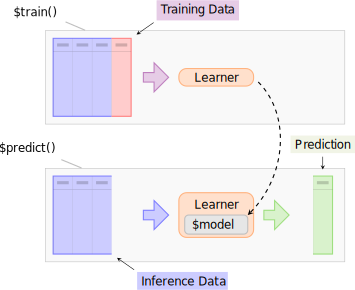

## Learners {#learners}

Objects of class `r ref("mlr3::Learner")` provide a unified interface to many popular machine learning algorithms in R.
They consist of methods to train and predict a model for a `r ref("mlr3::Task")` and provide meta-information about the learners, such as the hyperparameters you can set.

The package ships with a minimal set of classification and regression learners to avoid lots of dependencies:

* `r ref("mlr_learners_classif.featureless")`: Simple baseline classification learner, constantly predicts the label that is most frequent in the training set.
* `r ref("mlr_learners_classif.rpart")`: Single classification tree from `r cran_pkg("rpart")`.
* `r ref("mlr_learners_regr.featureless")`: Simple baseline regression learner, constantly predicts with the mean.
* `r ref("mlr_learners_regr.rpart")`: Single regression tree from `r cran_pkg("rpart")`.

Some of the most popular learners are connected via the `r mlr_pkg("mlr3learners")` package:

* (penalized) linear and logistic regression
* $k$-Nearest Neighbors regression and classification
* Linear and Quadratic Discriminant Analysis
* Naive Bayes
* Support-Vector machines
* Gradient Boosting
* Random Regression Forests and Random Classification Forests
* Kriging

More learners are collected in the [mlr3extralearners repository](https://github.com/mlr-org/mlr3extralearners/). A full list of implemented learners across is given in [this interactive list](https://mlr3extralearners.mlr-org.com/articles/learners/list_learners.html) and also via `mlr3extralearners::list_mlr3learners()`. The latest build status of all learners is listed [here](https://mlr3extralearners.mlr-org.com/articles/learners/learner_status.html).

Below a graphical illustration of the role of a learner:


```{r 02-basics-learners-001, echo = FALSE}

```


The base class of each learner is `r ref("Learner")`, specialized for regression as `r ref("LearnerRegr")` and for classification as `r ref("LearnerClassif")`.
In contrast to the `r ref("Task")`, the creation of a custom Learner is usually not required and a more advanced topic.
Hence, we refer the reader to Section \@ref(extending-learners) and proceed with an overview of the interface of already implemented learners.

### Predefined Learners {#learners-predefined}

Similar to `r ref("mlr_tasks")`, the `r ref("Dictionary")` `r ref("mlr_learners")` can be queried for available learners:

```{r 02-basics-learners-002}
library("mlr3learners")
mlr_learners
```

Each learner has the following information:

* `feature_types`: the type of features the learner can deal with.
* `packages`: the packages required to train a model with this learner and make predictions.
* `properties`: additional properties and capabilities.
  For example, a learner has the property "missings" if it is able to handle missing feature values, and "importance" if it computes and allows to extract data on the relative importance of the features.
  A complete list of these is available in the mlr3 reference on [regression learners](https://mlr3.mlr-org.com/reference/LearnerRegr.html#construction) and [classification learners](https://mlr3.mlr-org.com/reference/LearnerClassif.html#construction).
* `predict_types`: possible prediction types. For example, a classification learner can predict labels ("response") or probabilities ("prob"). For a complete list of possible predict types see the [mlr3 reference](https://mlr3.mlr-org.com/reference/Learner.html#construction).

For a tabular overview of integrated learners, see Section \@ref(list-learners).

You can get a specific learner using its `id`, listed under `key` in the dictionary:

```{r 02-basics-learners-003}
learner = mlr_learners$get("classif.rpart")
print(learner)
```

The field `param_set` stores a description of the hyperparameters the learner has, their ranges, defaults, and current values:

```{r 02-basics-learners-004}
learner$param_set
```

The set of current hyperparameter values is stored in the `values` field of the `param_set` field.
You can change the current hyperparameter values by assigning a named list to this field:

```{r 02-basics-learners-005}
learner$param_set$values = list(cp = 0.01, xval = 0)
learner
```

Note that this operation just overwrites all previously set parameters.
If you just want to add or update hyperparameters, you can use `r ref("mlr3misc::insert_named()")`:

```{r 02-basics-learners-006}
learner$param_set$values = mlr3misc::insert_named(
  learner$param_set$values,
  list(cp = 0.02, minsplit = 2)
)
learner
```

This updates `cp` to `0.02`, sets `minsplit` to `2` and keeps the previously set parameter `xval`.

Again, there is an alternative to writing down the lengthy `mlr_learners$get()` part: `r ref("lrn()")`.
This function additionally allows to construct learners with specific hyperparameters or settings of a different identifier in one go:

```{r 02-basics-learners-007}
lrn("classif.rpart", id = "rp", cp = 0.001)
```

If you pass hyperparameters here, they are added to the parameters in a `r ref("mlr3misc::insert_named()", text = "insert_named()")`-fashion.
