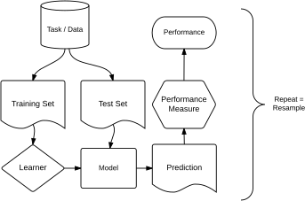

# Basics {#basics}

This chapter will teach you the essential building blocks of `r mlr_pkg("mlr3")`, as well as its R6 classes and operations used for machine learning.
A typical machine learning workflow looks like this:

```{r 02-basics-001, echo = FALSE}

```

The data, which `r mlr_pkg("mlr3")` encapsulates in [tasks](#tasks), is split into non-overlapping training and test sets.
Since we are interested in models that extrapolate to new data rather than just memorizing the training data, the separate test data allows to objectively evaluate models with respect to generalization.
The training data is given to a machine learning algorithm, which we call a [learner](#learners) in `r mlr_pkg("mlr3")`.
The [learner](#learners) uses the training data to build a model of the relationship of the input features to the output target values.
This model is then used to produce [predictions](#predicting) on the test data, which are compared to the ground truth values to assess the quality of the model.
`r mlr_pkg("mlr3")` offers a number of different [measures](#measure) to quantify how well a model performs based on the difference between predicted and actual values.
Usually this [measure](#measure) is a numeric score.

The process of splitting up data into training and test sets, building a model, and evaluating it may be repeated several times, [resampling](#resampling) different training and test sets from the original data each time.
Multiple [resampling iterations](#resampling) allow us to get a better, more generalizable performance estimate for a particular type of model as it is tested under different conditions and less likely to get lucky or unlucky because of a particular way the data was resampled.

In many cases, this simple workflow is not sufficient to deal with real-world data, which may require normalization, imputation of missing values, or feature selection.
We will cover more complex workflows that allow to do this and even more later in the book.

This chapter covers the following subtopics:

**Tasks**

Tasks encapsulate the data with meta-information, such as the name of the prediction target column.
We cover how to:

* access [predefined tasks](#tasks-predefined),
* specify a [task type](#tasks-types),
* create a [task](#tasks-creation),
* work with a task's [API](#tasks-api),
* assign roles to [rows and columns](#tasks-roles) of a task,
* implement [task mutators](#tasks-mutators), and
* [retrieve the data](#tasks-retrieved) that is stored in a task.

**Learners**

[Learners](#learners) encapsulate machine learning algorithms to train models and make predictions for a [task](#tasks).
They are provided by R and other packages.
We cover how to:

* access the set of [classification and regression learners](#learners-predefined) that come with mlr3 and retrieve a specific learner,
* access the set of [hyperparameter values](#learners-predefined) of a learner and modify them.

How to modify and extend learners is covered in a supplemental [advanced technical section](#extending-learners).

**Train and predict**

The section on the [train and predict methods](#train-predict) illustrates how to use [tasks](#tasks) and [learners](#learners) to train a model and make [predictions](#predicting) on a new data set.
In particular, we cover how to:

* properly set up [tasks](#train-predict-objects) and [learners](#train-predict-objects),
* set up [train and test splits](#split-data) for a task,
* [train](#training) the learner on the training set to produce a model,
* generate [predictions](#predicting) on the test set, and
* assess the [performance](#measure) of the model by comparing predicted and actual values.

**Resampling**

A [resampling](#resampling) is a method to create training and test splits.
We cover how to

* access and select [resampling strategies](#resampling-settings),
* instantiate the [split into training and test sets](#resampling-inst) by applying the resampling, and
* execute the resampling to obtain [results](#resampling-exec).

Additional information on resampling can be found in the section about [nested resampling](#nested-resampling) and in the chapter on [model optimization](#optimization).

**Benchmarking**

[Benchmarking](#benchmarking) is used to compare the performance of different models, for example models trained with different learners, on different tasks, or with different resampling methods.
We cover how to

* create a [benchmarking design](#bm-design),
* [execute a design](#bm-exec) and aggregate results, and
* convert benchmarking objects to [resample objects](#bm-resamp).

**Binary classification**

[Binary classification](#binary-classification) is a special case of classification where the target variable to predict has only two possible values.
In this case, additional considerations apply; in particular:

* [ROC curves](#binary-roc) and the threshold where to predict one class versus the other, and
* threshold tuning (WIP).

Before we get into the details of how to use `r mlr_pkg("mlr3")` for machine learning, we give a brief introduction to R6 as it is a relatively new part of R.
`r mlr_pkg("mlr3")` heavily relies on R6 and all basic building blocks it provides are R6 classes:

* [tasks](#tasks),
* [learners](#learners),
* [measures](#measures), and
* [resamplings](#resampling).
