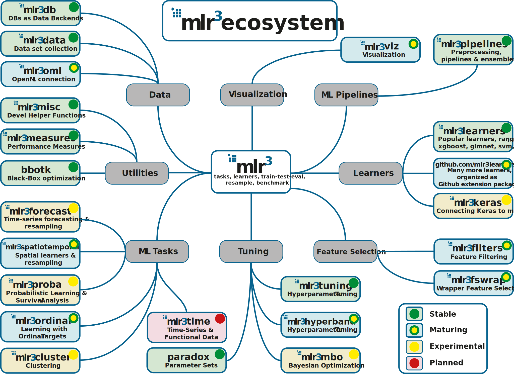

---
output: html_document
--

# Basics {#basics}

This chapter will teach you the essential building blocks, R6 classes, and operations of `r mlr_pkg("mlr3")` for machine learning.
A typical machine learning workflow looks like this:

```{r 02-basics-001, echo = FALSE}

```

The data, which `r mlr_pkg("mlr3")` encapsulates in [tasks](#tasks), is split into non-overlapping training and test sets.
We are interested in models that generalize to new data rather than just memorizing the training data, and separate test data allows to objectively evaluate models with respect to that.
The training data is given to a machine learning algorithm, which we call a [learner](#learners) in `r mlr_pkg("mlr3")`.
The [learner](#learners) uses the training data to build a model of the relationship of the input features to the output target values.
This model is then used to produce [predictions](#predicting) on the test data, which are compared to the ground truth values to assess the quality of the model.
`r mlr_pkg("mlr3")` offers a number of different [measures](#measure) to quantify how well a model performs based on the difference between predicted and actual values.
Usually this [measure](#measure) is a numeric score.

The process of splitting up data into training and test sets, building a model, and evaluating it may be repeated several times, [resampling](#resampling) different training and test sets from the original data each time.
Multiple [resampling iterations](#resampling) allow us to get a better generalization performance estimate for a particular type of model as it is tested under different conditions and less likely to get lucky or unlucky because of a particular way the data was resampled.

In many cases, this simple workflow is not sufficient to deal with real-world data, which may require normalization, imputation of missing values, or feature selection.
We will cover more complex workflows that allow to do this and even more later in the book.

This chapter covers the following subtopics:

**Tasks**

Tasks encapsulate the data with meta-information, such as the name of the prediction target column.
We cover how to:

* access [predefined tasks](#tasks-predefined),
* specify a [task type](#tasks-types),
* create a [task](#tasks-creation),
* work with a task's [API](#tasks-api),
* assign roles to [rows and collums](#tasks-roles) of a task,
* implement [task mutators](#tasks-mutators), and
* [retrieve the data](#tasks-retrieved) that is stored in a task.

**Learners**

[Learners](#learners) encapsulate machine learning algorithms to train models and make predictions for a [task](#tasks).
They are provided by R and other packages.
We cover how to:

* access the set of [classification and regression learners](#learners-predefined) that come with mlr3 and retrieve a specific learner,
* access the set of [hyperparameter values](#learners-predefined) of a learner and modify them.

How to modify and extend learners is covered in a supplemental [advanced technical section](#ext-learner).

**Train and predict**

The section on the [train and predict methods](#train-predict) illustrates how to use [tasks](#tasks) and [learners](#learners) to train a model and make [predictions](#predicting) on a new data set.
In particular, we cover how to:

* set up [tasks](#train-predict-objects) and [learners](#train-predict-objects) properly,
* set up [train and test splits](#split-data) for a task,
* [train](#training) the learner on the training set to produce a model,
* generate [predictions](#predicting) on the test set, and
* assess the [performance](#measure) of the model by comparing predicted and actual values.

**Resampling**

A [resampling](#resampling) is a method to create training and test splits.
We cover how to

* access and select [resampling strategies](#resampling-settings),
* instantiate the [split into training and test sets](#resampling-inst) by applying the resampling, and
* execute the resampling to obtain [results](#resampling-exec).

Additional information on resampling can be found in the section about [nested resampling](#nested-resampling) and in the chapter on [model optimization](#model-optim).

**Benchmarking**

[Benchmarking](#benchmarking) is used to compare the performance of different models, for example models trained with different learners, on different tasks, or with different resampling methods.
We cover how to

* create a [benchmarking design](#bm-design),
* [execute a design](#bm-exec) and aggregate results, and
* convert benchmarking objects to [resample objects](#bm-resamp).

**Binary classification**

[Binary classification](#binary) is a special case of classification where the target variable to predict has only two possible values.
In this case, additional considerations apply; in particular:

* [ROC curves](#binary-roc) and the threshold where to predict one class versus the other, and
* threshold tuning (WIP).

Before we get into the details of how to use `r mlr_pkg("mlr3")` for machine learning, we give a brief introduction to R6 as it is a relatively new part of R.
`r mlr_pkg("mlr3")` heavily relies on R6 and all basic building blocks it provides are R6 classes:

* [tasks](#tasks),
* [learners](#learners),
* [measures](#measures), and
* [resamplings](#resampling).

## Quick R6 Intro for Beginners {#r6}

R6 is one of R's more recent dialects for object-oriented programming (OO).
It addresses shortcomings of earlier OO implementations in R, such as S3, which we used in `r mlr_pkg("mlr")`.
If you have done any object-oriented programming before, R6 should feel familiar.
We focus on the parts of R6 that you need to know to use `r mlr_pkg("mlr3")` here.

* Objects are created by calling the constructor of an `R6Class()` object, specifically the `$new()` method.
  For example, `foo = Foo$new(bar = 1)` creates a new object of class `Foo`, setting the `bar` argument of the constructor to `1`.
* Classes have mutable state, which is encapsulated in their fields, which can be accessed through the dollar operator.
  We can access the `bar` value in the `Foo` class through `foo$bar` and set its value by assigning the field, e.g. `foo$bar = 2`.
* In addition to fields, objects expose methods that may allow to inspect the object's state, retrieve information, or perform an action that may change the internal state of the object.
  For example, the `$train` method of a learner changes the internal state of the learner by building and storing a trained model, which can then be used to make predictions given data.
* Objects can have public and private fields and methods.
  In `r mlr_pkg("mlr3")`, you can only access the public variables and methods.
  Private fields and methods are only relevant to change or extend `r mlr_pkg("mlr3")`.
* R6 variables are references to objects rather then the actual objects, which are stored in an environment.
  For example `foo2 = foo` does not create a copy of `foo` in `foo2`, but another reference to the same actual object.
  Setting `foo$bar = 3` will also change `foo2$bar` to `3` and vice versa.
* To copy an object, use the `$clone()` method and the `deep = TRUE` argument for nested objects, for example `foo2 = foo$clone(deep = TRUE)`.

Here is an overview of the extension packages of mlr:

```{r 02-basics-002, echo = FALSE, fig.align='center', out.width="98%"}

```

For further information see [wiki](https://github.com/mlr-org/mlr3/wiki/Extension-Packages) for short descriptions and links to the respective repositories.

For more details on R6, have a look at the [R6 vignettes](https://r6.r-lib.org/).

## Tasks {#tasks}

Tasks are objects that contain the data and additional meta-data for a machine learning problem.
The meta-data is for example the name of the target variable (the prediction) for supervised machine learning problems, or the type of the dataset (e.g. a _spatial_ or _survival_).
This information is used for specific operations that can be performed on a task.

### Task Types {#tasks-types}

To create a task from a `r ref("data.frame()")` or `r ref("data.table()")` object, the task type needs to be specified:

**Classification Task**: The target is a label (stored as `character()`or`factor()`) with only few distinct values.
<br/>→ `r ref("mlr3::TaskClassif")`

**Regression Task**: The target is a numeric quantity (stored as `integer()` or `double()`).
<br/>→ `r ref("mlr3::TaskRegr")`

**Survival Task**: The target is the (right-censored) time to an event.
<br/>→ `r ref("mlr3proba::TaskSurv")` in add-on package `r mlr_pkg("mlr3proba")`

**Ordinal Regression Task**: The target is ordinal.
<br/>→ `r ref("mlr3ordinal::TaskOrdinal")` in add-on package `r mlr_pkg("mlr3ordinal")`

**Cluster Task**: An unsupervised task type; there is no target and the aim is to identify similar groups within the feature space.
<br/>→ Not yet implemented

**Spatial Task**: Observations in the task have spatio-temporal information (e.g. coordinates).
<br/>→ Not yet implemented, but started in add-on package `r mlr_pkg("mlr3spatiotemporal")`

### Task Creation {#tasks-creation}

As an example, we will create a regression task using the `mtcars` data set from the package `datasets` and predict the target `"mpg"` (miles per gallon).
We only consider the first two features in the dataset for brevity.

First, we load and prepare the data.

```{r 02-basics-003}
data("mtcars", package = "datasets")
data = mtcars[, 1:3]
str(data)
```

Next, we create the task using the constructor for a regression task object (`TaskRegr$new`) and give the following information:

1. `id`: An arbitrary identifier for the task, used in plots and summaries.
2. `backend`: This parameter allows fine-grained control over how data is accessed.
   Here, we simply provide the dataset which is automatically converted to a `r ref("DataBackendDataTable")`.
   Alternatively, we could also construct a `r ref("DataBackend")` manually.
3. `target`: The name of the target column for the regression problem.

```{r 02-basics-004}
library(mlr3)

task_mtcars = TaskRegr$new(id = "cars", backend = data, target = "mpg")
print(task_mtcars)
```

The `print()` method gives a short summary of the task:
It has `r task_mtcars$nrow` observations and `r task_mtcars$ncol` columns, of which `r length(task_mtcars$feature_names)` are features.

We can also plot the task using the `r mlr_pkg("mlr3viz")` package, which gives a graphical summary of its properties:

```{r 02-basics-005}
library(mlr3viz)
autoplot(task_mtcars, type = "pairs")
```

### Predefined tasks {#tasks-predefined}

`r mlr_pkg("mlr3")` ships with a few predefined machine learning tasks.
All tasks are stored in an R6 `r ref("Dictionary")` (a key-value store) named `r ref("mlr_tasks")`.
Printing it gives the keys (the names of the datasets):

```{r 02-basics-006}
mlr_tasks
```

We can get a more informative summary of the example tasks by converting the dictionary to a `data.table()` object:

```{r 02-basics-007}
library(data.table)
as.data.table(mlr_tasks)
```

To get a task from the dictionary, one can use the `$get()` method from the `mlr_tasks` class and assign the return value to a new object.
For example, to use the [iris data set](https://en.wikipedia.org/wiki/Iris_flower_data_set) for classification:

```{r 02-basics-008}
task_iris = mlr_tasks$get("iris")
print(task_iris)
```

Alternatively, you can also use the convenience function `r ref("tsk()")`, which also constructs a task from the dictionary.

```{r 02-basics-009}
tsk("iris")
```

### Task API {#tasks-api}

All task properties and characteristics can be queried using the task's public fields and methods (see `r ref("Task")`).
Methods are also used to change the behavior of the task.

#### Retrieving Data {#tasks-retrieving}

The data stored in a task can be retrieved directly from fields, for example:

```{r 02-basics-010}
task_iris$nrow
task_iris$ncol
```

More information can be obtained through methods of the object, for example:

```{r 02-basics-011}
task_iris$data()
```

In `r mlr_pkg("mlr3")`, each row (observation) has a unique identifier, stored as an `intger()`.
These can be passed as arguments to the `$data()` method to select specific rows:

```{r 02-basics-012}
# iris uses integer row_ids
head(task_iris$row_ids)

# retrieve data for rows with ids 1, 51, and 101
task_iris$data(rows = c(1, 51, 101))
```

The _mtcars_ task on the other hand uses names for its `row_ids`, encoded as `character`:

```{r 02-basics-013}
task_mtcars = tsk("mtcars")
head(task_mtcars$row_ids)

# retrieve data for rows with id "Datsun 710"
task_mtcars$data(rows = "Datsun 710")
```

Note that the method `$data()` only allows to read the data and does not modify it.

Similarly, each column has an identifier or name.
These names are stored in the public slots `feature_names` and `target_names`.
Here "target" refers to the variable we want to predict and "feature" to the predictors for the task.

```{r 02-basics-014}
task_iris$feature_names
task_iris$target_names
```

The `row_id`s and column names can be combined when selecting a subset of the data:

```{r 02-basics-015}
# retrieve data for rows 1, 51, and 101 and only select column "Species"
task_iris$data(rows = c(1, 51, 101), cols = "Species")
```

To extract the complete data from the task, one can simply convert it to a `data.table`:

```{r 02-basics-016}
summary(as.data.table(task_iris))
```

#### Roles (Rows and Columns) {#tasks-roles}

It is possible to assign roles to rows and columns.
These roles affect the behavior of the task for different operations.
Furthermore, these roles provide additional meta-data for it.

For example, the previously-constructed _mtcars_ task has the following column roles:

```{r 02-basics-017}
print(task_mtcars$col_roles)
```

To add the row names of `mtcars` as an additional feature, we first add them to the data table and then recreate the task.

```{r 02-basics-018}
# with `keep.rownames`, data.table stores the row names in an extra column "rn"
data = as.data.table(mtcars[, 1:3], keep.rownames = TRUE)
task = TaskRegr$new(id = "cars", backend = data, target = "mpg")

# we now have integer row_ids
task$row_ids

# there is a new feature called "rn"
task$feature_names
```

The row names are now a feature whose values are stored in the column "rn".
We include this column here for educational purposes only.
Generally speaking, there is no point in having a feature that uniquely identifies each row.
Furthermore, the character data type will cause problems with many types of machine learning algorithms.
The identifier may be useful to label points in plots and identify outliers however.
To use the new column for only this purpose, we will change the role of the "rn" column and remove it from the set of active features.

```{r 02-basics-019}
task$feature_names

# working with a list of column vectors
task$col_roles$name = "rn"
task$col_roles$feature = setdiff(task$col_roles$feature, "rn")

# "rn" not listed as feature anymore
task$feature_names

# does also not appear when we access the data anymore
task$data(rows = 1:2)
task$head(2)
```

Changing the role does not change the underlying data.
Changing the role only changes the view on it.
The data is not copied in the code above.
The view is changed in-place though, i.e. the task object itself is modified.

Just like columns, it is also possible to assign different roles to rows.

Rows can have two different roles:

1. Role `use`:
Rows that are generally available for model fitting (although they may also be used as test set in resampling).
This role is the default role.

2. Role `validation`:
Rows that are not used for training.
Rows that have missing values in the target column during task creation are automatically set to the validation role.

There are several reasons to hold some observations back or treat them differently:

1. It is often good practice to validate the final model on an external validation set to identify possible overfitting.
2. Some observations may be unlabeled, e.g. in competitions like [Kaggle](https://www.kaggle.com/).

These observations cannot be used for training a model, but can be used to get predictions.

#### Task Mutators {#tasks-mutators}

As shown above, modifying `$col_roles` or `$row_roles` changes the view on the data.
The additional convenience method `$filter()` subsets the current view based on row ids and `$select()` subsets the view based on feature names.

```{r 02-basics-020}
task = tsk("iris")
task$select(c("Sepal.Width", "Sepal.Length")) # keep only these features
task$filter(1:3) # keep only these rows
task$head()
```

While the methods discussed above allow to subset the data, the methods `$rbind()` and `$cbind()` allow to add extra rows and columns to a task.
Again, the original data is not changed.
The additional rows or columns are only added to the view of the data.

```{r 02-basics-021}
task$cbind(data.table(foo = letters[1:3])) # add column foo
task$head()
```

### Plotting Tasks {#autoplot-task}

The `r mlr_pkg("mlr3viz")` package provides plotting facilities for many classes implemented in `r mlr_pkg("mlr3")`.
The available plot types depend on the inherited class, but all plots are returned as `r cran_pkg("ggplot2")` objects which can be easily customized.

For classification tasks (inheriting from `r ref("TaskClassif")`), see the documentation of `r ref("mlr3viz::autoplot.TaskClassif")` for the implemented plot types.
Here are some examples to get an impression:

```{r 02-basics-022, warning = FALSE, message = FALSE}
library(mlr3viz)

# get the pima indians task
task = tsk("pima")

# subset task to only use the 3 first features
task$select(head(task$feature_names, 3))

# default plot: class frequencies
autoplot(task)

# pairs plot (requires package GGally)
autoplot(task, type = "pairs")

# duo plot (requires package GGally)
autoplot(task, type = "duo")
```

Of course, you can do the same for regression tasks (inheriting from `r ref("TaskRegr")`) as documented in `r ref("mlr3viz::autoplot.TaskRegr")`:

```{r 02-basics-023, warning = FALSE, message = FALSE}
library(mlr3viz)

# get the boston housing task
task = tsk("mtcars")

# subset task to only use the 3 first features
task$select(head(task$feature_names, 3))

# default plot: boxplot of target variable
autoplot(task)

# pairs plot (requires package GGally)
autoplot(task, type = "pairs")
```


## Learners {#learners}

Objects of class `r ref("mlr3::Learner")` provide a unified interface to many popular machine learning algorithms in R.
They consist of methods to train and predict a model for a `r ref("mlr3::Task")` and provide meta-information about the learners, such as the hyperparameters you can set.

The package ships with a minimal set of classification and regression learners to avoid lots of dependencies:

* `r ref("mlr_learners_classif.featureless")`: Simple baseline classification learner, constantly predicts the label that is most frequent in the training set.
* `r ref("mlr_learners_classif.rpart")`: Single classification tree from `r cran_pkg("rpart")`.
* `r ref("mlr_learners_regr.featureless")`: Simple baseline regression learner, constantly predicts with the mean.
* `r ref("mlr_learners_regr.rpart")`: Single regression tree from `r cran_pkg("rpart")`.

Some of the most popular learners are connected via the `r mlr_pkg("mlr3learners")` package:

* (penalized) linear and logistic regression
* $k$-Nearest Neighbors regression and classification
* Linear and Quadratic Discriminant Analysis
* Naive Bayes
* Support-Vector machines
* Gradient Boosting
* Random Regression Forests and Random Classification Forests
* Kriging

More learners are collected on GitHub in the [mlr3learners organization](https://github.com/mlr3learners/).
Their state is also listed on the [wiki](https://github.com/mlr-org/mlr3learners/wiki) of the [mlr3learners repository](https://github.com/mlr-org/mlr3learners/).
Below a graphical illustration of the role of a learner:


```{r 02-basics-024, echo = FALSE}
knitr::include_graphics("images/learner.svg")
```


The base class of each learner is `r ref("Learner")`, specialized for regression as `r ref("LearnerRegr")` and for classification as `r ref("LearnerClassif")`.
In contrast to the `r ref("Task")`, the creation of a custom Learner is usually not required and a more advanced topic.
Hence, we refer the reader to Section \@ref(ext-learner) and proceed with an overview of the interface of already implemented learners.

### Predefined Learners {#learners-predefined}

Similar to `r ref("mlr_tasks")`, the `r ref("Dictionary")` `r ref("mlr_learners")` can be queried for available learners:

```{r 02-basics-025}
library(mlr3learners)
mlr_learners
```

Each learner has the following information:

* `feature_types`: the type of features the learner can deal with.
* `packages`: the packages required to train a model with this learner and make predictions.
* `properties`: additional properties and capabilities.
  For example, a learner has the property "missings" if it is able to handle missing feature values, and "importance" if it computes and allows to extract data on the relative importance of the features.
  A complete list of these is available in the mlr3 reference on [regression learners](https://mlr3.mlr-org.com/reference/LearnerRegr.html#construction) and [classification learners](https://mlr3.mlr-org.com/reference/LearnerClassif.html#construction).
* `predict_types`: possible prediction types. For example, a classification learner can predict labels ("response") or probabilities ("prob"). For a complete list of possible predict types see the [mlr3 reference](https://mlr3.mlr-org.com/reference/Learner.html#construction).

For a tabular overview of integrated learners, see Section \@ref(list-learners).

You can get a specific learner using its `id`, listed under `key` in the dictionary:

```{r 02-basics-026}
learner = mlr_learners$get("classif.rpart")
print(learner)
```

The field `param_set` stores a description of the hyperparameters the learner has, their ranges, defaults, and current values:

```{r 02-basics-027}
learner$param_set
```

The set of current hyperparameter values is stored in the `values` field of the `param_set` field.
You can change the current hyperparameter values by assigning a named list to this field:

```{r 02-basics-028}
learner$param_set$values = list(cp = 0.01, xval = 0)
learner
```

Note that this operation just overwrites all previously set parameters.
If you just want to add or update hyperparameters, you can use `r ref("mlr3misc::insert_named()")`:

```{r 02-basics-029}
learner$param_set$values = mlr3misc::insert_named(
  learner$param_set$values,
  list(cp = 0.02, minsplit = 2)
)
learner
```

This updates `cp` to `0.02`, sets `minsplit` to `2` and keeps the previously set parameter `xval`.

Again, there is an alternative to writing down the lengthy `mlr_learners$get()` part: `r ref("lrn()")`.
This function additionally allows to construct learners with specific hyperparameters or settings of a different identifier in one go:

```{r 02-basics-030}
lrn("classif.rpart", id = "rp", cp = 0.001)
```

If you pass hyperparameters here, they are added to the parameters in a `r ref("mlr3misc::insert_named()", text = "insert_named()")`-fashion.

## Train and Predict {#train-predict}

In this section, we explain how [tasks](#tasks) and [learners](#learners) can be used to train a model and predict to a new dataset.
The concept is demonstrated on a supervised classification using the iris dataset and the **rpart** learner, which builds a singe classification tree.

Training a [learner](#learners) means fitting a model to a given data set.
Subsequently, we want to [predict](#predicting) the label for new observations.
These [predictions](#predicting) are compared to the ground truth values in order to assess the predictive performance of the model.

### Creating Task and Learner Objects {#train-predict-objects}

The first step is to generate the following `r mlr_pkg("mlr3")` objects from the [task dictionary](#tasks) and the [learner dictionary](#learners), respectively:

1. The classification [task](#tasks):

```{r 02-basics-031}
task = tsk("sonar")
```

2. A [learner](#learners) for the classification tree:

```{r 02-basics-032}
learner = lrn("classif.rpart")
```

### Setting up the train/test splits of the data {#split-data}

It is common to train on a majority of the data.
Here we use 80% of all available observations and predict on the remaining 20%.
For this purpose, we create two index vectors:

```{r 02-basics-033}
train_set = sample(task$nrow, 0.8 * task$nrow)
test_set = setdiff(seq_len(task$nrow), train_set)
```

In Section \@ref(resampling) we will learn how mlr3 can automatically create training and test sets based on different [resampling](#resampling) strategies.

### Training the learner {#training}

The field `$model` stores the model that is produced in the training step.
Before the `$train()` method is called on a learner object, this field is `NULL`:

```{r 02-basics-034}
learner$model
```

Next, the classification tree is trained using the train set of the iris task by calling the `$train()` method of the `r ref("Learner")`:

```{r 02-basics-035}
learner$train(task, row_ids = train_set)
```

This operation modifies the learner in-place.
We can now access the stored model via the field `$model`:

```{r 02-basics-036}
print(learner$model)
```

### Predicting {#predicting}

After the model has been trained, we use the remaining part of the data for prediction.
Remember that we [initially split the data](#split-data) in `train_set` and `test_set`.

```{r 02-basics-037}
prediction = learner$predict(task, row_ids = test_set)
print(prediction)
```

The `$predict()` method of the `r ref("Learner")` returns a `r ref("Prediction")` object.
More precisely, a `r ref("LearnerClassif")` returns a `r ref("PredictionClassif")` object.

A prediction objects holds the row ids of the test data, the respective true label of the target column and the respective predictions.
The simplest way to extract this information is by converting the `r ref("Prediction")` object to a `data.table()`:

```{r 02-basics-038}
head(as.data.table(prediction))
```

For classification, you can also extract the confusion matrix:

```{r 02-basics-039}
prediction$confusion
```

### Changing the Predict Type {#predict-type}

Classification learners default to predicting the class label.
However, many classifiers additionally also tell you how sure they are about the predicted label by providing posterior probabilities.
To switch to predicting these probabilities, the `predict_type` field of a `r ref("LearnerClassif")` must be changed from `"response"` to `"prob"` before training:

```{r 02-basics-040}
learner$predict_type = "prob"

# re-fit the model
learner$train(task, row_ids = train_set)

# rebuild prediction object
prediction = learner$predict(task, row_ids = test_set)
```

The prediction object now contains probabilities for all class labels:

```{r 02-basics-041}
# data.table conversion
head(as.data.table(prediction))

# directly access the predicted labels:
head(prediction$response)

# directly access the matrix of probabilities:
head(prediction$prob)
```

Analogously to predicting probabilities, many `r ref("LearnerRegr", text = "regression learners")` support the extraction of standard error estimates by setting the predict type to `"se"`.


### Plotting Predictions {#autoplot-prediction}

Analogously to [plotting tasks](#autoplot-task), `r mlr_pkg("mlr3viz")` provides a `r ref("ggplot2::autoplot()", text = "autoplot()")` method for `r ref("Prediction")` objects.
All available types are listed on the manual page of `r ref("autoplot.PredictionClassif()")` or `r ref("autoplot.PredictionClassif()")`, respectively.

```{r 02-basics-042, message = FALSE, warning = FALSE}
library(mlr3viz)

task = tsk("sonar")
learner = lrn("classif.rpart", predict_type = "prob")
learner$train(task)
prediction = learner$predict(task)
autoplot(prediction)
autoplot(prediction, type = "roc")
```

```{r 02-basics-043, message = FALSE, warning = FALSE}
library(mlr3viz)
library(mlr3learners)
local({ # we do this locally to not overwrite the objects from previous chunks
    task = tsk("mtcars")
    learner = lrn("regr.lm")
    learner$train(task)
    prediction = learner$predict(task)
    autoplot(prediction)
})
```


### Performance assessment {#measure}

The last step of modeling is usually the performance assessment.
To assess the quality of the predictions, the predicted labels are compared with the true labels.
How this comparison is calculated is defined by a measure, which is given by a `r ref("Measure")` object.
Note that if the prediction was made on a dataset without the target column, i.e. without true labels, then no performance can be calculated.

Predefined available measures are stored in `r ref("mlr_measures")` (with convenience getter `r ref("msr()")`):

```{r 02-basics-044}
mlr_measures
```

We choose **accuracy** (`r ref("mlr_measures_classif.acc", text = "classif.acc")`) as a specific performance measure and call the method `$score()` of the `r ref("Prediction")` object to quantify the predictive performance.

```{r 02-basics-045}
measure = msr("classif.acc")
prediction$score(measure)
```

Note that, if no measure is specified, classification defaults to classification error (`r ref("mlr_measures_classif.ce", text = "classif.ce")`) and regression defaults to the mean squared error (`r ref("mlr_measures_regr.mse", text = "regr.mse")`).

## Resampling {#resampling}

Resampling strategies are usually used to assess the performance of a learning algorithm.
`mlr3` entails 6 predefined [resampling](#resampling) strategies:
Cross-validation, Leave-one-out cross validation, Repeated cross-validation, Out-of-bag bootstrap and other variants (e.g. b632), Monte-Carlo cross-validation and Holdout.
The following sections provide guidance on how to set and select a resampling strategy and how to subsequently instantiate the resampling process.

Below you can find a graphical illustration of the resampling process:

```{r 02-optimization-graphics-38, echo=FALSE}

```

### Settings {#resampling-settings}

In this example we use the _iris_ task and a simple classification tree from the package `r cran_pkg("rpart")`.

```{r 02-basics-047}
task = tsk("iris")
learner = lrn("classif.rpart")
```

When performing resampling with a dataset, we first need to define which approach should be used.
The resampling strategies of mlr3 can be queried using the `$keys()` method of the `r ref("mlr_resamplings")` dictionary.

```{r 02-basics-048}
mlr_resamplings
```

Additional resampling methods for special use cases will be available via extension packages, such as `r gh_pkg("mlr-org/mlr3spatiotemporal")` for spatial data (still in development).

The model fit conducted in the [train/predict/score](#train-predict) chapter is equivalent to a "holdout resampling", so let's consider this one first.
Again, we can retrieve elements from the dictionary `r ref("mlr_resamplings")` via `$get()` or with the convenience function`r ref("rsmp()")`:

```{r 02-basics-049}
resampling = rsmp("holdout")
print(resampling)
```

Note that the `$is_instantiated` field is set to `FALSE`.
This means we did not actually apply the strategy on a dataset yet.
Applying the strategy on a dataset is done in the next section [Instantiation](#instantiation).

By default we get a .66/.33 split of the data.
There are two ways in which the ratio can be changed:

1. Overwriting the slot in `$param_set$values` using a named list:

```{r 02-basics-050}
resampling$param_set$values = list(ratio = 0.8)
```

2. Specifying the resampling parameters directly during construction:

```{r 02-basics-051}
rsmp("holdout", ratio = 0.8)
```

### Instantiation {#resampling-inst}

So far we just set the stage and selected the resampling strategy.

To actually perform the splitting and obtain indices for the training and the test split the resampling needs a `r ref("Task")`.
By calling the method `instantiate()`, splits into training and test set are calculated and stored in the `r ref("Resampling")` object:

```{r 02-basics-052}
resampling = rsmp("cv", folds = 3L)
resampling$instantiate(task)
resampling$iters
str(resampling$train_set(1))
str(resampling$test_set(1))
```

### Execution {#resampling-exec}

With a `r ref("Task")`, a `r ref("Learner")` and a `r ref("Resampling")` object we can call `r ref("resample()")` and create a `r ref("ResampleResult")` object.

Before we go into more detail, let's change the resampling to a "3-fold cross-validation" to better illustrate what operations are possible with a `r ref("ResampleResult")`.
Additionally, we tell `r ref("resample()")` to keep the fitted models via the flag `store_models`:

```{r 02-basics-053}
task = tsk("pima")
learner = lrn("classif.rpart", maxdepth = 3, predict_type = "prob")
resampling = rsmp("cv", folds = 3L)

rr = resample(task, learner, resampling, store_models = TRUE)
print(rr)
```

The following operations are supported with `r ref("ResampleResult")` objects:

* Calculate the average performance:

    ```{r 02-basics-054}
    rr$aggregate(msr("classif.ce"))
    ```

* Extract the performance for the individual resampling iterations:

    ```{r 02-basics-055}
    rr$score(msr("classif.ce"))
    ```

* Check for warnings or errors:

    ```{r 02-basics-056}
    rr$warnings
    rr$errors
    ```

* Extract and inspect the resampling splits:

    ```{r 02-basics-057}
    rr$resampling
    rr$resampling$iters
    str(rr$resampling$test_set(1))
    str(rr$resampling$train_set(1))
    ```

* Retrieve the [learner](#learners) of a specific iteration and inspect it:

    ```{r 02-basics-058}
    lrn = rr$learners[[1]]
    lrn$model
    ```

* Extract the predictions:

    ```{r 02-basics-059}
    rr$prediction() # all predictions merged into a single Prediction
    rr$predictions()[[1]] # prediction of first resampling iteration
    ```

Note that if you want to compare multiple [learners](#learners), you should ensure to that each learner operates on the same resampling instance by manually instantiating beforehand.
This reduces the variance of the performance estimation.

If your aim is to compare different `r ref("Task")`, `r ref("Learner")` or `r ref("Resampling")`, you are better off using the `r ref("benchmark()")` function, covered in the [next section](#benchmarking).
It is basically a wrapper around `r ref("resample()")` simplifying the handling of multiple settings.
If you discover this only after you've run multiple `r ref("resample()")` calls, don't worry.
You can combine multiple `r ref("ResampleResult")` objects into a `r ref("BenchmarkResult")` (also explained in the [next section](#benchmarking)).

### Custom resampling {#resamp-custom}

Sometimes it is necessary to perform resampling with custom splits.
If you want to do that because you are coming from a specific modeling field, first take a look at the mlr3 extension packages, to check wheter your resampling method has been implemented already.
If this is not the case, feel welcome to extend an existing package or create your own extension package.

A manual resampling instance can be created using the `"custom"` template.

```{r 02-basics-060}
resampling = rsmp("custom")
resampling$instantiate(task,
  train = list(c(1:10, 51:60, 101:110)),
  test = list(c(11:20, 61:70, 111:120))
)
resampling$iters
resampling$train_set(1)
resampling$test_set(1)
```

### Plotting Resample Results {#autoplot-resampleresult}

Again, `r mlr_pkg("mlr3viz")` provides a `r ref("ggplot2::autoplot()", text = "autoplot()")` method.

```{r 02-basics-061}
library(mlr3viz)

autoplot(rr)
autoplot(rr, type = "roc")
```

All available plot types are listed on the manual page of `r ref("autoplot.ResampleResult()")`.

## Benchmarking {#benchmarking}

Comparing the performance of different learners on multiple tasks and/or different resampling schemes is a recurrent task.
This operation is usually referred to as "benchmarking" in the field of machine-learning.
The `r mlr_pkg("mlr3")` package offers the `r ref("benchmark()")` function for convenience.

### Design Creation {#bm-design}

In mlr3 we require you to supply a "design" of your benchmark experiment.
By "design" we essentially mean the matrix of settings you want to execute.
A "design" consists of `r ref("Task")`, `r ref("Learner")` and `r ref("Resampling")`.

Here, we call `r ref("benchmark()")` to perform a single holdout split on a single task and two learners.
We use the `r ref("benchmark_grid()")` function to create an exhaustive design and  instantiate the resampling properly, so that all learners are executed on the same train/test split for each task:

```{r 02-basics-062}
library(data.table)
design = benchmark_grid(
  tasks = tsk("iris"),
  learners = list(lrn("classif.rpart"), lrn("classif.featureless")),
  resamplings = rsmp("holdout")
)
print(design)
bmr = benchmark(design)
```

Instead of using `r ref("benchmark_grid()")` you could also create the design manually as a `data.table` and use the full flexibility of the `r ref("benchmark()")` function.
The design does not have to be exhaustive, e.g. it can also contain a different learner for each task.
However, you should note that `r ref("benchmark_grid()")` makes sure to instantiate the resamplings for each task.
If you create the design manually, even if the same task is used multiple times, the train/test splits will be different for each row of the design if you do not [**manually instantiate**](#resampling-inst) the resampling before creating the design.


Let's construct a more complex design to show the full capabilities of the `r ref("benchmark()")` function.

```{r 02-basics-063}
# get some example tasks
tasks = lapply(c("german_credit", "sonar"), tsk)

# get some learners and for all learners ...
# * predict probabilities
# * predict also on the training set
library(mlr3learners)
learners = c("classif.featureless", "classif.rpart", "classif.ranger", "classif.kknn")
learners = lapply(learners, lrn,
  predict_type = "prob", predict_sets = c("train", "test"))

# compare via 3-fold cross validation
resamplings = rsmp("cv", folds = 3)

# create a BenchmarkDesign object
design = benchmark_grid(tasks, learners, resamplings)
print(design)
```

### Execution and Aggregation of Results {#bm-exec}

After the [benchmark design](#bm-design) is ready, we can directly call `r ref("benchmark()")`:

```{r 02-basics-064}
# execute the benchmark
bmr = benchmark(design)
```

Note that we did not instantiate the resampling instance manually.
`r ref("benchmark_grid()")` took care of it for us:
Each resampling strategy is instantiated once for each task during the construction of the exhaustive grid.

After the benchmark, we can calculate and aggregate the performance with `$aggregate()`:

```{r 02-basics-065}
# measures:
# * area under the curve (auc) on training
# * area under the curve (auc) on test
measures = list(
  msr("classif.auc", id = "auc_train", predict_sets = "train"),
  msr("classif.auc", id = "auc_test")
)
bmr$aggregate(measures)
```

Subsequently, we can aggregate the results further.
For example, we might be interested which learner performed best over all tasks simultaneously.
Simply aggregating the performances with the mean is usually not statistically sound.
Instead, we calculate the rank statistic for each learner grouped by task.
Then the calculated ranks grouped by learner are aggregated.
Since the AUC needs to be maximized, we multiply with $-1$ so that the best learner gets a rank of 1.

```{r 02-basics-066}
tab = bmr$aggregate(measures)
ranks = tab[, .(learner_id, rank_train = rank(-auc_train), rank_test = rank(-auc_test)), by = task_id]
print(ranks)

ranks[, .(mrank_train = mean(rank_train), mrank_test = mean(rank_test)), by = learner_id][order(mrank_test)]
```

Unsurprisingly, the featureless learner is outperformed.


### Plotting Benchmark Results {#autoplot-benchmarkresult}

Analogously to plotting [tasks](#autoplot-task), [predictions](#autoplot-prediction) or [resample results](#autoplot-resampleresult), `r mlr_pkg("mlr3viz")` also provides a `r ref("ggplot2::autoplot()", text = "autoplot()")` method for benchmark results.

```{r 02-basics-067}
library(mlr3viz)
library(ggplot2)

autoplot(bmr) + theme(axis.text.x = element_text(angle = 45, hjust = 1))
```

We can also plot ROC curves.
To do so, we first need to filter the `r ref("BenchmarkResult")` to only contain a single `r ref("Task")`:

```{r 02-basics-068}
autoplot(bmr$clone()$filter(task_id = "german_credit"), type = "roc")
```

All available types are listed on the manual page of `r ref("autoplot.BenchmarkResult()")`.

### Extracting ResampleResults {#bm-resamp}

A `r ref("BenchmarkResult")` object is essentially a collection of multiple `r ref("ResampleResult")` objects.
As these are stored in a column of the aggregated `data.table()`, we can easily extract them:

```{r 02-basics-069}
tab = bmr$aggregate(measures)
rr = tab[task_id == "sonar" & learner_id == "classif.ranger"]$resample_result[[1]]
print(rr)
```

We can now investigate this resampling and even single resampling iterations using one of the approaches shown in [the previous section](#bm-exec):

```{r 02-basics-070}
measure = msr("classif.auc")
rr$aggregate(measure)

# get the iteration with worst AUC
perf = rr$score(measure)
i = which.min(perf$classif.auc)

# get the corresponding learner and train set
print(rr$learners[[i]])
head(rr$resampling$train_set(i))
```

### Converting and Merging ResampleResults

It is also possible to cast a single `r ref("ResampleResult")` to a `r ref("BenchmarkResult")` using the converter `r ref("as_benchmark_result()")`.

```{r 02-basics-071}
task = tsk("iris")
resampling = rsmp("holdout")$instantiate(task)

rr1 = resample(task, lrn("classif.rpart"), resampling)
rr2 = resample(task, lrn("classif.featureless"), resampling)

# Cast both ResampleResults to BenchmarkResults
bmr1 = as_benchmark_result(rr1)
bmr2 = as_benchmark_result(rr2)

# Merge 2nd BMR into the first BMR
bmr1$combine(bmr2)

bmr1
```

## Binary classification {#binary}

Classification problems with a target variable containing only two classes are called "binary".
For such binary target variables, you can specify the *positive class* within the `r ref("TaskClassif", text = "classification task")` object during task creation.
If not explicitly set during construction, the positive class defaults to the first level of the target variable.

```{r 02-basics-072}
# during construction
data("Sonar", package = "mlbench")
task = TaskClassif$new(id = "Sonar", Sonar, target = "Class", positive = "R")

# switch positive class to level 'M'
task$positive = "M"
```

### ROC Curve and Thresholds {#binary-roc}

ROC Analysis, which stands for "receiver operating characteristics", is a subfield of machine learning which studies the evaluation of binary prediction systems.
We saw earlier that one can retrieve the confusion matrix of a `r ref("Prediction")` by accessing the `$confusion` field:

```{r 02-basics-073}
learner = lrn("classif.rpart", predict_type = "prob")
pred = learner$train(task)$predict(task)
C = pred$confusion
print(C)
```

The confusion matrix contains the counts of correct and incorrect class assignments, grouped by class labels.
The columns illustrate the true (observed) labels and the rows display the predicted labels.
The positive is always the first row or column in the confusion matrix.
Thus, the element in $C_{11}$ is the number of times our model predicted the positive class and was right about it.
Analogously, the element in $C_{22}$ is the number of times our model predicted the negative class and was also right about it.
The elements on the diagonal are called True Positives (TP) and True Negatives (TN).
The element $C_{12}$ is the number of times we falsely predicted a positive label, and is called False Positives (FP).
The element $C_{21}$ is called False Negatives (FN).

We can now normalize in rows and columns of the confusion matrix to derive several informative metrics:

* **True Positive Rate (TPR)**: How many of the true positives did we predict as positive?
* **True Negative Rate (TNR)**: How many of the true negatives did we predict as negative?
* **Positive Predictive Value PPV**: If we predict positive how likely is it a true positive?
* **Negative Predictive Value NPV**: If we predict negative how likely is it a true negative?


```{r 02-basics-074, echo = FALSE, out.width="98%"}
knitr::include_graphics("images/confusion_matrix.png")
```

Source: [Wikipedia](https://en.wikipedia.org/wiki/Evaluation_of_binary_classifiers)


It is difficult to achieve a high TPR and low FPR in conjunction, so one uses them for constructing the ROC Curve.
We characterize a classifier by its TPR and FPR values and plot them in a coordinate system.
The best classifier lies on the top-left corner.
The worst classifier lies at the diagonal.
<!-- FIXME Why is the best classifier on the top-left? The argument here only shows that classifiers at the diagonal are inferior but there is no argument in place, illustrating why the other (top left) classifiers are superior. -->
Classifiers lying on the diagonal produce random labels (with different proportions).
If each positive $x$ will be randomly classified with 25\% as "positive", we get a TPR of 0.25.
If we assign each negative $x$ randomly to "positive" we get a FPR of 0.25.
In practice, we should never obtain a classifier below the diagonal, as inverting the predicted labels will result in a reflection at the diagonal.
<!-- FIXME Why is that reflection bad as such ? One sentence to elaborate would add here-->

A scoring classifier is a model which produces scores or probabilities, instead of discrete labels.
To obtain probabilities from a learner in mlr3, you have to set `predict_type = "prob"` for a `ref("LearnerClassif")`.
Whether a classifier can predict probabilities is given in its `$predict_types` field.
Thresholding flexibly converts measured probabilities to labels.
Predict $1$ (positive class) if $\hat{f}(x) > \tau$ else predict $0$.
Normally, one could use $\tau = 0.5$ to convert probabilities to labels, but for imbalanced or cost-sensitive situations another threshold could be more suitable.
After thresholding, any metric defined on labels can be used.

For `mlr3` prediction objects, the ROC curve can easily be created with `r mlr_pkg("mlr3viz")` which relies on the `r cran_pkg("precrec")` to calculate and plot ROC curves:

```{r 02-basics-075}
# TPR vs FPR / Sensitivity vs (1 - Specificity)
ggplot2::autoplot(pred, type = "roc")

# Precision vs Recall
ggplot2::autoplot(pred, type = "prc")
```

### Threshold Tuning

<!--
When we are interested in class labels based on scores or probabilities, we can set the classification threshold according to our target performance measure.
This threshold however can also be **tuned**, since the optimal threshold might differ for different (custom) measures or in situations like const-sensitive classification.

This can be also done with `mlr3`.
-->
