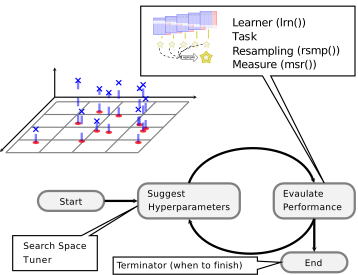

## Hyperparameter Tuning {#tuning}


Hyperparameters are second-order parameters of machine learning models that, while often not explicitly optimized during the model estimation process, can have an important impact on the outcome and predictive performance of a model.
Typically, hyperparameters are fixed before training a model.
However, because the output of a model can be sensitive to the specification of hyperparameters, it is often recommended to make an informed decision about which hyperparameter settings may yield better model performance.
In many cases, hyperparameter settings may be chosen _a priori_, but it can be advantageous to try different settings before fitting your model on the training data.
This process is often called model 'tuning'.

Hyperparameter tuning is supported via the `r mlr_pkg("mlr3tuning")` extension package.
Below you can find an illustration of the process:

```{r 03-optimization-tuning-001, echo = FALSE}

```

At the heart of `r mlr_pkg("mlr3tuning")` are the R6 classes:

* `r ref("TuningInstanceSingleCrit")`, `r ref("TuningInstanceMultiCrit")`: These two classes describe the tuning problem and store the results.
* `r ref("Tuner")`: This class is the base class for implementations of tuning algorithms.

### The `TuningInstance*` Classes {#tuning-optimization}

The following sub-section examines the optimization of a simple classification tree on the `r ref("mlr_tasks_pima", text = "Pima Indian Diabetes")` data set.

```{r 03-optimization-tuning-002}
task = tsk("pima")
print(task)
```

We use the classification tree from `r cran_pkg("rpart")` and choose a subset of the hyperparameters we want to tune.
This is often referred to as the "tuning space".

```{r 03-optimization-tuning-003}
learner = lrn("classif.rpart")
learner$param_set
```

Here, we opt to tune two parameters:

* The complexity `cp`
* The termination criterion `minsplit`

The tuning space needs to be bounded, therefore one has to set lower and upper bounds:

```{r 03-optimization-tuning-004}
library("paradox")
tune_ps = ParamSet$new(list(
  ParamDbl$new("cp", lower = 0.001, upper = 0.1),
  ParamInt$new("minsplit", lower = 1, upper = 10)
))
tune_ps
```

Next, we need to specify how to evaluate the performance.
For this, we need to choose a `r ref("Resampling", text = "resampling strategy")` and a `r ref("Measure", text = "performance measure")`.

```{r 03-optimization-tuning-005}
hout = rsmp("holdout")
measure = msr("classif.ce")
```

Finally, one has to select the budget available, to solve this tuning instance.
This is done by selecting one of the available `r ref("Terminator", text = "Terminators")`:

* Terminate after a given time (`r ref("TerminatorClockTime")`)
* Terminate after a given amount of iterations (`r ref("TerminatorEvals")`)
* Terminate after a specific performance is reached (`r ref("TerminatorPerfReached")`)
* Terminate when tuning does not improve (`r ref("TerminatorStagnation")`)
* A combination of the above in an *ALL* or *ANY* fashion (`r ref("TerminatorCombo")`)

For this short introduction, we specify a budget of 20 evaluations and then put everything together into a `r ref("TuningInstanceSingleCrit")`:

```{r 03-optimization-tuning-006}
library("mlr3tuning")

evals20 = trm("evals", n_evals = 20)

instance = TuningInstanceSingleCrit$new(
  task = task,
  learner = learner,
  resampling = hout,
  measure = measure,
  search_space = tune_ps,
  terminator = evals20
)
instance
```

To start the tuning, we still need to select how the optimization should take place.
In other words, we need to choose the **optimization algorithm** via the `r ref("Tuner")` class.

### The `Tuner` Class

The following algorithms are currently implemented in `r mlr_pkg("mlr3tuning")`:

* Grid Search (`r ref("TunerGridSearch")`)
* Random Search (`r ref("TunerRandomSearch")`) [@bergstra2012]
* Generalized Simulated Annealing (`r ref("TunerGenSA")`)
* Non-Linear Optimization (`r ref("TunerNLoptr")`)

In this example, we will use a simple grid search with a grid resolution of 5.

```{r 03-optimization-tuning-007}
tuner = tnr("grid_search", resolution = 5)
```

Since we have only numeric parameters, `r ref("TunerGridSearch")` will create an equidistant grid between the respective upper and lower bounds.
As we have two hyperparameters with a resolution of 5, the two-dimensional grid consists of $5^2 = 25$ configurations.
Each configuration serves as a hyperparameter setting for the previously defined `r ref("Learner")` and triggers a 3-fold cross validation on the task.
All configurations will be examined by the tuner (in a random order), until either all configurations are evaluated or the `r ref("Terminator")` signals that the budget is exhausted.

### Triggering the Tuning {#tuning-triggering}

To start the tuning, we simply pass the `r ref("TuningInstanceSingleCrit")` to the `$optimize()` method of the initialized `r ref("Tuner")`.
The tuner proceeds as follows:

1. The `r ref("Tuner")` proposes at least one hyperparameter configuration (the `r ref("Tuner")` may propose multiple points to improve parallelization, which can be controlled via the setting `batch_size`).
2. For each configuration, the given `r ref("Learner")` is fitted on the `r ref("Task")` using the provided `r ref("Resampling")`.
   All evaluations are stored in the archive of the `r ref("TuningInstanceSingleCrit")`.
3. The `r ref("Terminator")` is queried if the budget is exhausted.
   If the budget is not exhausted, restart with 1) until it is.
4. Determine the configuration with the best observed performance.
5. Store the best configurations as result in the instance object.
   The best hyperparameter settings (`$result_learner_param_vals`) and the corresponding measured performance (`$result_y`) can be accessed from the instance.

```{r 03-optimization-tuning-008}
tuner$optimize(instance)
instance$result_learner_param_vals
instance$result_y
```

One can investigate all resamplings which were undertaken, as they are stored in the archive of the `r ref("TuningInstanceSingleCrit")` and can be accessed through `$data()` method:

```{r 03-optimization-tuning-009}
instance$archive$data()
```

In sum, the grid search evaluated 20/25 different configurations of the grid in a random order before the `r ref("Terminator")` stopped the tuning.

The associated resampling iterations can be accessed in the `r ref("BenchmarkResult")`:

```{r 03-optimization-tuning-010}
instance$archive$benchmark_result
```

The `uhash` column links the resampling iterations to the evaluated configurations stored in `instance$archive$data()`. This allows e.g. to score the included `r ref("ResampleResult")`s on a different measure.

```{r 03-optimization-tuning-011}
instance$archive$benchmark_result$score(msr("classif.acc"))
```

Now the optimized hyperparameters can take the previously created `r ref("Learner")`, set the returned hyperparameters and train it on the full dataset.

```{r 03-optimization-tuning-012}
learner$param_set$values = instance$result_learner_param_vals
learner$train(task)
```

The trained model can now be used to make a prediction on external data.
Note that predicting on observations present in the `task`,  should be avoided.
The model has seen these observations already during tuning and therefore results would be statistically biased.
Hence, the resulting performance measure would be over-optimistic.
Instead, to get statistically unbiased performance estimates for the current task, [nested resampling](#nested-resamling) is required.

### Automating the Tuning {#autotuner}

The `r ref("AutoTuner")` wraps a learner and augments it with an automatic tuning for a given set of hyperparameters.
Because the `r ref("AutoTuner")` itself inherits from the `r ref("Learner")` base class, it can be used like any other learner.
Analogously to the previous subsection, a new classification tree learner is created.
This classification tree learner automatically tunes the parameters `cp` and `minsplit` using an inner resampling (holdout).
We create a terminator which allows 10 evaluations, and use a simple random search as tuning algorithm:

```{r 03-optimization-tuning-013}
library("paradox")
library("mlr3tuning")

learner = lrn("classif.rpart")
tune_ps = ParamSet$new(list(
  ParamDbl$new("cp", lower = 0.001, upper = 0.1),
  ParamInt$new("minsplit", lower = 1, upper = 10)
))
terminator = trm("evals", n_evals = 10)
tuner = tnr("random_search")

at = AutoTuner$new(
  learner = learner,
  resampling = rsmp("holdout"),
  measure = msr("classif.ce"),
  search_space = tune_ps,
  terminator = terminator,
  tuner = tuner
)
at
```

We can now use the learner like any other learner, calling the `$train()` and `$predict()` method.
This time however, we pass it to `r ref("benchmark()")` to compare the tuner to a classification tree without tuning.
This way, the `r ref("AutoTuner")` will do its resampling for tuning on the training set of the respective split of the outer resampling.
The learner then undertakes predictions using the test set of the outer resampling.
This yields unbiased performance measures, as the observations in the test set have not been used during tuning or fitting of the respective learner.
This is called [nested resampling](#nested-resampling).

To compare the tuned learner with the learner that uses default values, we can use `r ref("benchmark()")`:

```{r 03-optimization-tuning-014}
grid = benchmark_grid(
  task = tsk("pima"),
  learner = list(at, lrn("classif.rpart")),
  resampling = rsmp("cv", folds = 3)
)

# avoid console output from mlr3tuning
logger = lgr::get_logger("bbotk")
logger$set_threshold("warn")

bmr = benchmark(grid)
bmr$aggregate(msrs(c("classif.ce", "time_train")))
```

Note that we do not expect any differences compared to the non-tuned approach for multiple reasons:

* the task is too easy
* the task is rather small, and thus prone to overfitting
* the tuning budget (10 evaluations) is small
* `r cran_pkg("rpart")` does not benefit that much from tuning
