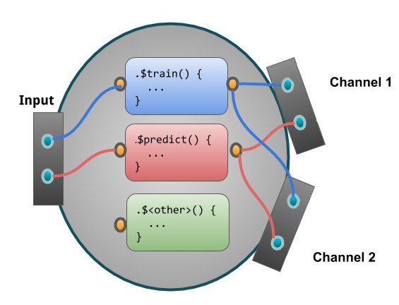

## In-depth look into mlr3pipelines {#in-depth-pipelines}

```{r 04-pipelines-in-depth-001, include = FALSE}
library("mlr3pipelines")
```

This vignette is an in-depth introduction to `r cran_pkg("mlr3pipelines")`, the dataflow programming toolkit for machine learning in `R` using `r mlr_pkg("mlr3")`.
It will go through basic concepts and then give a few examples that both show the simplicity as well as the power and versatility of using `r cran_pkg("mlr3pipelines")`.

### What's the Point

Machine learning toolkits often try to abstract away the processes happening inside machine learning algorithms.
This makes it easy for the user to switch out one algorithm for another without having to worry about what is happening inside it, what kind of data it is able to operate on etc.
The benefit of using `mlr3`, for example, is that one can create a `Learner`, a `Task`, a `Resampling` etc. and use them for typical machine learning operations.
It is trivial to exchange individual components and therefore use, for example, a different `Learner` in the same experiment for comparison.

```{r 04-pipelines-in-depth-002}
task = TaskClassif$new("iris", as_data_backend(iris), "Species")
lrn = mlr_learners$get("classif.rpart")
rsmp = mlr_resamplings$get("holdout")
resample(task, lrn, rsmp)
```

However, this modularity breaks down as soon as the learning algorithm encompasses more than just model fitting, like data preprocessing, ensembles or other meta models.
`r cran_pkg("mlr3pipelines")` takes modularity one step further than `mlr3`: it makes it possible to build individual steps within a `Learner` out of building blocks called **`PipeOp`s**.

### `PipeOp`: Pipeline Operators

The most basic unit of functionality within `r cran_pkg("mlr3pipelines")` is the **`PipeOp`**, short for "pipeline operator", which represents a trans-formative operation on input (for example a training dataset) leading to output.
It can therefore be seen as a generalized notion of a function, with a certain twist: `PipeOp`s behave differently during a "training phase" and a "prediction phase".
The training phase will typically generate a certain model of the data that is saved as internal state.
The prediction phase will then operate on the input data depending on the trained model.

An example of this behavior is the *principal component analysis* operation ("`PipeOpPCA`"):
During training, it will transform incoming data by rotating it in a way that leads to uncorrelated features ordered by their contribution to total variance.
It will *also* save the rotation matrix to be used during for new data.
This makes it possible to perform "prediction" with single rows of new data, where a row's scores on each of the principal components (the components of the training data!) is computed.

```{r 04-pipelines-in-depth-003}
po = mlr_pipeops$get("pca")
po$train(list(task))[[1]]$data()
```

```{r 04-pipelines-in-depth-004}
single_line_task = task$clone()$filter(1)
po$predict(list(single_line_task))[[1]]$data()
```

```{r 04-pipelines-in-depth-005}
po$state
```

This shows the most important primitives incorporated in a `PipeOp`:
* **`$train()`**, taking a list of input arguments, turning them into a list of outputs, meanwhile saving a state in `$state`
* **`$predict()`**, taking a list of input arguments, turning them into a list of outputs, making use of the saved `$state`
* **`$state`**, the "model" trained with `$train()` and utilized during `$predict()`.

Schematically we can represent the `PipeOp` like so:

```{r 04-pipelines-in-depth-006, echo = FALSE}
knitr::include_graphics("images/po_viz.png")
```

#### Why the `$state`

It is important to take a moment and notice the importance of a `$state` variable and the `$train()` / `$predict()` dichotomy in a `PipeOp`.
There are many preprocessing methods, for example scaling of parameters or imputation, that could in theory just be applied to training data and prediction / validation data separately, or they could be applied to a task before resampling is performed.
This would, however, be fallacious:

* The preprocessing of each instance of prediction data should not depend on the remaining prediction dataset.
A prediction on a single instance of new data should give the same result as prediction performed on a whole dataset.
* If preprocessing is performed on a task *before* resampling is done, information about the test set can leak into the training set.
Resampling should evaluate the generalization performance of the *entire* machine learning method, therefore the behavior of this entire method must only depend only on the content of the *training* split during resampling.

#### Where to Get `PipeOp`s

Each `PipeOp` is an instance of an "`R6`" class, many of which are provided by the `r cran_pkg("mlr3pipelines")` package itself.
They can be constructed explicitly ("`PipeOpPCA$new()`") or retrieved from the `mlr_pipelines` collection: `mlr_pipeops$get("pca")`.
The entire list of available `PipeOp`s, and some meta-information, can be retrieved using `as.data.table()`:

```{r 04-pipelines-in-depth-007}
as.data.table(mlr_pipeops)[, c("key", "input.num", "output.num")]
```

When retrieving `PipeOp`s from the `mlr_pipeops` dictionary, it is also possible to give additional constructor arguments, such as an [id](#pipeop-ids-and-id-name-clashes) or [parameter values](#hyperparameters).

```{r 04-pipelines-in-depth-008}
mlr_pipeops$get("pca", param_vals = list(rank. = 3))
```

### PipeOp Channels

#### Input Channels

Just like functions, `PipeOp`s can take multiple inputs.
These multiple inputs are always given as elements in the input list.
For example, there is a `PipeOpFeatureUnion` that combines multiple tasks with different features and "`cbind()`s" them together, creating one combined task.
When two halves of the `iris` task are given, for example, it recreates the original task:
```{r 04-pipelines-in-depth-009}
iris_first_half = task$clone()$select(c("Petal.Length", "Petal.Width"))
iris_second_half = task$clone()$select(c("Sepal.Length", "Sepal.Width"))

pofu = mlr_pipeops$get("featureunion", innum = 2)

pofu$train(list(iris_first_half, iris_second_half))[[1]]$data()
```

Because `PipeOpFeatureUnion` effectively takes two input arguments here, we can say it has two **input channels**.
An input channel also carries information about the *type* of input that is acceptable.
The input channels of the `pofu` object constructed above, for example, each accept a `Task` during training and prediction.
This information can be queried from the `$input` slot:
```{r 04-pipelines-in-depth-010}
pofu$input
```

Other `PipeOp`s may have channels that take different types during different phases.
The `backuplearner` `PipeOp`, for example, takes a `NULL` and a `Task` during training, and a `Prediction` and a `Task` during prediction:

```{r 04-pipelines-in-depth-011}
## TODO this is an important case to handle here, do not delete unless there is a better example.
## mlr_pipeops$get("backuplearner")$input
```

#### Output Channels

Unlike the typical notion of a function, `PipeOp`s can also have multiple **output channels**.
`$train()` and `$predict()` always return a list, so certain `PipeOp`s may return lists with more than one element.
Similar to input channels, the information about the number and type of outputs given by a `PipeOp` is available in the `$output` slot.
The `chunk` PipeOp, for example, chunks a given `Task` into subsets and consequently returns multiple `Task` objects, both during training and prediction.
The number of output channels must be given during construction through the `outnum` argument.

```{r 04-pipelines-in-depth-012}
mlr_pipeops$get("chunk", outnum = 3)$output
```

Note that the number of output channels during training and prediction is the same.
A schema of a `PipeOp` with two output channels:

```{r 04-pipelines-in-depth-013, echo = FALSE}

```

#### Channel Configuration

Most `PipeOp`s have only one input channel (so they take a list with a single element), but there are a few with more than one;
In many cases, the number of input or output channels is determined during construction, e.g. through the `innum` / `outnum` arguments.
The `input.num` and `output.num` columns of the `mlr_pipeops`-table [above](#where-to-get-pipeops) show the default number of channels, and `NA` if the number depends on a construction argument.

The default printer of a `PipeOp` gives information about channel names and types:

```{r 04-pipelines-in-depth-014, out.width="98%"}
## mlr_pipeops$get("backuplearner")
```

### `Graph`: Networks of `PipeOp`s

#### Basics

What is the advantage of this tedious way of declaring input and output channels and handling in/output through lists?
Because each `PipeOp` has a known number of input and output channels that always produce or accept data of a known type, it is possible to network them together in **`Graph`**s.
A `Graph` is a collection of `PipeOp`s with "edges" that mandate that data should be flowing along them.
Edges always pass between `PipeOp` *channels*, so it is not only possible to explicitly prescribe which position of an input or output list an edge refers to, it makes it possible to make different components of a `PipeOp`'s output flow to multiple different other `PipeOp`s, as well as to have a `PipeOp` gather its input from multiple other `PipeOp`s.

A schema of a simple graph of `PipeOp`s:

```{r 04-pipelines-in-depth-015, echo = FALSE}
knitr::include_graphics("images/po_multi_viz.png")
```

A `Graph` is empty when first created, and `PipeOp`s can be added using the **`$add_pipeop()`** method.
The **`$add_edge()`** method is used to create connections between them.
While the printer of a `Graph` gives some information about its layout, the most intuitive way of visualizing it is using the `$plot()` function.

```{r 04-pipelines-in-depth-016}
gr = Graph$new()
gr$add_pipeop(mlr_pipeops$get("scale"))
gr$add_pipeop(mlr_pipeops$get("subsample", param_vals = list(frac = 0.1)))
gr$add_edge("scale", "subsample")
```

```{r 04-pipelines-in-depth-017}
print(gr)
```

```{r 04-pipelines-in-depth-018, fig.width = 8, fig.height = 8}
gr$plot(html = FALSE)
```

A `Graph` itself has a **`$train()`** and a **`$predict()`** method that accept some data and propagate this data through the network of `PipeOp`s.
The return value corresponds to the output of the `PipeOp` output channels that are not connected to other `PipeOp`s.

```{r 04-pipelines-in-depth-019}
gr$train(task)[[1]]$data()
```

```{r 04-pipelines-in-depth-020}
gr$predict(single_line_task)[[1]]$data()
```

The collection of `PipeOp`s inside a `Graph` can be accessed through the **`$pipeops`** slot.
The set of edges in the Graph can be inspected through the **`$edges`** slot.
It is possible to modify individual `PipeOps` and edges in a Graph through these slots, but this is not recommended because no error checking is performed and it may put the `Graph` in an unsupported state.

#### Networks

The example above showed a linear preprocessing pipeline, but it is in fact possible to build true "graphs" of operations, as long as no loops are introduced^[It is tempting to denote this as a "directed acyclic graph", but this would not be entirely correct because edges run between channels of `PipeOp`s, not `PipeOp`s themselves.].
`PipeOp`s with multiple output channels can feed their data to multiple different subsequent `PipeOp`s, and `PipeOp`s with multiple input channels can take results from different `PipeOp`s.
When a `PipeOp` has more than one input / output channel, then the `Graph`'s `$add_edge()` method needs an additional argument that indicates which channel to connect to.
This argument can be given in the form of an integer, or as the name of the channel.

The following constructs a `Graph` that copies the input and gives one copy each to a "scale" and a "pca" `PipeOp`.
The resulting columns of each operation are put next to each other by "featureunion".

```{r 04-pipelines-in-depth-021, tidy = FALSE}
gr = Graph$new()$
  add_pipeop(mlr_pipeops$get("copy", outnum = 2))$
  add_pipeop(mlr_pipeops$get("scale"))$
  add_pipeop(mlr_pipeops$get("pca"))$
  add_pipeop(mlr_pipeops$get("featureunion", innum = 2))

gr$
  add_edge("copy", "scale", src_channel = 1)$        # designating channel by index
  add_edge("copy", "pca", src_channel = "output2")$  # designating channel by name
  add_edge("scale", "featureunion", dst_channel = 1)$
  add_edge("pca", "featureunion", dst_channel = 2)

gr$plot(html = FALSE)
```
```{r 04-pipelines-in-depth-022}
gr$train(iris_first_half)[[1]]$data()
```

#### Syntactic Sugar

Although it is possible to create intricate `Graphs` with edges going all over the place (as long as no loops are introduced), there is usually a clear direction of flow between "layers" in the `Graph`.
It is therefore convenient to build up a `Graph` from layers, which can be done using the **`%>>%`** ("double-arrow") operator.
It takes either a `PipeOp` or a `Graph` on each of its sides and connects all of the outputs of its left-hand side to one of the inputs each of its right-hand side--the number of inputs therefore must match the number of outputs.
Together with the **`gunion()`** operation, which takes `PipeOp`s or `Graph`s and arranges them next to each other akin to a (disjoint) graph union, the above network can more easily be constructed as follows:

```{r 04-pipelines-in-depth-023}
gr = mlr_pipeops$get("copy", outnum = 2) %>>%
  gunion(list(mlr_pipeops$get("scale"), mlr_pipeops$get("pca"))) %>>%
  mlr_pipeops$get("featureunion", innum = 2)

gr$plot(html = FALSE)
```

#### `PipeOp` IDs and ID Name Clashes

`PipeOp`s within a graph are addressed by their **`$id`**-slot.
It is therefore necessary for all `PipeOp`s within a `Graph` to have a unique `$id`.
The `$id` can be set during or after construction, but it should not directly be changed after a `PipeOp` was inserted in a `Graph`.
At that point, the **`$set_names()`**-method can be used to change `PipeOp` ids.

```{r 04-pipelines-in-depth-024, error = TRUE}
po1 = mlr_pipeops$get("scale")
po2 = mlr_pipeops$get("scale")
po1 %>>% po2  ## name clash
```

```{r 04-pipelines-in-depth-025}
po2$id = "scale2"
gr = po1 %>>% po2
gr
```

```{r 04-pipelines-in-depth-026}
## Alternative ways of getting new ids:
mlr_pipeops$get("scale", id = "scale2")
PipeOpScale$new(id = "scale2")
```

```{r 04-pipelines-in-depth-027, error = TRUE}
## sometimes names of PipeOps within a Graph need to be changed
gr2 = mlr_pipeops$get("scale") %>>% mlr_pipeops$get("pca")
gr %>>% gr2
```

```{r 04-pipelines-in-depth-028}
gr2$set_names("scale", "scale3")
gr %>>% gr2
```

### Learners in Graphs, Graphs in Learners

The true power of `r cran_pkg("mlr3pipelines")` derives from the fact that it can be integrated seamlessly with `mlr3`.
Two components are mainly responsible for this:

* **`PipeOpLearner`**, a `PipeOp` that encapsulates a `mlr3` `Learner` and creates a `PredictionData` object in its `$predict()` phase
* **`GraphLearner`**, a `mlr3` `Learner` that can be used in place of any other `mlr3` `Learner`, but which does prediction using a `Graph` given to it

Note that these are dual to each other: One takes a `Learner` and produces a `PipeOp` (and by extension a `Graph`); the other takes a `Graph` and produces a `Learner`.

#### `PipeOpLearner`

The `PipeOpLearner` is constructed using a `mlr3` `Learner` and will use it to create `PredictionData` in the `$predict()` phase.
The output during `$train()` is `NULL`.
It can be used after a preprocessing pipeline, and it is even possible to perform operations on the `PredictionData`, for example by averaging multiple predictions or by using the "`PipeOpBackupLearner`" operator to impute predictions that a given model failed to create.

The following is a very simple `Graph` that performs training and prediction on data after performing principal component analysis.

```{r 04-pipelines-in-depth-029}
gr = mlr_pipeops$get("pca") %>>% mlr_pipeops$get("learner",
  mlr_learners$get("classif.rpart"))
```
```{r 04-pipelines-in-depth-030}
gr$train(task)
gr$predict(task)
```

#### `GraphLearner`

Although a `Graph` has `$train()` and `$predict()` functions, it can not be used directly in places where `mlr3` `Learners` can be used like resampling or benchmarks.
For this, it needs to be wrapped in a `GraphLearner` object, which is a thin wrapper that enables this functionality.
The resulting `Learner` is extremely versatile, because every part of it can be modified, replaced, parameterized and optimized over.
Resampling the graph above can be done the same way that resampling of the `Learner` was performed in the [introductory example](#whats-the-point).

```{r 04-pipelines-in-depth-031}
lrngrph = GraphLearner$new(gr)
resample(task, lrngrph, rsmp)
```

### Hyperparameters

`r cran_pkg("mlr3pipelines")` relies on the [`paradox`](https://paradox.mlr-org.com) package to provide parameters that can modify each `PipeOp`'s behavior.
`paradox` parameters provide information about the parameters that can be changed, as well as their types and ranges.
They provide a unified interface for benchmarks and parameter optimization ("tuning").
For a deep dive into `paradox`, see the [mlr3book](https://mlr3book.mlr-org.com).

The `ParamSet`, representing the space of possible parameter configurations of a `PipeOp`, can be inspected by accessing the **`$param_set`** slot of a `PipeOp` or a `Graph`.

```{r 04-pipelines-in-depth-032}
op_pca = mlr_pipeops$get("pca")
op_pca$param_set
```

To set or retrieve a parameter, the **`$param_set$values`** slot can be accessed.
Alternatively, the `param_vals` value can be given during construction.

```{r 04-pipelines-in-depth-033}
op_pca$param_set$values$center = FALSE
op_pca$param_set$values
```

```{r 04-pipelines-in-depth-034}
op_pca = mlr_pipeops$get("pca", param_vals = list(center = TRUE))
op_pca$param_set$values
```

Each `PipeOp` can bring its own individual parameters which are collected together in the `Graph`'s `$param_set`.
A `PipeOp`'s parameter names are prefixed with its `$id` to prevent parameter name clashes.

```{r 04-pipelines-in-depth-035}
gr = op_pca %>>% mlr_pipeops$get("scale")
gr$param_set
```

```{r 04-pipelines-in-depth-036}
gr$param_set$values
```

Both `PipeOpLearner` and `GraphLearner` preserve parameters of the objects they encapsulate.

```{r 04-pipelines-in-depth-037}
op_rpart = mlr_pipeops$get("learner", mlr_learners$get("classif.rpart"))
op_rpart$param_set
```

```{r 04-pipelines-in-depth-038}
glrn = GraphLearner$new(gr %>>% op_rpart)
glrn$param_set
```
