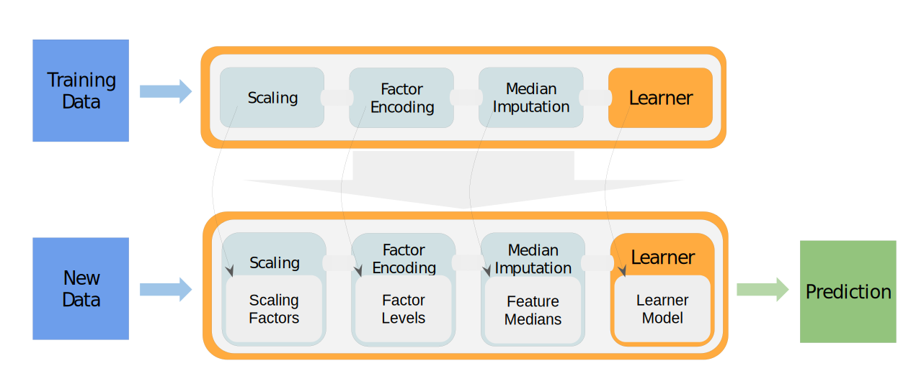

## Modeling {#pipe-modeling}

```{r 04-pipelines-modeling-001, include = FALSE}
library("mlr3pipelines")
```

The main purpose of a `r ref("Graph")` is to build combined preprocessing and model fitting pipelines that can be used as `r mlr_pkg("mlr3")` `r ref("Learner")`.

Conceptually, the process may be summarized as follows:

```{r 04-pipelines-modeling-002, echo=FALSE }

```

In the following we chain two preprocessing tasks:

* mutate (creation of a new feature)
* filter (filtering the dataset)

Subsequently one can chain a PO learner to train and predict on the modified dataset.

```{r 04-pipelines-modeling-003}
mutate = mlr_pipeops$get("mutate")
filter = mlr_pipeops$get("filter",
  filter = mlr3filters::FilterVariance$new(),
  param_vals = list(filter.frac = 0.5))

graph = mutate %>>%
  filter %>>%
  mlr_pipeops$get("learner",
    learner = mlr_learners$get("classif.rpart"))
```

Until here we defined the main pipeline stored in `r ref("Graph")`.
Now we can train and predict the pipeline:

```{r 04-pipelines-modeling-004}
task = mlr_tasks$get("iris")
graph$train(task)
graph$predict(task)
```

Rather than calling `$train()` and `$predict()` manually, we can put the pipeline `r ref("Graph")` into a `r ref("GraphLearner")` object.
A `r ref("GraphLearner")` encapsulates the whole pipeline (including the preprocessing steps) and can be put into `r ref("resample()")`  or `r ref("benchmark()")` .
If you are familiar with the old _mlr_ package, this is the equivalent of all the `make*Wrapper()` functions.
The pipeline being encapsulated (here `r ref("Graph")` ) must always produce a `r ref("Prediction")`  with its `$predict()` call, so it will probably contain at least one `r ref("PipeOpLearner")` .

```{r 04-pipelines-modeling-005}
glrn = GraphLearner$new(graph)
```

This learner can be used for model fitting, resampling, benchmarking, and tuning:

```{r 04-pipelines-modeling-006}
cv3 = rsmp("cv", folds = 3)
resample(task, glrn, cv3)
```

### Setting Hyperparameters {#pipe-hyperpars}

Individual POs offer hyperparameters because they contain `$param_set` slots that can be read and written from `$param_set$values` (via the paradox package).
The parameters get passed down to the `r ref("Graph")`, and finally to the `r ref("GraphLearner")` .
This makes it not only possible to easily change the behavior of a `r ref("Graph")`  / `r ref("GraphLearner")` and try different settings manually, but also to perform tuning using the `r mlr_pkg("mlr3tuning")` package.

```{r 04-pipelines-modeling-007}
glrn$param_set$values$variance.filter.frac = 0.25
cv3 = rsmp("cv", folds = 3)
resample(task, glrn, cv3)
```

### Tuning {#pipe-tuning}

If you are unfamiliar with tuning in `r mlr_pkg("mlr3")`, we recommend to take a look at the section about [tuning](#tuning) first.
Here we define a `r ref("ParamSet")` for the "rpart" learner and the "variance" filter which should be optimized during the tuning process.

```{r 04-pipelines-modeling-008}
library("paradox")
ps = ParamSet$new(list(
  ParamDbl$new("classif.rpart.cp", lower = 0, upper = 0.05),
  ParamDbl$new("variance.filter.frac", lower = 0.25, upper = 1)
))
```

After having defined the `PerformanceEvaluator`, a random search with 10 iterations is created.
For the inner resampling, we are simply using holdout (single split into train/test) to keep the runtimes reasonable.

```{r 04-pipelines-modeling-009}
library("mlr3tuning")
instance = TuningInstanceSingleCrit$new(
  task = task,
  learner = glrn,
  resampling = rsmp("holdout"),
  measure = msr("classif.ce"),
  search_space = ps,
  terminator = trm("evals", n_evals = 20)
)
```

```{r 04-pipelines-modeling-010, eval = FALSE}
tuner = tnr("random_search")
tuner$optimize(instance)
```

The tuning result can be found in the respective `result` slots.

```{r 04-pipelines-modeling-011, eval = FALSE}
instance$result_learner_param_vals
instance$result_y
```
