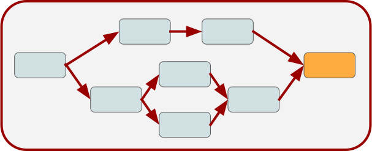

## Nodes, Edges and Graphs {#pipe-nodes-edges-graphs}

```{r 04-pipelines-nodes-edges-graphs-001, include = FALSE}
library("mlr3pipelines")
```

POs are combined into `r ref("Graph")`s.
The manual way (= hard way) to construct a `r ref("Graph")`  is to create an empty graph first.
Then one fills the empty graph with POs, and connects edges between the POs.
Conceptually, this may look like this:

```{r 04-pipelines-nodes-edges-graphs-002, echo=FALSE}

```

POs are identified by their `$id`.
Note that the operations all modify the object in-place and return the object itself.
Therefore, multiple modifications can be chained.

For this example we use the `pca` PO defined above and a new PO named "mutate".
The latter creates a new feature from existing variables.
Additionally, we use the filter PO again.

```{r 04-pipelines-nodes-edges-graphs-003}
mutate = mlr_pipeops$get("mutate")

filter = mlr_pipeops$get("filter",
  filter = mlr3filters::FilterVariance$new(),
  param_vals = list(filter.frac = 0.5))
```

```{r 04-pipelines-nodes-edges-graphs-004}

graph = Graph$new()$
  add_pipeop(mutate)$
  add_pipeop(filter)$
  add_edge("mutate", "variance")  # add connection mutate -> filter
```

The much quicker way is to use the `%>>%` operator to chain POs or `r ref("Graph")` s.
The same result as above can be achieved by doing the following:

```{r 04-pipelines-nodes-edges-graphs-005}
graph = mutate %>>% filter
```

Now the `r ref("Graph")`  can be inspected using its `$plot()` function:

```{r 04-pipelines-nodes-edges-graphs-006}
graph$plot()
```

**Chaining multiple POs of the same kind**

If multiple POs of the same kind should be chained, it is necessary to change the `id` to avoid name clashes.
This can be done by either accessing the `$id` slot or during construction:

```{r 04-pipelines-nodes-edges-graphs-007, error = TRUE}
graph$add_pipeop(mlr_pipeops$get("pca"))
```

```{r 04-pipelines-nodes-edges-graphs-008}
graph$add_pipeop(mlr_pipeops$get("pca", id = "pca2"))
```
