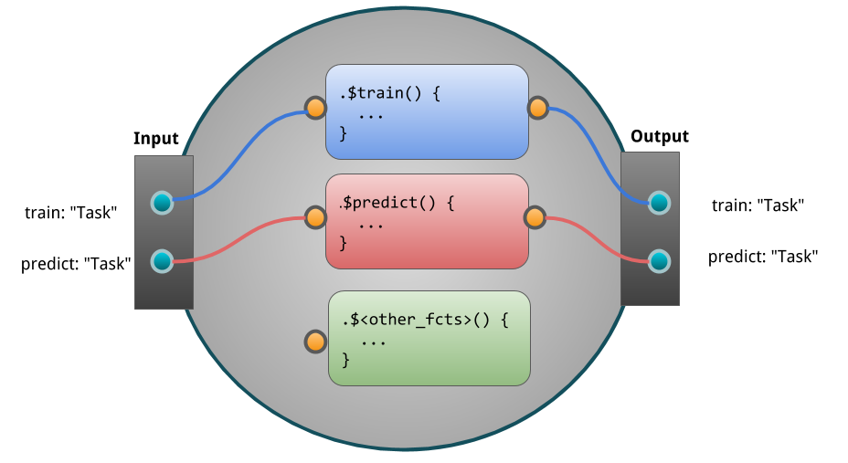

## The Building Blocks: PipeOps {#pipe-pipeops}

The building blocks of `r mlr_pkg("mlr3pipelines")` are **PipeOp**-objects (PO).
They can be constructed directly using `PipeOp<NAME>$new()`, but the recommended way is to retrieve them from the `mlr_pipeops` dictionary:

```{r 04-pipelines-pipeops-001}
library("mlr3pipelines")
as.data.table(mlr_pipeops)
```

Single POs can be created using `mlr_pipeops$get(<name>)`:

```{r 04-pipelines-pipeops-002}
pca = mlr_pipeops$get("pca")
```

or using **syntactic sugar**

```{r 04-pipelines-pipeops-003, eval = FALSE}
pca = po("pca")
```

Some POs require additional arguments for construction:

```{r 04-pipelines-pipeops-004, eval = FALSE}
learner = mlr_pipeops$get("learner")

# Error in as_learner(learner) : argument "learner" is missing, with no default argument "learner" is missing, with no default
```

```{r 04-pipelines-pipeops-005}
learner = mlr_pipeops$get("learner", mlr_learners$get("classif.rpart"))
```

or in short `po("learner", lrn("classif.rpart"))`.

Hyperparameters of POs can be set through the `param_vals` argument.
Here we set the fraction of features for a filter:

```{r 04-pipelines-pipeops-006}
filter = mlr_pipeops$get("filter",
  filter = mlr3filters::FilterVariance$new(),
  param_vals = list(filter.frac = 0.5))
```

or in short notation:

```{r 04-pipelines-pipeops-007, eval = FALSE}
po("filter", mlr3filters::FilterVariance$new(), filter.frac = 0.5)
```

The figure below shows an exemplary `PipeOp`.
It takes an input, transforms it during `.$train` and `.$predict` and returns data:

```{r 04-pipelines-pipeops-008, echo=FALSE}

```
