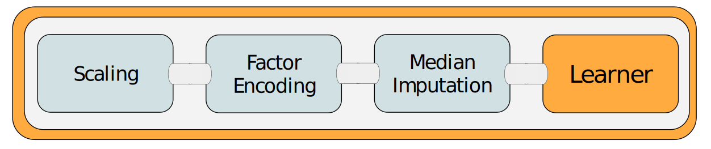

# Pipelines {#pipelines}

`r mlr_pkg("mlr3pipelines")` is a dataflow programming toolkit.
This chapter focuses on the applicant's side of the package.
A more in-depth and technically oriented vignette can be found in the [mlr3pipeline vignette](https://mlr3pipelines.mlr-org.com/articles/introduction.html).

Machine learning workflows can be written as directed “Graphs”/"Pipelines" that represent data flows between preprocessing, model fitting, and ensemble learning units in an expressive and intuitive language.
We will most often use the term "Graph" in this manual but it can interchangeably be used  with "pipeline" or "workflow".

Below you can examine an example for such a graph:

```{r 04-pipelines-001, echo=FALSE, fig.align='center', out.width="98%"}

```

Single computational steps can be represented as so-called PipeOps, which can then be connected with directed edges in a Graph.
The scope of `r mlr_pkg("mlr3pipelines")` is still growing.
Currently supported features are:

* Data manipulation and preprocessing operations, e.g. PCA, feature filtering, imputation
* Task subsampling for speed and outcome class imbalance handling
* `r mlr_pkg("mlr3")` Learner operations for prediction and stacking
* Ensemble methods and aggregation of predictions

Additionally, we implement several meta operators that can be used to construct powerful pipelines:

* Simultaneous path branching (data going both ways)
* Alternative path branching (data going one specific way, controlled by hyperparameters)

An extensive introduction to creating custom **PipeOps** (PO's) can be found in the [technical introduction](#extending-mlr3pipelines).

Using methods from `r mlr_pkg("mlr3tuning")`, it is even possible to simultaneously optimize parameters of multiple processing units.

A predecessor to this package is the `r cran_pkg("mlrCPO")` package, which works with `r cran_pkg("mlr")` 2.x.
Other packages that provide, to varying degree, some preprocessing functionality or machine learning domain specific language, are:

* the `r cran_pkg("caret")` package and the related `r cran_pkg("recipes")`  project
* the `r cran_pkg("dplyr")` package

An example for a Pipeline that can be constructed using `r mlr_pkg("mlr3pipelines")` is depicted below:

```{r 04-pipelines-002, echo = FALSE, width = 10, height = 10, eval = TRUE, message=FALSE}
# This just produces a plot, not visible to the user.
library("mlr3pipelines")

graph = mlr_pipeops$get("branch", c("nop", "pca", "scale")) %>>%
  gunion(list(
      mlr_pipeops$get("nop", id = "null1"),
      mlr_pipeops$get("pca"),
      mlr_pipeops$get("scale")
  ))
gr = graph %>>%
  mlr_pipeops$get("unbranch", c("nop", "pca", "scale")) %>>%
  mlr_pipeops$get("learner", mlr_learners$get("classif.rpart"))

gr$plot(html = FALSE)
```
