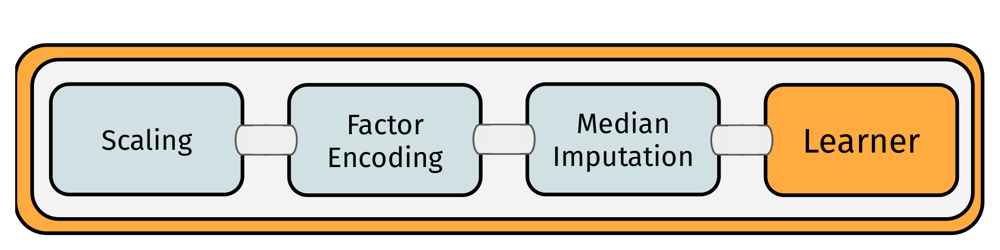
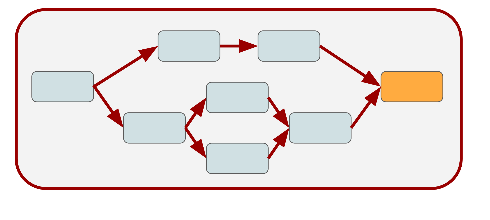
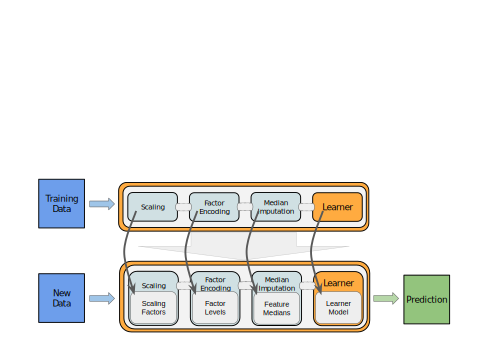
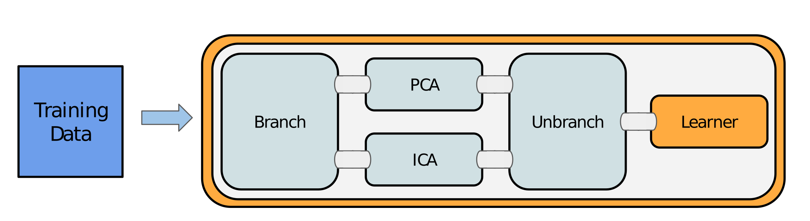
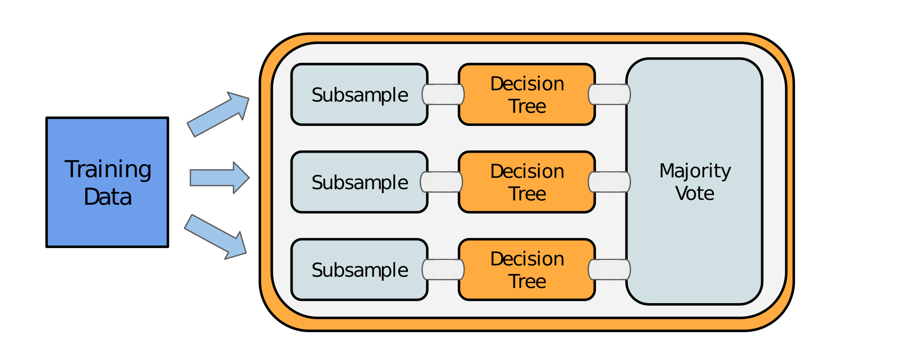
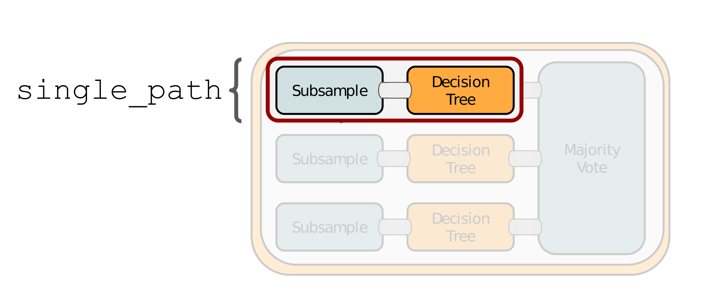
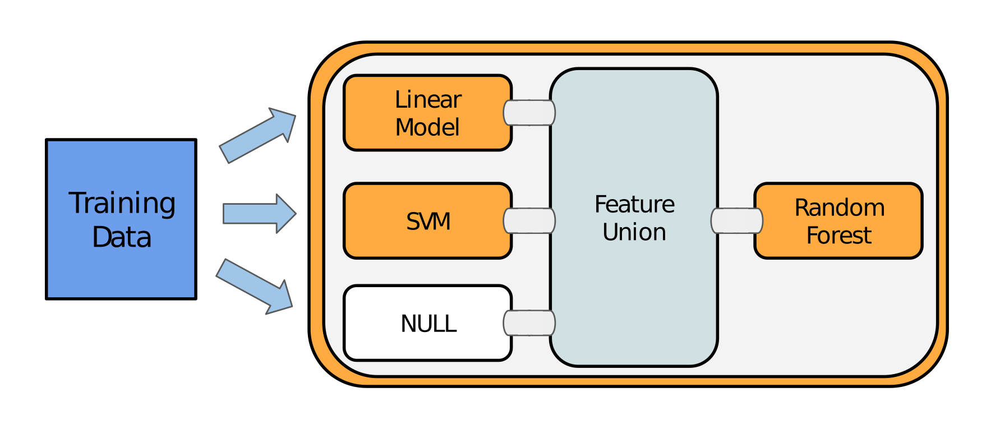

# Pipelines {#pipelines}

`r mlr_pkg("mlr3pipelines")` is a dataflow programming toolkit.
This chapter focuses on the applicant's side of the package.
A more in-depth and technically oriented vignette can be found in the [mlr3pipeline vignette](https://mlr3pipelines.mlr-org.com/articles/introduction.html).

Machine learning workflows can be written as directed “Graphs”/"Pipelines" that represent data flows between preprocessing, model fitting, and ensemble learning units in an expressive and intuitive language.
We will most often use the term "Graph" in this manual but it can interchangeably be used  with "pipeline" or "workflow".

Below an example for such a graph:

```{r 04-pipelines-001, echo=FALSE, fig.align='center', out.width="98%"}

```

Single computational steps can be represented as so-called PipeOps, which can then be connected with directed edges in a Graph.
The scope of `r mlr_pkg("mlr3pipelines")` is still growing.
Currently supported features are:

* Data manipulation and preprocessing operations, e.g. PCA, feature filtering, imputation
* Task subsampling for speed and outcome class imbalance handling
* `r mlr_pkg("mlr3")` Learner operations for prediction and stacking
* Ensemble methods and aggregation of predictions

Additionally, we implement several meta operators that can be used to construct powerful pipelines:

* Simultaneous path branching (data going both ways)
* Alternative path branching (data going one specific way, controlled by hyperparameters)

An extensive introduction to creating custom **PipeOps** (PO's) can be found in the [technical introduction](#extending-mlr3pipelines).

Using methods from `r mlr_pkg("mlr3tuning")`, it is even possible to simultaneously optimize parameters of multiple processing units.

A predecessor to this package is the [mlrCPO](https://github.com/mlr-org/mlrCPO) package, which works with mlr 2.x.
Other packages that provide, to varying degree, some preprocessing functionality or machine learning domain specific language, are:

* the `r cran_pkg("caret")` package and the related `r cran_pkg("recipes")`  project
* the `r cran_pkg("dplyr")` package

An example for a Pipeline that can be constructed using `r mlr_pkg("mlr3pipelines")` is depicted below:

```{r 04-pipelines-002, echo = FALSE, width = 10, height = 10, eval = TRUE}
# This just produces a plot, not visible to the user.
library(visNetwork)
library(mlr3misc)
library(mlr3pipelines)
graph = mlr_pipeops$get("branch", c("nop", "pca", "scale")) %>>%
  gunion(list(
      mlr_pipeops$get("nop", id = "null1"),
      mlr_pipeops$get("pca"),
      mlr_pipeops$get("scale")
  ))
gr = graph %>>%
  mlr_pipeops$get("unbranch", c("nop", "pca", "scale")) %>>%
  mlr_pipeops$get("learner", mlr_learners$get("classif.rpart"))

 gr$plot(html = TRUE) %>% visInteraction(zoomView = FALSE)
```

## The Building Blocks: PipeOps

The building blocks of `r mlr_pkg("mlr3pipelines")` are **PipeOp**-objects (PO).
They can be constructed directly using `PipeOp<NAME>$new()`, but the recommended way is to retrieve them from the `mlr_pipeops` dictionary:

```{r 04-pipelines-003}
library("mlr3pipelines")
as.data.table(mlr_pipeops)
```

Single POs can be created using `mlr_pipeops$get(<name>)`:

```{r 04-pipelines-004}
pca = mlr_pipeops$get("pca")
```

Some POs require additional arguments for construction:

```{r 04-pipelines-005, eval = FALSE}
learner = mlr_pipeops$get("learner")

# Error in as_learner(learner) : argument "learner" is missing, with no default argument "learner" is missing, with no default
```

```{r 04-pipelines-006}
learner = mlr_pipeops$get("learner", mlr_learners$get("classif.rpart"))
```

Hyperparameters of POs can be set through the `param_vals` argument.
Here we set the fraction of features for a filter:

```{r 04-pipelines-007}
filter = mlr_pipeops$get("filter",
  filter = mlr3filters::FilterVariance$new(),
  param_vals = list(filter.frac = 0.5))
```

The figure below shows an exemplary `PipeOp`.
It takes an input, transforms it during `.$train` and `.$predict` and returns data:

{ width=90% }

## The Pipeline Operator: `%>>%` {#pipe-operator}

It is possible to create intricate `Graphs` with edges going all over the place (as long as no loops are introduced).
Irrespective, there is usually a clear direction of flow between "layers" in the `Graph`.
It is therefore convenient to build up a `Graph` from layers.
This can be done using the **`%>>%`** ("double-arrow") operator.
It takes either a `PipeOp` or a `Graph` on each of its sides and connects all of the outputs of its left-hand side to one of the inputs each of its right-hand side.
The number of inputs therefore must match the number of outputs.

```{r 04-pipelines-008}
gr = mlr_pipeops$get("scale") %>>% mlr_pipeops$get("pca")
gr$plot(html = TRUE) %>% visInteraction(zoomView = FALSE) # disable zoom
```

## Nodes, Edges and Graphs {#pipe-nodes-edges-graphs}

POs are combined into `r ref("Graph")`s.
The manual way (= hard way) to construct a `r ref("Graph")`  is to create an empty graph first.
Then one fills the empty graph with POs, and connects edges between the POs.
Conceptually, this may look like this: 

```{r 04-pipelines-009, echo=FALSE, fig.align='center', out.width="98%"}

```

POs are identified by their `$id`.
Note that the operations all modify the object in-place and return the object itself.
Therefore, multiple modifications can be chained.

For this example we use the "pca" PO defined above and a new PO named "mutate".
The latter creates a new feature from existing variables.

```{r 04-pipelines-010}
mutate = mlr_pipeops$get("mutate")
```

```{r 04-pipelines-011}
graph = Graph$new()$
  add_pipeop(mutate)$
  add_pipeop(filter)$
  add_edge("mutate", "variance")  # add connection mutate -> filter
```

The much quicker way is to use the `%>>%` operator to chain POs or `r ref("Graph")` s.
The same result as above can be achieved by doing the following:

```{r 04-pipelines-012}
graph = mutate %>>% filter
```

Now the `r ref("Graph")`  can be inspected using its `$plot()` function:

```{r 04-pipelines-013}
graph$plot(html = TRUE) %>% visInteraction(zoomView = FALSE) # disable zoom
```

**Chaining multiple POs of the same kind**

If multiple POs of the same kind should be chained, it is necessary to change the `id` to avoid name clashes.
This can be done by either accessing the `$id` slot or during construction:

```{r 04-pipelines-014, error = TRUE}
graph$add_pipeop(mlr_pipeops$get("pca"))
```

```{r 04-pipelines-015}
graph$add_pipeop(mlr_pipeops$get("pca", id = "pca2"))
```

## Modeling {#pipe-modeling}

The main purpose of a `r ref("Graph")` is to build combined preprocessing and model fitting pipelines that can be used as `r mlr_pkg("mlr3")` `r ref("Learner")`.

Conceptually, the process may be summarized as follows:

```{r 04-pipelines-016, echo=FALSE, fig.align='center', out.width="98%"}

```

In the following we chain two preprocessing tasks:

* mutate (creation of a new feature)
* filter (filtering the dataset)

Subsequently one can chain a PO learner to train and predict on the modified dataset.

```{r 04-pipelines-017}
graph = mutate %>>%
  filter %>>%
  mlr_pipeops$get("learner",
    learner = mlr_learners$get("classif.rpart"))
```

Until here we defined the main pipeline stored in `r ref("Graph")`.
Now we can train and predict the pipeline:

```{r 04-pipelines-018}
task = mlr_tasks$get("iris")
graph$train(task)
graph$predict(task)
```

Rather than calling `$train()` and `$predict()` manually, we can put the pipeline `r ref("Graph")` into a `r ref("GraphLearner")` object.
A `r ref("GraphLearner")` encapsulates the whole pipeline (including the preprocessing steps) and can be put into `r ref("resample()")`  or `r ref("benchmark()")` .
If you are familiar with the old _mlr_ package, this is the equivalent of all the `make*Wrapper()` functions.
The pipeline being encapsulated (here `r ref("Graph")` ) must always produce a `r ref("Prediction")`  with its `$predict()` call, so it will probably contain at least one `r ref("PipeOpLearner")` .

```{r 04-pipelines-019}
glrn = GraphLearner$new(graph)
```

This learner can be used for model fitting, resampling, benchmarking, and tuning:

```{r 04-pipelines-020}
cv3 = rsmp("cv", folds = 3)
resample(task, glrn, cv3)
```

### Setting Hyperparameters {#pipe-hyperpars}

Individual POs offer hyperparameters because they contain `$param_set` slots that can be read and written from `$param_set$values` (via the paradox package).
The parameters get passed down to the `r ref("Graph")`, and finally to the `r ref("GraphLearner")` .
This makes it not only possible to easily change the behavior of a `r ref("Graph")`  / `r ref("GraphLearner")` and try different settings manually, but also to perform tuning using the `r mlr_pkg("mlr3tuning")` package.

```{r 04-pipelines-021}
glrn$param_set$values$variance.filter.frac = 0.25
cv3 = rsmp("cv", folds = 3)
resample(task, glrn, cv3)
```

### Tuning {#pipe-tuning}

If you are unfamiliar with tuning in `r mlr_pkg("mlr3")`, we recommend to take a look at the section about [tuning](#tuning) first.
Here we define a `r ref("ParamSet")` for the "rpart" learner and the "variance" filter which should be optimized during the tuning process.

```{r 04-pipelines-022}
library("paradox")
ps = ParamSet$new(list(
  ParamDbl$new("classif.rpart.cp", lower = 0, upper = 0.05),
  ParamDbl$new("variance.filter.frac", lower = 0.25, upper = 1)
))
```

After having defined the `PerformanceEvaluator`, a random search with 10 iterations is created.
For the inner resampling, we are simply using holdout (single split into train/test) to keep the runtimes reasonable.

```{r 04-pipelines-023}
library("mlr3tuning")
instance = TuningInstance$new(
  task = task,
  learner = glrn,
  resampling = rsmp("holdout"),
  measures = msr("classif.ce"),
  param_set = ps,
  terminator = term("evals", n_evals = 20)
)
```

```{r 04-pipelines-024, eval = FALSE}
tuner = TunerRandomSearch$new()
tuner$tune(instance)
```

The tuning result can be found in the `result` slot.

```{r 04-pipelines-025, eval = FALSE}
instance$result
```

## Non-Linear Graphs {#pipe-nonlinear}

The Graphs seen so far all have a linear structure.
Some POs may have multiple input or output channels.
These channels make it possible to create non-linear Graphs with alternative paths taken by the data.

Possible types are:

- [Branching](#pipe-model-ensembles-branching):
  Splitting of a node into several paths, e.g. useful when comparing multiple feature-selection methods (pca, filters).
  Only one path will be executed.
- [Copying](#pipe-model-ensembles-copying):
  Splitting of a node into several paths, all paths will be executed (sequentially).
  Parallel execution is not yet supported.
- [Stacking](#pipe-model-ensembles-stacking):
  Single graphs are stacked onto each other, i.e. the output of one `r ref("Graph")` is the input for another.
  In machine learning this means that the prediction of one `r ref("Graph")` is used as input for another `r ref("Graph")`

### Branching & Copying {#pipe-model-ensembles-branching-copying}

The `r ref("PipeOpBranch")`  and `r ref("PipeOpUnbranch")`  POs make it possible to specify multiple alternative paths.
Only one path is actually executed, the others are ignored.
The active path is determined by a hyperparameter.
This concept makes it possible to tune alternative preprocessing paths (or learner models).

Below a conceptual visualization of branching:

```{r 04-pipelines-026, echo=FALSE, fig.align='center', out.width="98%"}

```

`PipeOp(Un)Branch` is initialized either with the number of branches, or with a `character`-vector indicating the names of the branches.
If names are given, the "branch-choosing" hyperparameter becomes more readable.
In the following, we set three options:

1. Doing nothing ("nop")
2. Applying a PCA
3. Scaling the data

It is important to "unbranch" again after "branching", so that the outputs are merged into one result objects.

In the following we first create the branched graph and then show what happens if the "unbranching" is not applied:

```{r 04-pipelines-027, eval = FALSE}
graph = mlr_pipeops$get("branch", c("nop", "pca", "scale")) %>>%
  gunion(list(
      mlr_pipeops$get("nop", id = "null1"),
      mlr_pipeops$get("pca"),
      mlr_pipeops$get("scale")
  ))
```

Without "unbranching" one creates the following graph:

```{r 04-pipelines-028}
graph$plot(html = TRUE) %>%
  visInteraction(zoomView = FALSE) # disable zoom
```

Now when "unbranching", we obtain the following results:

```{r 04-pipelines-029}
(graph %>>% mlr_pipeops$get("unbranch", c("nop", "pca", "scale")))$plot(html = TRUE) %>%
  visInteraction(zoomView = FALSE) # disable zoom
```

### Model Ensembles {#pipe-model-ensembles}

We can leverage the different operations presented to connect POs.
This allows us to form powerful graphs.

Before we go into details, we split the task into train and test indices.

```{r 04-pipelines-030}
task = mlr_tasks$get("iris")
train.idx = sample(seq_len(task$nrow), 120)
test.idx = setdiff(seq_len(task$nrow), train.idx)
```

#### Bagging {#pipe-model-ensembles-bagging}

We first examine Bagging introduced by [@Breiman1996].
The basic idea is to create multiple predictors and then aggregate those to a single, more powerful predictor.

> "... multiple versions are formed
> by making bootstrap replicates of the learning set
> and using these as new learning sets" [@Breiman1996]

Bagging then aggregates a set of predictors by averaging (regression) or majority vote (classification).
The idea behind bagging is, that a set of weak, but different predictors can be combined in order to arrive at a single, better predictor.

We can achieve this by downsampling our data before training a learner, repeating this e.g. 10 times and then performing a majority vote on the predictions.
Graphically, it may be summarized as followed:

```{r 04-pipelines-031, echo=FALSE, fig.align='center', out.width="98%"}

```

First, we create a simple pipeline, that uses `r ref("PipeOpSubsample")`  before a `r ref("PipeOpLearner")`  is trained:

```{r 04-pipelines-032}
single_pred = PipeOpSubsample$new(param_vals = list(frac = 0.7)) %>>%
  PipeOpLearner$new(mlr_learners$get("classif.rpart"))
```

This simple pipeline conceptually may be visualized as followed:

```{r 04-pipelines-033, echo=FALSE, fig.align='center', out.width="98%"}

```

We can now copy this operation 10 times using `r ref("greplicate")` .
The `r ref("greplicate")` command allows us to parallelize many copies of an operation.

```{r 04-pipelines-034}
pred_set = greplicate(single_pred, 10L)
```

Afterwards we need to aggregate the 10 pipelines to form a single model:

```{r 04-pipelines-035}
bagging = pred_set %>>%
  PipeOpClassifAvg$new(innum = 10L)
```

Now we can plot again to see what happens:

```{r 04-pipelines-036, fig.width=7.5}
vn = bagging$plot(html = TRUE)
visNetwork::visInteraction(vn, zoomView = FALSE) # disable zoom
```

This pipeline can again be used in conjunction with `r ref("GraphLearner")`  in order for Bagging to be used like a `r ref("Learner")`:

```{r 04-pipelines-037}
baglrn = GraphLearner$new(bagging)
baglrn$train(task, train.idx)
baglrn$predict(task, test.idx)
```

In conjunction with different `Backends`, this can be a very powerful tool.
In cases when the data does not fully fit in memory, one can obtain a fraction of the data for each learner from a `r ref("DataBackend")`  and then aggregate predictions over all learners.

#### Stacking {#pipe-model-ensembles-stacking}

Stacking [@Wolpert1992] is another technique that can improve model performance.
The basic idea behind stacking is the use of predictions from one model as features for a subsequent model to possibly improve performance.

Below an conceptual illustration of stacking: 

```{r 04-pipelines-038, echo=FALSE, fig.align='center', out.width="98%"}

```

As an example we can train a decision tree and use the predictions from this model in conjunction with the original features in order to train an additional model on top.

To limit overfitting, we additionally do not predict on the original predictions of the learner.
Instead, we predict on out-of-bag predictions.
To do all this, we can use `r ref("PipeOpLearnerCV")` .

`r ref("PipeOpLearnerCV")`  performs nested cross-validation on the training data, fitting a model in each fold.
Each of the models is then used to predict on the out-of-fold data.
As a result, we obtain predictions for every data point in our input data.

We first create a "level 0" learner, which is used to extract a lower level prediction.
Additionally, we `clone()` the learner object to obtain a copy of the learner.
Subsequently, one sets a custom id for the `r ref("PipeOp")` .

```{r 04-pipelines-038, eval = FALSE}
lrn = mlr_learners$get("classif.rpart")
lrn_0 = PipeOpLearnerCV$new(lrn$clone())
lrn_0$id = "rpart_cv"
```

We use a 'FIXME' in parallel to the "level 0" learner.
This is done to send the unchanged Task to the next level, where it is then combined with the predictions from our decision tree learner.

```{r 04-pipelines-040, eval = FALSE}
level_0 = gunion(list(lrn_0, PipeOpNOP$new()))
```

Afterwards, we want to concatenate the predictions from `r ref("PipeOpLearnerCV")`  and the original Task using `r ref("PipeOpFeatureUnion")` :

```{r 04-pipelines-041, eval = FALSE}
combined = level_0 %>>% PipeOpFeatureUnion$new(2)
```

Now we can train another learner on top of the combined features:

```{r 04-pipelines-042, fig.width=7.5, eval = FALSE}
stack = combined %>>% PipeOpLearner$new(lrn$clone())
vn = stack$plot(html = TRUE)
visNetwork::visInteraction(vn, zoomView = FALSE) # disable zoom
```

```{r 04-pipelines-043, eval = FALSE}
stacklrn = GraphLearner$new(stack)
stacklrn$train(task, train.idx)
stacklrn$predict(task, test.idx)
```

In this vignette, we showed a very simple usecase for stacking.
In many real-world applications, stacking is done for multiple levels and on multiple representations of the dataset.
On a lower level, different preprocessing methods can be defined in conjunction with several learners.
On a higher level, we can then combine those predictions in order to form a very powerful model.

#### Multilevel Stacking

In order to showcase the power of `r mlr_pkg("mlr3pipelines")`, we will show a more complicated stacking example.

In this case, we train a `glmnet` and 2 different `rpart` models (some transform its inputs using `r ref("PipeOpPCA")` ) on our task in the "level 0" and concatenate them with the original features (via 'FIXME').
The result is then passed on to "level 1", where we copy the concatenated features 3 times and put this task into an `rpart` and a `glmnet` model.
Additionally, we keep a version of the "level 0" output (via 'FIXME') and pass this on to "level 2".
In "level 2" we simply concatenate all "level 1" outputs and train a final decision tree.

```{r 04-pipelines-044, eval = FALSE}
library(mlr3learners) # for classif.glmnet
rprt = lrn("classif.rpart", predict_type = "prob")
glmn = lrn("classif.glmnet", predict_type = "prob")

#  Create Learner CV Operators
lrn_0 = PipeOpLearnerCV$new(rprt, id = "rpart_cv_1")
lrn_0$values$maxdepth = 5L
lrn_1 = PipeOpPCA$new(id = "pca1") %>>% PipeOpLearnerCV$new(rprt, id = "rpart_cv_2")
lrn_1$values$rpart_cv_2.maxdepth = 1L
lrn_2 = PipeOpPCA$new(id = "pca2") %>>% PipeOpLearnerCV$new(glmn)

# Union them with a PipeOpNULL to keep original features
level_0 = gunion(list(lrn_0, lrn_1,lrn_2, PipeOpNOP$new(id = "NOP1")))

# Cbind the output 3 times, train 2 learners but also keep level
# 0 predictions
level_1 = level_0 %>>%
  PipeOpFeatureUnion$new(4) %>>%
  PipeOpCopy$new(3) %>>%
  gunion(list(
    PipeOpLearnerCV$new(rprt, id = "rpart_cv_l1"),
    PipeOpLearnerCV$new(glmn, id = "glmnt_cv_l1"),
    PipeOpNOP$new(id = "NOP_l1")
  ))

# Cbind predictions, train a final learner
level_2 = level_1 %>>%
  PipeOpFeatureUnion$new(3, id = "u2") %>>%
  PipeOpLearner$new(rprt,
    id = "rpart_l2")

# Plot the resulting graph
vn = level_2$plot(html = TRUE)
visNetwork::visInteraction(vn, zoomView = FALSE) # disable zoom

task = tsk("iris")
lrn = GraphLearner$new(level_2)

lrn$
  train(task, train.idx)$
  predict(task, test.idx)$
  score()
```

## Special Operators {#pipe-special-ops}

This section introduces some special operators, that might be useful in numerous further applications.

### Imputation: `PipeOpImpute`

An often occurring setting is the imputation of missing data.
Imputation methods range from relatively simple imputation using either *mean*, *median* or histograms to way more involved methods including using machine learning algorithms in order to predict missing values.

The following `PipeOp`, `r ref("PipeOpImpute")`:

- imputes numeric values from a histogram
- adds a new level for factors 
- adds a column marking whether a value for a given feature was missing or not

```{r 04-pipelines-045}
pom = PipeOpMissInd$new()
pon = PipeOpImputeHist$new(id = "imputer_num", param_vals = list(affect_columns = is.numeric))
pof = PipeOpImputeNewlvl$new(id = "imputer_fct", param_vals = list(affect_columns = is.factor))
imputer = pom %>>% pon %>>% pof
```

A learner can thus be equipped with automatic imputation of missing values by adding an imputation Pipeop.

```{r 04-pipelines-046}
polrn = PipeOpLearner$new(mlr_learners$get("classif.rpart"))
lrn = GraphLearner$new(graph = imputer %>>% polrn)
```

### Feature Engineering: `PipeOpMutate`

New features can be added or computed from a task using `r ref("PipeOpMutate")` .
The operator evaluates one or multiple expressions provided in an `alist`.
In this example, we compute some new features on top of the `iris` task.
Then we add them to the data as illustrated below:

```{r 04-pipelines-047}
pom = PipeOpMutate$new()

# Define a set of mutations
mutations = list(
  Sepal.Sum = ~ Sepal.Length + Sepal.Width,
  Petal.Sum = ~ Petal.Length + Petal.Width,
  Sepal.Petal.Ratio = ~ (Sepal.Length / Petal.Length)
)
pom$param_set$values$mutation = mutations
```

If outside data is required, we can make use of the `env` parameter.
Moreover, we provide an environment, where expressions are evaluated (`env` defaults to `.GlobalEnv`).

### Training on data subsets: `PipeOpChunk`

In cases, where data is too big to fit into the machine's memory, an often-used technique is to split the data into several parts.
Subsequently, the parts are trained on each part of the data.

After undertaking these steps, we aggregate the models.
In this example, we split our data into 4 parts using `r ref("PipeOpChunk")` .
Additionally, we create 4 `r ref("PipeOpLearner")`  POS, which are then trained on each split of the data.

```{r 04-pipelines-049}
chks = PipeOpChunk$new(4)
lrns = greplicate(PipeOpLearner$new(mlr_learners$get("classif.rpart")), 4)
```

Afterwards we can use `r ref("PipeOpClassifAvg")`  to aggregate the predictions from the 4 different models into a new one.

```{r 04-pipelines-050}
mjv = PipeOpClassifAvg$new(4)
```

We can now connect the different operators and visualize the full graph:

```{r 04-pipelines-051, fig.width=7.5, fig.height = 9}
pipeline = chks %>>% lrns %>>% mjv
pipeline$plot(html = TRUE) %>% visInteraction(zoomView = FALSE) # disable zoom
```

```{r 04-pipelines-052}
pipelrn = GraphLearner$new(pipeline)
pipelrn$train(task, train.idx)$
  predict(task, train.idx)$
  score()
```

### Feature Selection: `PipeOpFilter` and `PipeOpSelect`

The package `r mlr_pkg("mlr3filters")` contains many different `r ref("mlr3filters::Filter")`s that can be used to select features for subsequent learners.
This is often required when the data has a large amount of features.


A `PipeOp` for filters is `r ref("PipeOpFilter")`:
```{r 04-pipelines-053}
PipeOpFilter$new(mlr3filters::FilterInformationGain$new())
```

How many features to keep can be set using `filter_nfeat`, `filter_frac` and `filter_cutoff`.

Filters can be selected / de-selected by name using `r ref("PipeOpSelect")` .
