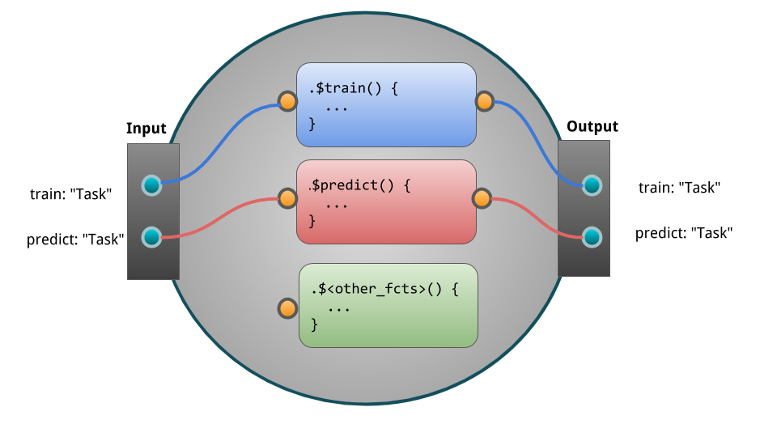

# Pipelines {#pipelines}

`r mlr_pkg("mlr3pipelines")` là một bộ công cụ lập trình dataflow.
Chương này tập trung vào phần áp dụng của packages.
Còn chi tiết sâu hơn về kỹ thuật có thể tìm trong [mlr3pipeline vignette](https://mlr3pipelines.mlr-org.com/articles/introduction.html).

Quy trình ML có thể được viết dưới dạng “Graphs”/"Pipelines" để biểu diễn data flows giữa preprocessing, model fitting, làm sao để có được sự hòa hợp giữa các đơn vị learning trong một ngôn ngữ một cách sinh động và trực quan.
Chúng tôi sẽ thường xuyên sử dụng thuật ngữ "Graph" trong phần hướng dẫn này hoặc có thể một vài trường hợp sử dụng thuật ngữ "pipeline" hay "workflow".

Ví dụ đầu tiên cho graph như sau:

```{r 04-pipelines-001, echo=FALSE, fig.align='center', out.width="98%"}
knitr::include_graphics("images/simple_pipeline.png")
```

Các bước tính toán đơn lẻ có thể được trình bày dưới dạng PipeOps, cái mà sau đó được kết nối trực tiếp với các edges trong Graph.
Phạm vi, ý tưởng của `r mlr_pkg("mlr3pipelines")` vẫn đang tiếp tục phát triển.
Hiện tại những tính năng đang hỗ trợ là:

* Data manipulation and preprocessing operations, e.g. PCA, feature filtering, imputation
* Task subsampling for speed and outcome class imbalance handling
* `r mlr_pkg("mlr3")` Learner operations for prediction and stacking
* Ensemble methods and aggregation of predictions

Ngoài ra, chúng tôi cũng sử dụng một số toán tử meta để xây dựng được những pipelines mạnh:

* Simultaneous path branching (data going both ways)
* Alternative path branching (data going one specific way, controlled by hyperparameters)

Phần mở rộng hướng dẫn tạo các tùy biến **PipeOps** (PO's) có thể tìm trong [technical introduction](#extending-mlr3pipelines).

Việc sử dụng các phương pháp trong `r mlr_pkg("mlr3tuning")`, thậm chí có thể tối ưu tham số của nhiều đơn vị xử lý.

Tiền thân của package này là [mlrCPO](https://github.com/mlr-org/mlrCPO) package, cái mà đã được sử dụng với mlr 2.x.
Ngoài ra, một số gói khác cũng cung cấp (ở các mức độ khác nhau) một vài hàm preprocessing hay ngôn ngữ cụ thể trong lĩnh vực ML ví dụ như:

* `r cran_pkg("caret")` package and project có liên quan như `r cran_pkg("recipes")`
* `r cran_pkg("dplyr")` package

Tiếp theo đây là một ví dụ mô tả cách xây dựng Pipeline sử dụng `r mlr_pkg("mlr3pipelines")`:


```{r 04-pipelines-002, echo = FALSE, width = 10, height = 10, eval = TRUE}
# This just produces a plot, not visible to the user.
library(visNetwork)
library(mlr3misc)
library(mlr3pipelines)
graph = mlr_pipeops$get("branch", c("nop", "pca", "scale")) %>>%
  gunion(list(
      mlr_pipeops$get("nop", id = "null1"),
      mlr_pipeops$get("pca"),
      mlr_pipeops$get("scale")
  ))
gr = graph %>>%
  mlr_pipeops$get("unbranch", c("nop", "pca", "scale")) %>>%
  mlr_pipeops$get("learner", mlr_learners$get("classif.rpart"))

gr$plot(html = TRUE) %>% visInteraction(zoomView = FALSE)
```

## The Building Blocks: PipeOps

Các khối của `r mlr_pkg("mlr3pipelines")` là **PipeOp**-objects (PO).
Chúng có thể được xây dựng trực tiếp sử dụng `PipeOp<NAME>$new()`, nhưng chúng tôi khuyến nghị truy xuất chúng từ từ điển `mlr_pipeops`:

```{r 04-pipelines-003}
library("mlr3pipelines")
as.data.table(mlr_pipeops)
```

POs đơn lẻ có thể được tạo sử dụng `mlr_pipeops$get(<name>)`:

```{r 04-pipelines-004}
pca = mlr_pipeops$get("pca")
```

Một vài POs yêu cầu bổ sung arguments khi xây dựng:

```{r 04-pipelines-005, eval = FALSE}
learner = mlr_pipeops$get("learner")

# Error in as_learner(learner) : argument "learner" is missing, with no default argument "learner" is missing, with no default
```

```{r 04-pipelines-006}
learner = mlr_pipeops$get("learner", mlr_learners$get("classif.rpart"))
```

Hyperparameters của POs có thể được cài đặt qua đối số `param_vals`.
Ở đây chúng tôi đặt tỷ lệ features cho một filter:


```{r 04-pipelines-007}
filter = mlr_pipeops$get("filter",
  filter = mlr3filters::FilterVariance$new(),
  param_vals = list(filter.frac = 0.5))
```

Hình bên dưới là một mẫu `PipeOp`.
Nó nhận đầu vào, biến đổi nó sử dụng phương pháp `.$train` và `.$predict` sau đó trả về dữ liệu:

{ width=90% }

## The Pipeline Operator: `%>>%` {#pipe-operator}

Mặc dù có thể sử dụng toán tử pipleline để tạo ra một `Graphs` phức tạp với edges đi khắp nơi (miễn là không vòng lặp nào được cho vào), nhưng các "layers" trong `Graph` thường có một hướng rõ ràng.
Vì vậy, nó rất thuật tiện để xây một `Graphs` từ layers.
Toán tử này là **`%>>%`** ("double-arrow").
Nó cần hoặc một `PipeOp` hay một `Graph` để kết nối tất cả đầu ra ở phía bên trái của nó với mỗi đầu vào bên phải nó.
Miễn sao số lượng đầu vào phải phù hợp với số lượng đầu ra.


```{r 04-pipelines-008}
gr = mlr_pipeops$get("scale") %>>% mlr_pipeops$get("pca")
gr$plot(html = TRUE) %>% visInteraction(zoomView = FALSE) # disable zoom
```

## Nodes, Edges and Graphs {#pipe-nodes-edges-graphs}

Các POs được kết hợp với nhau trong `r ref("Graph")`s.
Cách thủ công (= hard way) để xây dựng một `r ref("Graph")` là tạo một graph rỗng trước.
Sau đó điền đầy graph rỗng này bằng các POs, và kết nối edges giữa POs.
POs được định danh bằng `$id` của chúng.
Chú ý rằng, tất cả hoạt động này chỉnh sửa object thực hiện tại chỗ và trả về object của chính nó.
Vì vậy, nhiều chỉnh sửa có thể được kết nối thành chuỗi.

Ví dụ, chúng ta sử dụng PO "pca" đã định nghĩa ở trên và PO mới tên là "mutate".
Để tạo ra một feature mới từ những biến đã có.

```{r 04-pipelines-009}
mutate = mlr_pipeops$get("mutate")
```

```{r 04-pipelines-010}
graph = Graph$new()$
  add_pipeop(mutate)$
  add_pipeop(filter)$
  add_edge("mutate", "variance")  # add connection mutate -> filter
```

Cách nhanh hơn là sử dụng toán tử `%>>%` để sâu chuỗi các POs hay `r ref("Graph")` s.
Kết quả tương tự như trên có thể có được khi làm như sau:

```{r 04-pipelines-011}
graph = mutate %>>% filter
```

Bây giờ có thểm kiểm tra `r ref("Graph")` sử dụng hàm `$plot()` của nó:

```{r 04-pipelines-012}
graph$plot(html = TRUE) %>% visInteraction(zoomView = FALSE) # disable zoom
```

**Sâu chuỗi nhiều POs của cùng loại**

Nếu nhiều POs của cùng một loại được xâu chuỗi, cần phải thay đổi `id` để tránh xung đột tên.
Việc này có thể được làm bằng cách truy cập vào `$id` đã được tạo hoặc thiết lập tên `id` khi xây dựng:


```{r 04-pipelines-013, error = TRUE}
graph$add_pipeop(mlr_pipeops$get("pca"))
```

```{r 04-pipelines-014}
graph$add_pipeop(mlr_pipeops$get("pca", id = "pca2")) # add more pca
```

```{r}
graph$plot(html = TRUE) %>% visInteraction(zoomView = FALSE)
```

## Modeling {#pipe-modeling}

Mục đích chính của `r ref("Graph")` là xây dựng kết hợp preprocessing và model fitting bằng cách sử dụng `r mlr_pkg("mlr3")` `r ref("Learner")`.
Dưới đây, chúng tôi xâu chuỗi 2 preprocessing tasks:

* mutate (creation of a new feature)
* filter (filtering the dataset)

và sau đó xâu chuỗi một PO learner để huấn luyện và dự báo trên modified dataset.


```{r 04-pipelines-015}
graph = mutate %>>%
  filter %>>%
  mlr_pipeops$get("learner",
    learner = mlr_learners$get("classif.rpart"))
```

Đến đây, chúng tôi đã định nghĩa pipeline chính được lưu trong `r ref("Graph")`.
Bây giờ có thể thực hiện huấn luyện và dự báo pipeline:


```{r 04-pipelines-016}
task = mlr_tasks$get("iris")
graph$train(task)
graph$predict(task)
```

Thay vì gọi `$train()` và `$predict()` một cách thủ công, chúng ta có thể đặt pipeline `r ref("Graph")` vào một `r ref("GraphLearner")` object.
Một `r ref("GraphLearner")` đóng gói toàn bộ pipeline (bao gồm cả bước preprocessing) và có thể đưa vào `r ref("resample()")`  hay `r ref("benchmark()")` .
Nếu bạn đã quen với gói _mlr_ cũ, cái này bằng với hàm `make*Wrapper()`.
Một pipeline được đóng gói (ở đây là `r ref("Graph")`) phải luôn tạo ra một `r ref("Prediction")` khi gọi `$predict()` của nó, vì vậy, nó sẽ có thể có chứa ít nhất một `r ref("PipeOpLearner")` .


```{r 04-pipelines-017}
glrn = GraphLearner$new(graph)
```

Learner này có thể sử dụng cho model fitting, resampling, benchmarking, and tuning:

```{r 04-pipelines-018}
cv3 = rsmp("cv", folds = 3)
resample(task, glrn, cv3)
```

### Setting Hyperparameters {#pipe-hyperpars}

Các POs đơn lẻ cung cấp hyperparameters vì chúng có chứa `$param_set` slots cái mà có thể được đọc và viết từ `$param_set$values` (via the paradox package).
Những tham số này được truyền xuống `r ref("Graph")` và cuối cùng là `r ref("GraphLearner")` .
Việc này làm cho nó không chỉ dễ dạng thay đổi hành vi của một `r ref("Graph")`  / `r ref("GraphLearner")` và thử các cài đặt khác nhau theo cách thủ công, mà còn thực hiện điều chỉnh bằng cách sử dụng `r mlr_pkg("mlr3tuning")` package.


```{r 04-pipelines-019}
glrn$param_set$values$variance.filter.frac = 0.25
cv3 = rsmp("cv", folds = 3)
resample(task, glrn, cv3)
```

### Tuning {#pipe-tuning}

Nếu bạn không quen với tuning in `r mlr_pkg("mlr3")`, chúng tôi khuyên bạn nên xem lại phần [tuning](#tuning) trước.
Ở đây, chúng tôi định nghĩa một `r ref("ParamSet")` cho "rpart" learner và "variance" filter cái mà sẽ được tối ưu trong khi tuning.


```{r 04-pipelines-020}
library("paradox")
ps = ParamSet$new(list(
  ParamDbl$new("classif.rpart.cp", lower = 0, upper = 0.05),
  ParamDbl$new("variance.filter.frac", lower = 0.25, upper = 1)
))
```

Sau khi đã định nghĩa `PerformanceEvaluator`, một random search với 10 vòng lặp sẽ được tạo.
Với inner resampling, chúng ta đơn giản sử dụng holdout (single split into train/test) để không tốn nhiều thời gian chạy.


```{r 04-pipelines-021}
library("mlr3tuning")
instance = TuningInstance$new(
  task = task,
  learner = glrn,
  resampling = rsmp("holdout"),
  measures = msr("classif.ce"),
  param_set = ps,
  terminator = term("evals", n_evals = 20)
)
```

```{r 04-pipelines-022, eval = FALSE}
tuner = TunerRandomSearch$new()
tuner$tune(instance)
```

Kết quả tuning có thể được tìm trong `result` slot.

```{r 04-pipelines-023, eval = FALSE}
instance$result
```

## Non-Linear Graphs {#pipe-nonlinear}

Tất cả các Graphs ở trên đều có cấu trúc tuyến tính.
Vài POs có thể có nhiều kênh đầu vào và đầu ra.
Những cái này có thể tạo ra cấu trúc phi tuyến của Graphs với các đường dẫn được thay thế bởi data.

Các loại có thể có:

- [Branching](#pipe-model-ensembles-branching):
  Chia một node thành nhiều đường dẫn, cái này hữu ích khi so sánh nhiều phương pháp feature-seleaction (ví dụ pca, filters).
  Chỉ một đường dẫn được thực hiện.
- [Copying](#pipe-model-ensembles-copying):
  Chia một node thành nhiều đường dẫn, tất cả đường dẫn sẽ cùng được thực hiện (tuần tự).
  Parallel execution is not yet supported.
- [Stacking](#pipe-model-ensembles-stacking):
  Nhiều graphs đơn lẻ sẽ được xếp chồng lên mỗi cái khác, ví dụ đầu ra của một `r ref("Graph")` là đầu vào cho cái khác.
  Trong ML, nó có nghĩa là dự báo của một `r ref("Graph")` được sử dụng như đầu vào của `r ref("Graph")`
  
  
### Branching & Copying {#pipe-model-ensembles-branching-copying}

Sử dụng `r ref("PipeOpBranch")`  và `r ref("PipeOpUnbranch")`  POs nó có thể chỉ định nhiều đường dẫn khác nhau.
Chỉ một đường dẫn được thực hiện, cái khác bị bỏ qua.
Active path được xác định bằng một hyperparameter.
Khái niệm này cho phép điều chỉnh (tune) các đường dẫn preprocessing khác nhau (hoặc learner models).

`PipeOp(Un)Branch` được khởi tạo với một số nhánh (branches) hoặc với một `character`-vector chỉ ra tên của các nhánh.
Nếu được đặt tên, "branch-choosing" hyperparmeter trở nên dễ đọc.
Sau đây, chúng tôi đặt 3 tùy chọn:

1. Không làm gì cả - Doing nothing ("nop")
2. Applying a PCA
3. Scaling the data

Điều quan trong để "unbranch" một lần nữa sau khi "branching" làm sao để các đầu ra được kết hợp thành 1 result objects.

Sau đây, đầu tiên chúng ta tạo branched graph và sau đó hiển thị những điều sẽ xảy ra nếu "unbranching" không được áp dụng:


```{r 04-pipelines-024, eval = FALSE}
graph = mlr_pipeops$get("branch", c("nop", "pca", "scale")) %>>%
  gunion(list(
      mlr_pipeops$get("nop", id = "null1"),
      mlr_pipeops$get("pca"),
      mlr_pipeops$get("scale")
  ))
```


Không "unbranching" graph tạo biểu đồ sau:

```{r 04-pipelines-025}
graph$plot(html = TRUE) %>%
  visInteraction(zoomView = FALSE) # disable zoom
```

Bây giờ, khi "unbranching", chúng ta có được kết quả sau:

```{r 04-pipelines-026}
(graph %>>% mlr_pipeops$get("unbranch", c("nop", "pca", "scale")))$plot(html = TRUE) %>%
  visInteraction(zoomView = FALSE) # disable zoom
```

### Model Ensembles {#pipe-model-ensembles}

Chúng ta có thể tận dụng các operations khác nhau đã được trình bày để kết nối POs.
Nó cho phép chúng ta hình thành các graphs mạnh mẽ.

Trước khi chúng ta đi vào chi tiết, chúng ra chia task bằng 2 vector train và test indices.

```{r 04-pipelines-027}
task = mlr_tasks$get("iris")
train.idx = sample(seq_len(task$nrow), 120)
test.idx = setdiff(seq_len(task$nrow), train.idx)
```

#### Bagging {#pipe-model-ensembles-bagging}

Trước tiên, chúng ta kiểm tra Bagging được giới thiệu bởi [@Breiman1996].
Ý tưởng cơ bản là tạo nhiều yếu tố (predictors) và sau đó tổng hợp chúng thành một, more powerful predictor.


> "... multiple versions are formed
> by making bootstrap replicates of the learning set
> and using these as new learning sets" [@Breiman1996]

Bagging sau đó tổng hợp các predictors bằng trung bình (regression) hay theo đa số (majority vote) (classification).
Ý tưởng đằng sau bagging là, từ một tập các predictors yếu khác nhau có thể kết hợp thành một predictor tốt hơn.

Chúng ta làm điều này bằng giảm mẫu (downsampling) trước khi huấn luyện một learner, lặp lại ví dụ 10 lần và sau đó thực hiện majority vote về các predictions.

Đầu tiên, chúng ta tạo một pipeline đơn giản sử dụng `r ref("PipeOpSubsample")` trước khi `r ref("PipeOpLearner")` được huấn luyện:


```{r 04-pipelines-028}
single_pred = PipeOpSubsample$new(param_vals = list(frac = 0.7)) %>>%
  PipeOpLearner$new(mlr_learners$get("classif.rpart"))

print(single_pred)
```

Bây giờ chúng ta copy hoạt động này 10 lần sử dụng `r ref("greplicate")` .

```{r 04-pipelines-029}
pred_set = greplicate(single_pred, 10L)
print(pred_set)
```

Sau đó chúng ta cần tổng hợp 10 pipelines thành một model duy nhất:

```{r 04-pipelines-030}
bagging = pred_set %>>%
  PipeOpClassifAvg$new(innum = 10L)
```

Bây giờ chúng ta có thể plot để nhìn cái gì đã xảy ra:

```{r 04-pipelines-031, fig.width=7.5}
vn = bagging$plot(html = TRUE)
visNetwork::visInteraction(vn, zoomView = TRUE) # enable zoom
```

Pipeline có thể tiếp tục được sử dụng kết hợp với `r ref("GraphLearner")` để cho Bagging sử dụng giống `r ref("Learner")`:

```{r 04-pipelines-032}
baglrn = GraphLearner$new(bagging)
baglrn$train(task, train.idx)
baglrn$predict(task, test.idx)
```

Kết hợp với `Backends` khác nhau, có thể tạo ra mộ công cụ rất mạnh mẽ.
Trong trường hợp bộ nhớ không đủ sức chưa dữ liệu, chúng ta có thể lấy một phần dữ liệu cho mỗi learner từ một `r ref("DataBackend")` và sau đó tổng hợp predictions cho tất cả learners.

#### Stacking {#pipe-model-ensembles-stacking}

Xếp chồng [@Wolpert1992] là một kỹ thuật khác có thể cải thiện model performance.
Ý tưởng cơ bản của xếp chồng là sử dụng các giá trị dự báo (predictions) từ một mô hình như là một features cho mô hình tiếp theo để cải thiện hiệu suất.

Ví dụ, chúng ta có thể huấn luyện một decision tree và sử dụng giá trị dự báo của mô hình này kết hợp với các features ban đầu để huấn luyện một mô hình tiếp theo.

Để hạn chế overfitting, chúng ta không dự báo trên các dự báo ban đầu của learner.
Thay vào đó, chúng ta dự báo trên các dự báo out-of-bag.
Để làm những việc này, chúng ta có thẻ sử dụng `r ref("PipeOpLearnerCV")` .

`r ref("PipeOpLearnerCV")` thực hiện nested cross-validation trên training data, fitting mô hình trên mỗi fold.
Mỗi mô hình sau đó sử dụng để dự báo trên the out-of-fold data.
Kết quả là, chúng ta có được dự báo cho mỗi điểm dữ liệu trong dữ liệu đầu vào.

Đầu tiên, chúng ta tạo một "level 0" learner, cái mà sử dụng để xuất lower level prediction.
Ngoài ra, chúng ta `clone()` learner object để có được một copy của learner.
Sau đó, đặt một id tùy chỉnh cho `r ref("PipeOp")` .


```{r 04-pipelines-033}
lrn = mlr_learners$get("classif.rpart")
lrn_0 = PipeOpLearnerCV$new(lrn$clone())
lrn_0$id = "rpart_cv"
```

Chúng tôi sử dụng 'FIXME' song song với "level 0" learner, để gửi unchanged Task đến cấp độ tiếp theo, sau đó nó được kết hợp với các dự báo từ decision tree learner của chúng tôi.


```{r 04-pipelines-034}
level_0 = gunion(list(lrn_0, PipeOpNOP$new()))
```

Sau đó, chúng tôi nối các dự báo từ `r ref("PipeOpLearnerCV")` và Task ban đầu bằng cách sử dụng `r ref("PipeOpFeatureUnion")`:


```{r 04-pipelines-035}
combined = level_0 %>>% PipeOpFeatureUnion$new(2)
```

Bây giờ chúng tôi có thể huấn luyện một learner khác dựa trên trên các features được kết hợp:

```{r 04-pipelines-036, fig.width=7.5}
stack = combined %>>% PipeOpLearner$new(lrn$clone())
stack$plot(html = TRUE) %>% visNetwork::visInteraction(zoomView = FALSE) # disable zoom
```

```{r 04-pipelines-037}
stacklrn = GraphLearner$new(stack)
stacklrn$train(task, train.idx)
stacklrn$predict(task, test.idx)
```

Trong hướng dẫn này, chúng tôi đã cho thấy một usecase rất đơn giản để xếp chồng.
Trong nhiều ứng dụng trong thế giới thực, việc xếp chồng được thực hiện cho nhiều cấp độ và trên nhiều biểu diễn của bộ dữ liệu.
Ở cấp độ thấp hơn, các phương pháp tiền xử lý khác nhau có thể được xác định cùng với một số learners.
Ở cấp độ cao hơn, sau đó chúng ta có thể kết hợp những dự đoán đó để tạo thành một mô hình rất mạnh mẽ.


#### Multilevel Stacking

Để thể hiện sức mạnh của `r mlr_pkg("mlr3pipelines")`, chúng tôi sẽ đưa ra một ví dụ xếp chồng phức tạp hơn.

Trong trường hợp này, chúng tôi huấn luyện một mô hình `glmnet` và 2 mô hình` rpart` khác nhau (một số biến đổi đầu vào của nó bằng cách sử dụng `r ref("PipeOpPCA")`) với task trong "level 0" và ghép chúng với các features ban đầu ( thông qua 'FIXME').
Kết quả sau đó được chuyển đến "level 1", trong đó chúng tôi sao chép các features đã được nối 3 lần và đưa task này vào mô hình `rpart` và mô hình` glmnet`.
Ngoài ra, chúng tôi giữ một phiên bản đầu ra "level 0" (thông qua 'FIXME') và chuyển phiên bản này sang "level 2".
Trong "level 2", chúng tôi chỉ cần ghép tất cả các đầu ra "level 1" và huấn luyện một cây quyết định cuối cùng.


```{r 04-pipelines-038}
library(mlr3learners) # for classif.glmnet
rprt = lrn("classif.rpart", predict_type = "prob")
glmn = lrn("classif.glmnet", predict_type = "prob")

#  Create Learner CV Operators
lrn_0 = PipeOpLearnerCV$new(rprt, id = "rpart_cv_1")
lrn_0$param_set$values$maxdepth = 5 # lrn_0$values$maxdepth = 5L
lrn_1 = PipeOpPCA$new(id = "pca1") %>>% PipeOpLearnerCV$new(rprt, id = "rpart_cv_2")
lrn_1$param_set$values$rpart_cv_2.maxdepth = 11 # lrn_1$values$rpart_cv_2.maxdepth = 1L
lrn_2 = PipeOpPCA$new(id = "pca2") %>>% PipeOpLearnerCV$new(glmn)

# Union them with a PipeOpNULL to keep original features
level_0 = gunion(list(lrn_0, lrn_1,lrn_2, PipeOpNOP$new(id = "NOP1")))

# Cbind the output 3 times, train 2 learners but also keep level
# 0 predictions
level_1 = level_0 %>>%
  PipeOpFeatureUnion$new(4) %>>%
  PipeOpCopy$new(3) %>>%
  gunion(list(
    PipeOpLearnerCV$new(rprt, id = "rpart_cv_l1"),
    PipeOpLearnerCV$new(glmn, id = "glmnt_cv_l1"),
    PipeOpNOP$new(id = "NOP_l1")
  ))

# Cbind predictions, train a final learner
level_2 = level_1 %>>%
  PipeOpFeatureUnion$new(3, id = "u2") %>>%
  PipeOpLearner$new(rprt,
    id = "rpart_l2")

# Plot the resulting graph
level_2$plot(html = TRUE) %>% visNetwork::visInteraction(zoomView = TRUE) # enable zoom

task = tsk("iris")
lrn = GraphLearner$new(level_2)

lrn$
  train(task, train.idx)$
  predict(task, test.idx)$
  score()
```

## Special Operators {#pipe-special-ops}

Phần này giới thiệu một số toán tử đặc biệt, có thể hữu ích trong nhiều ứng dụng.

### Imputation: `PipeOpImpute`

Một cài đặt thường xuyên xảy ra là việc impute dữ liệu bị thiếu.
Các phương pháp Imputation trong phạm vi từ chối tương đối đơn giản bằng cách sử dụng *mean*, *median* or histograms đến các phương pháp có sự tham gia nhiều hơn của thuật toán ML để dự đoán các giá trị bị thiếu.

`PipeOp`, `r ref("PipeOpImpute")` sau đây, imputes các numeric values từ histogram, thêm một level cho các factors và thêm một cột đánh dấu xem giá trị của một feature nhất định có bị thiếu hay không.


```{r 04-pipelines-039}
pom = PipeOpMissInd$new()
pon = PipeOpImputeHist$new(id = "imputer_num", param_vals = list(affect_columns = is.numeric))
pof = PipeOpImputeNewlvl$new(id = "imputer_fct", param_vals = list(affect_columns = is.factor))
imputer = pom %>>% pon %>>% pof
```


Do đó, learner có thể được trang bị tự động imputation các giá trị bị thiếu bằng cách thêm một imputation Pipeop.

```{r 04-pipelines-040}
polrn = PipeOpLearner$new(mlr_learners$get("classif.rpart"))
lrn = GraphLearner$new(graph = imputer %>>% polrn)
```

### Feature Engineering: `PipeOpMutate`


Các features mới có thể được thêm hoặc tính toán từ một task bằng cách sử dụng `r ref("PipeOpMutate")`.
Toán tử đánh giá một hoặc nhiều biểu thức được cung cấp trong một `list`.
Trong ví dụ này, chúng tôi tính toán một số features mới trên `iris` task.
Sau đó, chúng tôi thêm chúng vào dữ liệu như minh họa dưới đây:

```{r 04-pipelines-041}
pom = PipeOpMutate$new()

# Define a set of mutations
mutations = list(
  Sepal.Sum = ~ Sepal.Length + Sepal.Width,
  Petal.Sum = ~ Petal.Length + Petal.Width,
  Sepal.Petal.Ratio = ~ (Sepal.Length / Petal.Length)
)
pom$param_set$values$mutation = mutations
```

Nếu dữ liệu bên ngoài là bắt buộc, chúng ta có thể sử dụng tham số `env`.
Hơn nữa, chúng tôi cung cấp một môi trường, nơi các biểu thức được ước tính (`env` mặc định là` .GlobalEnv`).

### Training on data subsets: `PipeOpChunk`

Trong trường hợp, khi dữ liệu quá lớn để phù hợp với bộ nhớ của máy, một kỹ thuật thường được sử dụng là chia dữ liệu thành nhiều phần.
Sau đó, các phần được huấn luyện trên từng phần của dữ liệu.
Sau khi thực hiện các bước này, chúng tôi tổng hợp các mô hình.
Trong ví dụ này, chúng tôi chia dữ liệu của chúng tôi thành 4 phần bằng cách sử dụng `r ref("PipeOpChunk")` .
Ngoài ra, chúng tôi tạo ra 4 `r ref("PipeOpLearner")`  POs, sau đó huấn luyện trên mỗi phần chia dữ liệu.

```{r 04-pipelines-042}
chks = PipeOpChunk$new(4)
lrns = greplicate(PipeOpLearner$new(mlr_learners$get("classif.rpart")), 4)
```

Sau đó, chúng ta có thể sử dụng `r ref("PipeOpClassifAvg")` để tổng hợp các dự đoán từ 4 mô hình khác nhau thành một mô hình mới.

```{r 04-pipelines-043}
mjv = PipeOpClassifAvg$new(4)
```

Bây giờ chúng ta có thể kết nối các toán tử khác nhau và trực quan hóa biểu đồ đầy đủ:

```{r 04-pipelines-044, fig.width=7.5, fig.height = 9}
pipeline = chks %>>% lrns %>>% mjv
pipeline$plot(html = TRUE) %>% visInteraction(zoomView = FALSE) # disable zoom
```

```{r 04-pipelines-045}
pipelrn = GraphLearner$new(pipeline)
pipelrn$train(task, train.idx)$
  predict(task, train.idx)$
  score()
```

### Feature Selection: `PipeOpFilter` and `PipeOpSelect`

Package `r mlr_pkg("mlr3filters")` chứa nhiều `r ref("mlr3filters::Filter")` khác nhau có thể được sử dụng để chọn các features cho những learners tiếp theo.
Điều này thường được yêu cầu khi dữ liệu có số lượng lớn các features..

Một `PipeOp` cho các filters là `r ref("PipeOpFilter")`:

```{r 04-pipelines-046}
PipeOpFilter$new(mlr3filters::FilterInformationGain$new())
```


Có bao nhiêu features cần giữ có thể được đặt bằng cách sử dụng `filter_nfeat`,` filter_frac` và` filter_cutoff`.

Các Filters có thể được chọn / bỏ chọn theo tên bằng cách sử dụng `r ref("PipeOpSelect")` .
