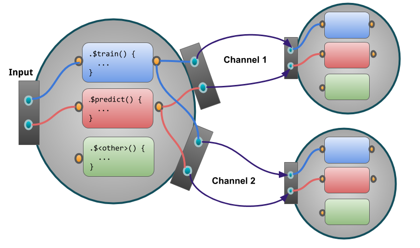

## Adding new PipeOps {#extending-pipeops}

This section showcases how the `mlr3pipelines` package can be extended to include custom `PipeOp`s.
To run the following examples, we will need a `Task`; we are using the well-known "Iris" task:

```{r 06-extending-pipeops-001}
library("mlr3")
task = mlr_tasks$get("iris")
task$data()
```

`mlr3pipelines` is fundamentally built around [`R6`](https://r6.r-lib.org/). When planning to create custom `r ref("PipeOp")` objects, it can only help to [familiarize yourself with it](https://adv-r.hadley.nz/r6.html).

In principle, all a `PipeOp` must do is inherit from the `PipeOp` R6 class and implement the `.train()` and `.predict()` functions.
There are, however, several auxiliary subclasses that can make the creation of *certain* operations much easier.

### General Case Example: `PipeOpCopy` {#ext-pipeopcopy}

A very simple yet useful `PipeOp` is `PipeOpCopy`, which takes a single input and creates a variable number of output channels, all of which receive a copy of the input data.
It is a simple example that showcases the important steps in defining a custom `PipeOp`.
We will show a simplified version here, **`PipeOpCopyTwo`**, that creates exactly two copies of its input data.

The following figure visualizes how our `PipeOp` is situated in the `Pipeline` and the significant in- and outputs.

```{r 06-extending-pipeops-002, echo=FALSE}

```


#### First Steps: Inheriting from `PipeOp`

The first part of creating a custom `PipeOp` is inheriting from `PipeOp`.
We make a mental note that we need to implement a `.train()` and a `.predict()` function, and that we probably want to have an `initialize()` as well:

```{r 06-extending-pipeops-003, eval = FALSE, tidy = FALSE}
PipeOpCopyTwo = R6::R6Class("PipeOpCopyTwo",
  inherit = mlr3pipelines::PipeOp,
  public = list(
    initialize = function(id = "copy.two") {
      ....
    },
  ),
  private == list(
    .train = function(inputs) {
      ....
    },

    .predict = function(inputs) {
      ....
    }
  )
)
```

Note, that **private** methods, e.g. `.train` and `.predict` etc are prefixed with a `.`.

#### Channel Definitions

We need to tell the `PipeOp` the layout of its channels: How many there are, what their names are going to be, and what types are acceptable.
This is done on initialization of the `PipeOp` (using a `super$initialize` call) by giving the `input` and `output` `data.table` objects.
These must have three columns: a `"name"` column giving the names of input and output channels, and a `"train"` and `"predict"` column naming the class of objects we expect during training and prediction as input / output.
A special value for these classes is `"*"`, which indicates that any class will be accepted; our simple copy operator accepts any kind of input, so this will be useful. We have only one input, but two output channels.

By convention, we name a single channel `"input"` or `"output"`, and a group of channels [`"input1"`, `"input2"`, ...], unless there is a reason to give specific different names. Therefore, our `input` `data.table` will have a single row `<"input", "*", "*">`, and our `output` table will have two rows, `<"output1", "*", "*">` and `<"output2", "*", "*">`.

All of this is given to the `PipeOp` creator. Our `initialize()` will thus look as follows:

```{r 06-extending-pipeops-004, eval = FALSE}
    initialize = function(id = "copy.two") {
      input = data.table::data.table(name = "input", train = "*", predict = "*")
      # the following will create two rows and automatically fill the `train`
      # and `predict` cols with "*"
      output = data.table::data.table(
        name = c("output1", "output2"),
        train = "*", predict = "*"
      )
      super$initialize(id,
        input = input,
        output = output
      )
    }
```

#### Train and Predict

Both `.train()` and `.predict()` will receive a `list` as input and must give a `list` in return.
According to our `input` and `output` definitions, we will always get a list with a single element as input, and will need to return a list with two elements. Because all we want to do is create two copies, we will just create the copies using `c(inputs, inputs)`.

Two things to consider:

- The `.train()` function must always modify the `self$state` variable to something that is not `NULL` or `NO_OP`.
  This is because the `$state` slot is used as a signal that `PipeOp`  has been trained on data, even if the state itself is not important to the `PipeOp` (as in our case).
  Therefore, our `.train()` will set `self$state = list()`.

- It is not necessary to "clone" our input or make deep copies, because we don't modify the data.
  However, if we were changing a reference-passed object, for example by changing data in a `Task`, we would have to make a deep copy first.
  This is because a `PipeOp` may never modify its input object by reference.

Our `.train()` and `.predict()` functions are now:

```{r 06-extending-pipeops-005, eval = FALSE}
.train = function(inputs) {
  self$state = list()
  c(inputs, inputs)
}
```
```{r 06-extending-pipeops-006, eval = FALSE}
.predict = function(inputs) {
  c(inputs, inputs)
}
```

#### Putting it Together

The whole definition thus becomes

```{r 06-extending-pipeops-007, tidy = FALSE}
PipeOpCopyTwo = R6::R6Class("PipeOpCopyTwo",
  inherit = mlr3pipelines::PipeOp,
  public = list(
    initialize = function(id = "copy.two") {
      super$initialize(id,
        input = data.table::data.table(name = "input", train = "*", predict = "*"),
        output = data.table::data.table(name = c("output1", "output2"),
                            train = "*", predict = "*")
      )
    }
  ),
  private = list(
    .train = function(inputs) {
      self$state = list()
      c(inputs, inputs)
    },

    .predict = function(inputs) {
      c(inputs, inputs)
    }
  )
)
```

We can create an instance of our `PipeOp`, put it in a graph, and see what happens when we train it on something:

```{r 06-extending-pipeops-008}
library("mlr3pipelines")
poct = PipeOpCopyTwo$new()
gr = Graph$new()
gr$add_pipeop(poct)

print(gr)

result = gr$train(task)

str(result)
```

### Special Case: Preprocessing {#ext-pipe-preproc}

Many `r ref("PipeOp")`s perform an operation on exactly one `r ref("Task")`, and return exactly one `r ref("Task")`. They may even not care about the "Target" / "Outcome" variable of that task, and only do some modification of some input data.
However, it is usually important to them that the `Task` on which they perform prediction has the same data columns as the `Task` on which they train.
For these cases, the auxiliary base class `r ref("PipeOpTaskPreproc")` exists.
It inherits from `r ref("PipeOp")` itself, and other `PipeOp`s should use it if they fall in the kind of use-case named above.

When inheriting from `r ref("PipeOpTaskPreproc")`, one must either implement the private methods `.train_task()` and `.predict_task()`, or the methods `.train_dt()`, `.predict_dt()`, depending on whether wants to operate on a `r ref("Task")` object or on its data as `data.table`s.
In the second case, one can optionally also overload the `.select_cols()` method, which chooses which of the incoming `Task`'s features are given to the `.train_dt()` / `.predict_dt()` functions.

The following will show two examples: `PipeOpDropNA`, which removes a `Task`'s rows with missing values during training (and implements `.train_task()` and `.predict_task()`), and `PipeOpScale`, which scales a `Task`'s numeric columns (and implements `.train_dt()`, `.predict_dt()`, and `.select_cols()`).

#### Example: `PipeOpDropNA`

Dropping rows with missing values may be important when training a model that can not handle them.

Because `mlr3` `r ref("Task", text = "Tasks")` only contain a view to the underlying data, it is not necessary to modify data to remove rows with missing values.
Instead, the rows can be removed using the `r ref("Task")`'s `$filter` method, which modifies the `r ref("Task")` in-place.
This is done in the private method `.train_task()`.
We take care that we also set the `$state` slot to signal that the `r ref("PipeOp")` was trained.

The private method `.predict_task()` does not need to do anything; removing missing values during prediction is not as useful, since learners that cannot handle them will just ignore the respective rows.
Furthermore, `mlr3` expects a `r ref("Learner")` to always return just as many predictions as it was given input rows, so a `r ref("PipeOp")` that removes `Task` rows during training can not be used inside a `r ref("GraphLearner")`.

When we inherit from `r ref("PipeOpTaskPreproc")`, it sets the `input` and `output` `data.table`s for us to only accept a single `r ref("Task")`.
The only thing we do during `initialize()` is therefore to set an `id` (which can optionally be changed by the user).

The complete `PipeOpDropNA` can therefore be written as follows.
Note that it inherits from `r ref("PipeOpTaskPreproc")`, unlike the `PipeOpCopyTwo` example from above:

```{r 06-extending-pipeops-009, tidy = FALSE}
PipeOpDropNA = R6::R6Class("PipeOpDropNA",
  inherit = mlr3pipelines::PipeOpTaskPreproc,
  public = list(
    initialize = function(id = "drop.na") {
      super$initialize(id)
    }
  ),

  private = list(
    .train_task = function(task) {
      self$state = list()
      featuredata = task$data(cols = task$feature_names)
      exclude = apply(is.na(featuredata), 1, any)
      task$filter(task$row_ids[!exclude])
    },

    .predict_task = function(task) {
      # nothing to be done
      task
    }
  )
)
```

To test this `PipeOp`, we create a small task with missing values:
```{r 06-extending-pipeops-010}
smalliris = iris[(1:5) * 30, ]
smalliris[1, 1] = NA
smalliris[2, 2] = NA
sitask = TaskClassif$new("smalliris", as_data_backend(smalliris), "Species")
print(sitask$data())
```

We test this by feeding it to a new `Graph` that uses `PipeOpDropNA`.

```{r 06-extending-pipeops-011}
gr = Graph$new()
gr$add_pipeop(PipeOpDropNA$new())

filtered_task = gr$train(sitask)[[1]]
print(filtered_task$data())
```

#### Example: `PipeOpScaleAlways`

An often-applied preprocessing step is to simply **center** and/or **scale** the data to mean $0$ and standard deviation $1$.
This fits the `r ref("PipeOpTaskPreproc")` pattern quite well.
Because it always replaces all columns that it operates on, and does not require any information about the task's target, it only needs to overload the `.train_dt()` and `.predict_dt()` functions.
This saves some boilerplate-code from getting the correct feature columns out of the task, and replacing them after modification.

Because scaling only makes sense on numeric features, we want to instruct `r ref("PipeOpTaskPreproc")` to give us only these numeric columns.
We do this by overloading the `.select_cols()` function: It is called by the class to determine which columns to pass to `.train_dt()` and `.predict_dt()`.
Its input is the `r ref("Task")` that is being transformed, and it should return a `character` vector of all features to work with.
When it is not overloaded, it uses all columns; instead, we will set it to only give us numeric columns.
Because the `levels()` of the data table given to `.train_dt()` and `.predict_dt()` may be different from the `task`'s levels, these functions must also take a `levels` argument that is a named list of column names indicating their levels.
When working with numeric data, this argument can be ignored, but it should be used instead of `levels(dt[[column]])` for factorial or character columns.

This is the first `PipeOp` where we will be using the `$state` slot for something useful: We save the centering offset and scaling coefficient and use it in `$.predict()`!

For simplicity, we are not using hyperparameters and will always scale and center all data.
Compare this `PipeOpScaleAlways` operator to the one defined inside the `mlr3pipelines` package, `r ref("PipeOpScale")`.

```{r 06-extending-pipeops-012, tidy = FALSE}
PipeOpScaleAlways = R6::R6Class("PipeOpScaleAlways",
  inherit = mlr3pipelines::PipeOpTaskPreproc,
  public = list(
    initialize = function(id = "scale.always") {
      super$initialize(id = id)
    }
  ),

  private = list(
    .select_cols = function(task) {
      task$feature_types[type == "numeric", id]
    },

    .train_dt = function(dt, levels, target) {
      sc = scale(as.matrix(dt))
      self$state = list(
        center = attr(sc, "scaled:center"),
        scale = attr(sc, "scaled:scale")
      )
      sc
    },

    .predict_dt = function(dt, levels) {
      t((t(dt) - self$state$center) / self$state$scale)
    }
  )
)
```

_(Note for the observant: If you check `PipeOpScale.R` from the `mlr3pipelines` package, you will notice that is uses "`get("type")`" and "`get("id")`" instead of "`type`" and "`id`", because the static code checker on CRAN would otherwise complain about references to undefined variables. This is a "problem" with `data.table` and not exclusive to `mlr3pipelines`.)_

We can, again, create a new `r ref("Graph")` that uses this `r ref("PipeOp")` to test it.
Compare the resulting data to the original "iris" `Task` data printed at the beginning:

```{r 06-extending-pipeops-013}
gr = Graph$new()
gr$add_pipeop(PipeOpScaleAlways$new())

result = gr$train(task)

result[[1]]$data()
```

### Special Case: Preprocessing with Simple Train

It is possible to make even further simplifications for many `r ref("PipeOp")`s that perform mostly the same operation during training and prediction.
The point of `r ref("Task")` preprocessing is often to modify the training data in mostly the same way as prediction data (but in a way that *may* depend on training data).

Consider constant feature removal, for example: The goal is to remove features that have no variance, or only a single factor level.
However, what features get removed must be decided during *training*, and may only depend on training data.
Furthermore, the actual process of removing features is the same during training and prediction.

A simplification to make is therefore to have a private method `.get_state(task)` which sets the `$state` slot during training, and a private method `.transform(task)`, which gets called both during training *and* prediction.
This is done in the `r ref("PipeOpTaskPreprocSimple")` class.
Just like `r ref("PipeOpTaskPreproc")`, one can inherit from this and overload these functions to get a `PipeOp` that performs preprocessing with very little boilerplate code.

Just like `r ref("PipeOpTaskPreproc")`, `r ref("PipeOpTaskPreprocSimple")` offers the possibility to instead overload the `.get_state_dt(dt, levels)` and `.transform_dt(dt, levels)` methods (and optionally, again, the `.select_cols(task)` function) to operate on `data.table` feature data instead of the whole `Task`.

Even some methods that do not use `r ref("PipeOpTaskPreprocSimple")` *could* work in a similar way: The `PipeOpScaleAlways` example from above will be shown to also work with this paradigm.

#### Example: `PipeOpDropConst`

A typical example of a preprocessing operation that does almost the same operation during training and prediction is an operation that drops features depending on a criterion that is evaluated during training.
One simple example of this is dropping constant features.
Because the `mlr3` `Task` class offers a flexible view on underlying data, it is most efficient to drop columns from the task directly using its `$select()` function, so the `.get_state_dt(dt, levels)` / `.transform_dt(dt, levels)` functions will *not* get used; instead we overload the `.get_state(task)` and `.transform(task)` methods.

The `.get_state()` function's result is saved to the `$state` slot, so we want to return something that is useful for dropping features.
We choose to save the names of all the columns that have nonzero variance.
For brevity, we use `length(unique(column)) > 1` to check whether more than one distinct value is present; a more sophisticated version could have a tolerance parameter for numeric values that are very close to each other.

The `.transform()` method is evaluated both during training *and* prediction, and can rely on the `$state` slot being present.
All it does here is call the `Task$select` function with the columns we chose to keep.

The full `r ref("PipeOp")` could be written as follows:

```{r 06-extending-pipeops-014, tidy = FALSE}
PipeOpDropConst = R6::R6Class("PipeOpDropConst",
  inherit = mlr3pipelines::PipeOpTaskPreprocSimple,
  public = list(
    initialize = function(id = "drop.const") {
      super$initialize(id = id)
    }
  ),

  private = list(
    .get_state = function(task) {
      data = task$data(cols = task$feature_names)
      nonconst = sapply(data, function(column) length(unique(column)) > 1)
      list(cnames = colnames(data)[nonconst])
    },

    .transform = function(task) {
      task$select(self$state$cnames)
    }
  )
)
```

This can be tested using the first five rows of the "Iris" `Task`, for which one feature (`"Petal.Width"`) is constant:

```{r 06-extending-pipeops-015}
irishead = task$clone()$filter(1:5)
irishead$data()
```

```{r 06-extending-pipeops-016}
gr = Graph$new()$add_pipeop(PipeOpDropConst$new())
dropped_task = gr$train(irishead)[[1]]

dropped_task$data()
```

We can also see that the `$state` was correctly set.
Calling `$.predict()` with this graph, even with different data (the whole Iris `Task`!) will still drop the `"Petal.Width"` column, as it should.

```{r 06-extending-pipeops-017}
gr$pipeops$drop.const$state
```

```{r 06-extending-pipeops-018}
dropped_predict = gr$predict(task)[[1]]

dropped_predict$data()
```

#### Example: `PipeOpScaleAlwaysSimple`

This example will show how a `PipeOpTaskPreprocSimple` can be used when only working on feature data in form of a `data.table`.
Instead of calling the `scale()` function, the `center` and `scale` values are calculated directly and saved to the `$state` slot.
The `.transform_dt()` function will then perform the same operation during both training and prediction: subtract the `center` and divide by the `scale` value.
As in the [`PipeOpScaleAlways` example above](#example-pipeopscalealways), we use `.select_cols()` so that we only work on numeric columns.

```{r 06-extending-pipeops-019, tidy = FALSE}
PipeOpScaleAlwaysSimple = R6::R6Class("PipeOpScaleAlwaysSimple",
  inherit = mlr3pipelines::PipeOpTaskPreprocSimple,
  public = list(
    initialize = function(id = "scale.always.simple") {
      super$initialize(id = id)
    }
  ),

  private = list(
    .select_cols = function(task) {
      task$feature_types[type == "numeric", id]
    },

    .get_state_dt = function(dt, levels, target) {
      list(
        center = sapply(dt, mean),
        scale = sapply(dt, sd)
      )
    },

    .transform_dt = function(dt, levels) {
      t((t(dt) - self$state$center) / self$state$scale)
    }
  )
)
```

We can compare this `r ref("PipeOp")` to the one above to show that it behaves the same.

```{r 06-extending-pipeops-020}
gr = Graph$new()$add_pipeop(PipeOpScaleAlways$new())
result_posa = gr$train(task)[[1]]

gr = Graph$new()$add_pipeop(PipeOpScaleAlwaysSimple$new())
result_posa_simple = gr$train(task)[[1]]
```

```{r 06-extending-pipeops-021}
result_posa$data()
```

```{r 06-extending-pipeops-022}
result_posa_simple$data()
```

### Hyperparameters {#ext-pipe-hyperpars}

`mlr3pipelines` uses the [`paradox`](https://paradox.mlr-org.com) package to define parameter spaces for `PipeOp`s.
Parameters for `PipeOp`s can modify their behavior in certain ways, e.g. switch centering or scaling off in the `PipeOpScale` operator.
The unified interface makes it possible to have parameters for whole `Graph`s that modify the individual `PipeOp`'s behavior.
The `Graph`s, when encapsulated in `GraphLearner`s, can even be tuned using the tuning functionality in `r mlr_pkg("mlr3tuning")`.

Hyperparameters are declared during initialization, when calling the `PipeOp`'s `$initialize()` function, by giving a `param_set` argument.
The `param_set` must be a `ParamSet` from the `paradox` package; see the [mlr3book](https://mlr3book.mlr-org.com) for more information on how to define parameter spaces.
After construction, the `ParamSet` can be accessed through the `$param_set` slot.
While it is *possible* to modify this `ParamSet`, using e.g. the `$add()` and `$add_dep()` functions, *after* adding it to the `PipeOp`, it is strongly advised against.

Hyperparameters can be set and queried through the `$values` slot.
When setting hyperparameters, they are automatically checked to satisfy all conditions set by the `$param_set`, so it is not necessary to type check them.
Be aware that it is always possible to *remove* hyperparameter values.

When a `PipeOp` is initialized, it usually does not have any parameter values---`$values` takes the value `list()`.
It is possible to set initial parameter values in the `$initialize()` constructor; this must be done *after* the `super$initialize()` call where the corresponding `ParamSet` must be supplied.
This is because setting `$values` checks against the current `$param_set`, which would fail if the `$param_set` was not set yet.

When using an underlying library function (the `scale` function in `PipeOpScale`, say), then there is usually a "default" behaviour of that function when a parameter is not given.
It is good practice to use this default behaviour whenever a parameter is not set (or when it was removed).
This can easily be done when using the `r mlr_pkg("mlr3misc")` library's `r ref("mlr3misc::invoke()")` function, which has functionality similar to `r ref("do.call()")`.

#### Hyperparameter Example: `PipeOpScale`

How to use hyperparameters can best be shown through the example of `r ref("PipeOpScale")`, which is very similar to the example above, `PipeOpScaleAlways`.
The difference is made by the presence of hyperparameters.
`r ref("PipeOpScale")` constructs a `ParamSet` in its `$initialize` function and passes this on to the `super$initialize` function:

```{r 06-extending-pipeops-023}
PipeOpScale$public_methods$initialize
```

The user has access to this and can set and get parameters.
Types are automatically checked:

```{r 06-extending-pipeops-024}
pss = PipeOpScale$new()
print(pss$param_set)
```

```{r 06-extending-pipeops-025}
pss$param_set$values$center = FALSE
print(pss$param_set$values)
```

```{r 06-extending-pipeops-026, error = TRUE}
pss$param_set$values$scale = "TRUE"  # bad input is checked!
```

How `r ref("PipeOpScale")` handles its parameters can be seen in its `$.train_dt` method: It gets the relevant parameters from its `$values` slot and uses them in the `r ref("mlr3misc::invoke()")` call.
This has the advantage over calling `scale()` directly that if a parameter is not given, its default value from the `r ref("scale()")` function will be used.

```{r 06-extending-pipeops-027}
PipeOpScale$private_methods$.train_dt
```

Another change that is necessary compared to `PipeOpScaleAlways` is that the attributes `"scaled:scale"` and `"scaled:center"` are not always present, depending on parameters, and possibly need to be set to default values $1$ or $0$, respectively.

It is now even possible (if a bit pointless) to call `PipeOpScale` with both `scale` and `center` set to `FALSE`, which returns the original dataset, unchanged.

```{r 06-extending-pipeops-028}
pss$param_set$values$scale = FALSE
pss$param_set$values$center = FALSE

gr = Graph$new()
gr$add_pipeop(pss)

result = gr$train(task)

result[[1]]$data()
```
