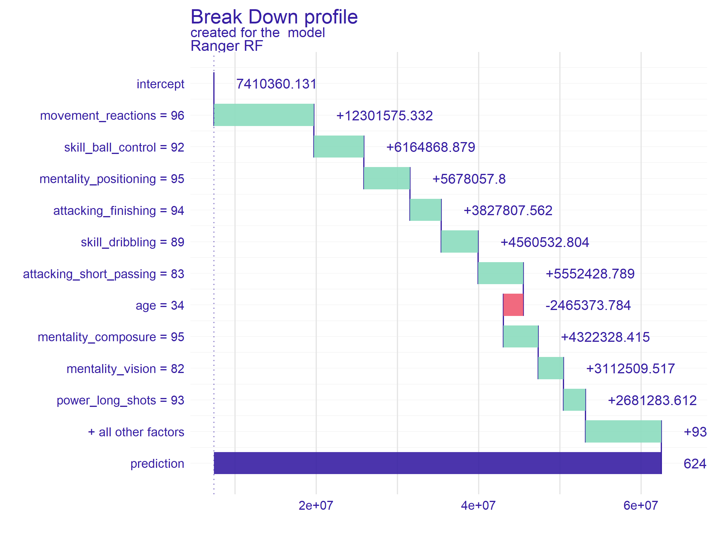
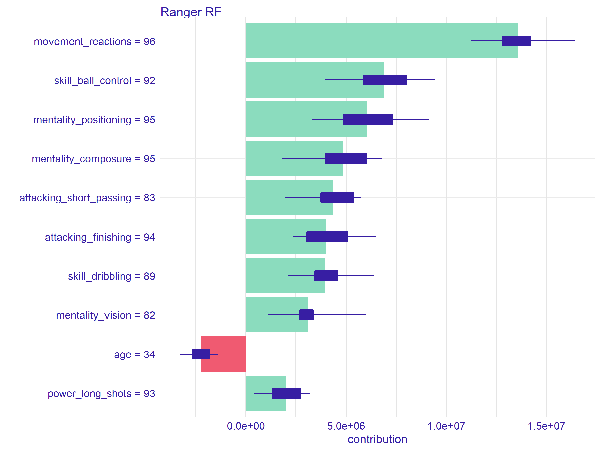
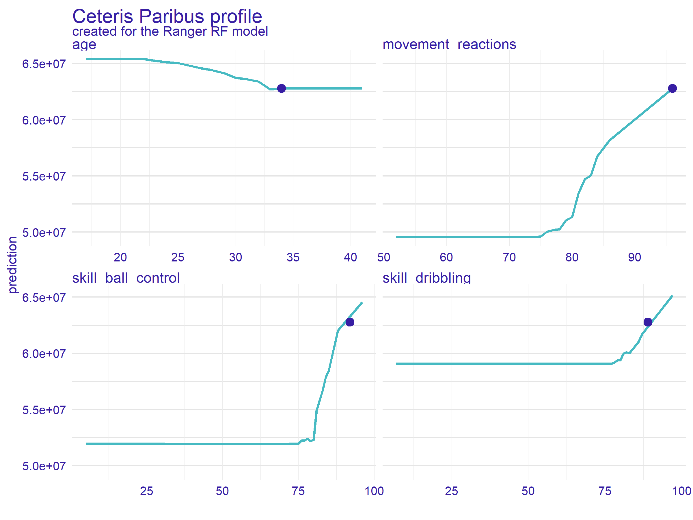

# Model Interpretation {#interpretation}

## IML {#iml}

## DALEX {#interpretability-dalex}

### Introduction {#interpretability-dalex-introduction}

The DALEX package xrays any predictive model and helps to explore, explain and visualize its behavior. The package implements a collection of methods for [Explanatory Model Analysis](https://pbiecek.github.io/ema/). It is based on a unified grammar summarised in Figure \@ref(fig:DALEXema).

In the following sections, we will present subsequent methods available in the DALEX package based on a random forest model trained for football players worth prediction on the FIFA 20 data. We will show both methods analyzing the model at the level of a single prediction and at the global level - for the whole data set.

The structure of this chapter is following:

* In section \@ref(interpretability-data-fifa) we introduce a fifa dataset and then in section \@ref(interpretability-train-ranger) we train a `ranger` regression model,
* Section \@ref(interpretability-architecture) introduces general logic beyond DALEX explainers,
* Section \@ref(interpretability-dataset-level) introduces methods for dataset level model exploration,
* Section \@ref(interpretability-instance-level) introduces methods for instance level model exploration,
* Section \@ref(interpretability-multiple-models) shows how to use the `DALEX` for cross comparison of multiple models.


```{r DALEXema, echo=FALSE, fig.cap='Pyramid with the methods of model exploration presented in this chapter. Left part overview methods for instance level exploration while right part is related to dataset level model exploration.', out.width = '100%', fig.align='center'}
knitr::include_graphics("images/DALEX_ema.png")
```


### Read data: fifa {#interpretability-data-fifa}

Examples presented in this chapter are based on data retrieved from the FIFA video game. We will use the data scrapped from the sofifa website. The raw data is available at  [fifa](https://www.kaggle.com/stefanoleone992/fifa-20-complete-player-dataset). After some basic data cleaning, the processed data for top 5000 football players is available in the DALEX package under the name `fifa`.

```{r eval=FALSE}
library("DALEX")
fifa[1:2,1:4]
```
```
                  nationality overall potential wage_eur
L. Messi            Argentina      94        94   565000
Cristiano Ronaldo    Portugal      93        93   405000
```

For every player, we have 42 features available.

```{r eval=FALSE}
dim(fifa)
## [1] 5000    42
```

In the table below we overview these 42 features for three selected players.
One of the features, called `value_eur`, is the worth of the footballer in euros. In the next section, we will build a prediction model, which will estimate the worth of the player based on other player characteristics.


|     |Lionel Messi |Cristiano Ronaldo |Neymar Junior |
|:--------------------------|:------------|:-----------------|:-------------|
|age  |32       |34            |27      |
|height_cm                  |170      |187           |175     |
|weight_kg                  |72       |83            |68      |
|value_eur                  |95 500 000 |58 500 000      |105 500 000                     |
|attacking_crossing         |88       |84            |87      |
|attacking_finishing        |95       |94            |87      |
|attacking_heading_accuracy |70       |89            |62      |
|attacking_short_passing    |92       |83            |87      |
|attacking_volleys          |88       |87            |87      |
|skill_dribbling            |97       |89            |96      |
|skill_curve                |93       |81            |88      |
|skill_fk_accuracy          |94       |76            |87      |
|skill_long_passing         |92       |77            |81      |
|skill_ball_control         |96       |92            |95      |
|movement_acceleration      |91       |89            |94      |
|movement_sprint_speed      |84       |91            |89      |
|movement_agility           |93       |87            |96      |
|movement_reactions         |95       |96            |92      |
|movement_balance           |95       |71            |84      |
|power_shot_power           |86       |95            |80      |
|power_jumping              |68       |95            |61      |
|power_stamina              |75       |85            |81      |
|power_strength             |68       |78            |49      |
|power_long_shots           |94       |93            |84      |
|mentality_aggression       |48       |63            |51      |
|mentality_interceptions    |40       |29            |36      |
|mentality_positioning      |94       |95            |87      |
|mentality_vision           |94       |82            |90      |
|mentality_penalties        |75       |85            |90      |
|mentality_composure        |96       |95            |94      |
|defending_marking          |33       |28            |27      |
|defending_standing_tackle  |37       |32            |26      |
|defending_sliding_tackle   |26       |24            |29      |
|goalkeeping_diving         |6        |7             |9       |
|goalkeeping_handling       |11       |11            |9       |
|goalkeeping_kicking        |15       |15            |15      |
|goalkeeping_positioning    |14       |14            |15      |
|goalkeeping_reflexes       |8        |11            |11      |


In order to get more stable model we remove four variables i.e. `nationality`, `overall`, `potential`, `wage_eur`.

```{r eval=FALSE}
fifa[,c('nationality', 'overall', 'potential', 'wage_eur')] <- NULL
```


### Train a model: Ranger {#interpretability-train-ranger}

The `DALEX` package works for any model regardless of its internal structure. Examples of how this package works are shown on a random forest model implemented in the `ranger` package.


We use the `mlr3` package to build a predictive model. 
First, let's load the required packages.

```{r eval=FALSE}
library("mlr3")
library("mlr3learners")
```

Then we can define the task - prediction for `value_eur` variable.

```{r eval=FALSE}
fifa_task <- TaskRegr$new(id = "fifa", backend = fifa, target = "value_eur")
```

Finally, we train the `ranger` model with 250 trees. Note that in this example for brevity we do not split the data into a train/test data. The model is built on the whole data.

```{r eval=FALSE}
fifa_ranger <- lrn("regr.ranger")
fifa_ranger$param_set$values <- list(num.trees = 250)
fifa_ranger$train(fifa_task)
```

### The general workflow {#interpretability-architecture}

Working with explanations in the DALEX package always consists of three steps schematically shown in the pipe below.

```
model %>%
  explain_mlr3(data = ..., y = ..., label = ...) %>%
  model_part() %>%
  plot()
```

1. All functions in the DALEX package can work for models with any structure. It is possible because in the first step we create an adapter that allows the downstream functions to access the model in a consistent fashion. In general, such an adapter is created with `DALEX::explain()` function, but for models created in the `mlr3` package it is more convenient to use the `DALEXtra::explain_mlr3()`.

2. Explanations are determined by the functions `model_part`, `model_profile`, `predict_part` and `predict_profile`. Each of these functions takes the model adapter as its first argument. The other arguments describe how the function works. We will present them in the following section.

3. Explanations can be visualized with the generic function `plot()` or summarised with the generic function `print()`. Each explanation is a data frame with an additional class attribute. The `plot()` function creates graphs using the `ggplot2` package, so they can be easily modified with usual `ggplot2` decorators.

We show this cascade of functions based on an FIFA example.

To get started with the exploration of the model behaviour we need to create an explainer. `DALEX::explain` function handles is for all types of predictive models. In the `DALEXtra` package there generic versions for the most common ML frameworks. Among them the `DALEXtra::explain_mlr3` function works for `mlr3` models.

This function performs a series of internal checks so the output is a bit verbose. Turn the `verbose = FALSE` argument to make it less wordy.

```{r eval=FALSE}
library("DALEX")
library("DALEXtra")

ranger_exp <- explain_mlr3(fifa_ranger,
        data  = fifa, 
        y = fifa$value_eur,
        label = "Ranger RF")
```
```
Preparation of a new explainer is initiated
  -> model label       :  Ranger RF 
  -> data              :  5000  rows  38  cols 
  -> target variable   :  5000  values 
  -> model_info        :  package mlr3 , ver. 0.1.8 , task regression (  default  ) 
  -> predict function  :  yhat.LearnerRegr  will be used (  default  )
  -> predicted values  :  numerical, min =  446856.7 , mean =  7410360 , max =  90967333  
  -> residual function :  difference between y and yhat (  default  )
  -> residuals         :  numerical, min =  -8418100 , mean =  -2228.131 , max =  18608533  
  A new explainer has been created!   
```
  
### Dataset level exploration {#interpretability-dataset-level}

The `model_parts()` function calculates the importance of variables using the [permutations based procedure](https://pbiecek.github.io/ema/featureImportance.html).

```{r eval=FALSE}
fifa_vi <- model_parts(ranger_exp)
```

Results can be visualized with generic `plot()`. The chart for all 38 variables would be unreadable, so with the `max_vars` argument, we limit the number of variables on the plot.

```{r eval=FALSE}
plot(fifa_vi, max_vars = 12, show_boxplots = FALSE) 
```
```{r, echo=FALSE}
knitr::include_graphics("images/DALEX_fi.png")
```

Once we know which variables are most important, we can use [Partial Dependence Plots](https://pbiecek.github.io/ema/partialDependenceProfiles.html) to show how the model, on average, changes with changes in seelcted variables. In this example they show the average relation between the particular variables and players' value.

```{r eval=FALSE}
selected_variables <- c("age", "movement_reactions",
                "skill_ball_control", "skill_dribbling")

fifa_pd <- model_profile(ranger_exp, 
                variables = selected_variables)$agr_profiles
```

Again, the result of the explanation can be presented with the generic function `plot()`.

```{r eval=FALSE}
library("ggplot2")
plot(fifa_pd) +
  scale_y_continuous("Estimated value in Euro", trans = "log10", labels = scales::dollar_format(suffix = "€", prefix = "")) +
  ggtitle("Partial Dependence profiles for selected variables")
```
```{r, echo=FALSE}
knitr::include_graphics("images/DALEX_pd.png")
```

The general trend for most player characteristics is the same. The higher are the skills the higher is the player's worth. With a single exception – variable Age. 


### Instance level explanation {#interpretability-instance-level}

Time to see how the model behaves for a single observation/player 
This can be done for any player, but this example we will use the Cristiano Ronaldo.

The function `predict_parts` is an instance level version of the `model_parts` function introduced in the previous section. For the background behind that method see [The Introduction to Break Down](https://pbiecek.github.io/ema/breakDown.html).

```{r eval=FALSE}
ronaldo <- fifa["Cristiano Ronaldo",]
ronaldo_bd_ranger <- predict_parts(ranger_exp,
                        new_observation = ronaldo)
```

The generic `plot()` function shows the estimated contribution of variables to the final prediction. 

Cristiano is a striker, therefore characteristics that influence his worth are those related to attack, like attacking_voleys or skill_dribbling. The only variable with negative attribution is Age. 

```{r, eval=FALSE}
plot(ronaldo_bd_ranger)
```
```{r, echo=FALSE}

```

Another way to inspect the local behavior of the model is to use [SHapley Additive exPlanations (SHAP)](https://pbiecek.github.io/ema/shapley.html). It locally shows the contribution of variables to a single observation, just like Break Down.

```{r, eval=FALSE}
ronaldo_shap_ranger <- predict_parts(ranger_exp,
                        new_observation = ronaldo,
                        type = "shap")
plot(ronaldo_shap_ranger)
```
```{r, echo=FALSE}

```

In the previous section we've introduced a global explanation - Partial Dependence Plots. [Ceteris Paribus](https://pbiecek.github.io/ema/ceterisParibus.html) is the instance level version of that plot. It shows the response of the model for observation when we change only one variable while others stay unchanged. Blue dot stands for the original value.

```{r, eval=FALSE}
selected_variables <- c("age", "movement_reactions",
                "skill_ball_control", "skill_dribbling")

ronaldo_cp_ranger <- predict_profile(ranger_exp, ronaldo, variables = selected_variables)

plot(ronaldo_cp_ranger, variables = selected_variables)
```
```{r, echo=FALSE}

```

